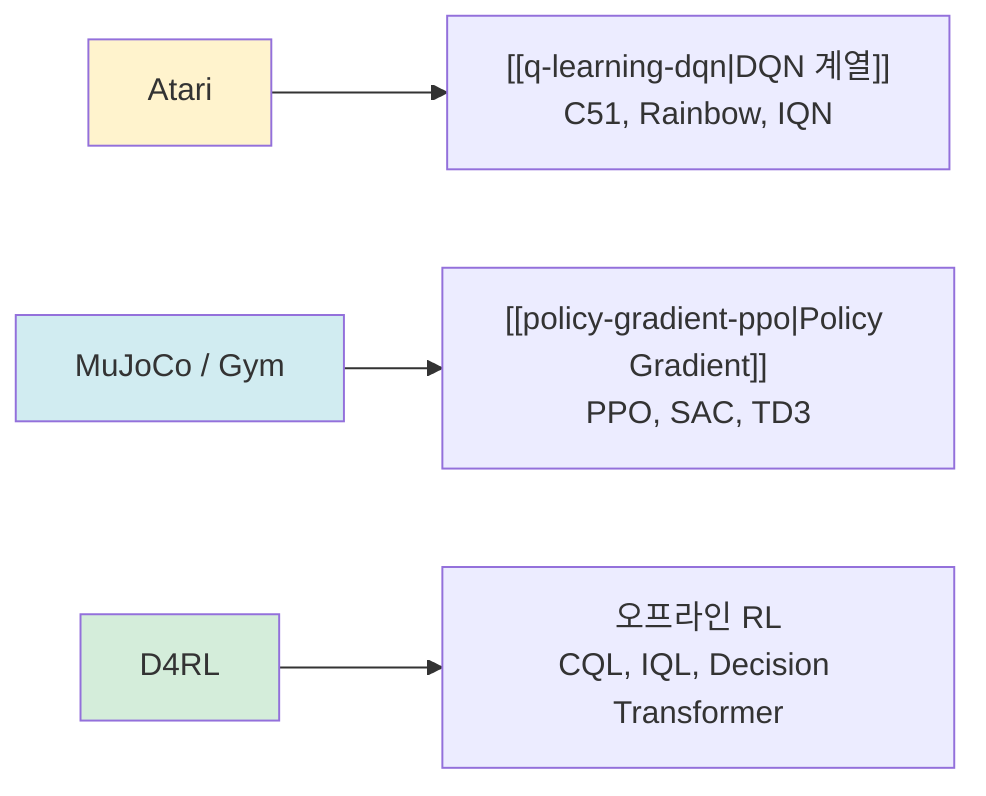

# RL 벤치마크 환경

강화학습(RL) 연구에서 알고리즘의 성능을 공정하게 비교하기 위해 표준화된 벤치마크 환경이 필수적이다. 각 벤치마크는 서로 다른 문제 특성(고차원 관찰, 연속 행동, 오프라인 데이터 등)을 강조하며, 어떤 벤치마크에서 평가하느냐에 따라 알고리즘의 강점과 약점이 달라진다.

## 주요 벤치마크 계보

```mermaid
flowchart TD
    subgraph Online["온라인 RL 벤치마크"]
        A[Atari 57개 게임\nDQN 계열]
        M[MuJoCo\n연속 제어]
        G[Gymnasium\nOpenAI Gym 후속]
    end
    subgraph Offline["오프라인 RL 벤치마크"]
        D[D4RL\nDatasets for DRL]
        R[RL Unplugged\nDeepMind]
    end
    subgraph LLM["LLM/언어 에이전트"]
        E[Embodied AI\nALFWorld, BabyAI]
        T[TextWorld\nIF 게임]
    end

    Online --> Offline
    style Online fill:#e8f4fd
    style Offline fill:#fef9e7
    style LLM fill:#eafaf1
```



위 계보는 벤치마크가 온라인 RL에서 오프라인 RL, 그리고 언어 기반 에이전트 평가로 확장되어 온 흐름을 보여준다.

## Atari 57

DeepMind의 Arcade Learning Environment(ALE) 기반. 2013년 DQN 논문이 아타리 게임에서 인간 수준을 달성하면서 온라인 RL의 표준 벤치마크로 자리잡았다.

- **입력**: 84x84 픽셀 그레이스케일 이미지 (4 프레임 스택)
- **행동 공간**: 이산(최대 18개 행동)
- **평가 지표**: 인간 정규화 점수(Human Normalized Score, HNS)
- **알고리즘 연관**: [[q-learning-dqn|DQN]], Rainbow, C51, IQN 등 가치 기반 알고리즘 검증에 최적

핵심 게임군별 특성:
| 게임 유형 | 대표 게임 | RL 난이도 |
|-----------|----------|-----------|
| 점수 누적 | Breakout, Pong | 상대적으로 쉬움 |
| 탐색 필요 | Montezuma's Revenge | 희소 보상, 매우 어려움 |
| 빠른 반응 | Space Invaders | 짧은 시야(horizon) |

## MuJoCo

Physics-based 연속 제어 시뮬레이터. DeepMind Control Suite와 함께 [[policy-gradient-ppo|PPO]], SAC, TD3 등 연속 행동 알고리즘의 표준 테스트베드다.

- **입력**: 관절 각도, 속도 등 저차원 연속 상태 벡터
- **행동 공간**: 연속 (토크, 힘 제어)
- **주요 환경**:
  - HalfCheetah-v4: 앞으로 달리기 (기준선)
  - Hopper-v4: 한 발 점프, 불안정
  - Walker2d-v4: 두 발 보행
  - Ant-v4: 4족 보행, 고차원 행동
  - Humanoid-v4: 376차원 상태, 가장 복잡

2022년 MuJoCo가 DeepMind에 인수된 후 오픈소스로 전환되었다.

## D4RL (Datasets for Deep Data-Driven Reinforcement Learning)

오프라인 RL의 표준 벤치마크. Justin Fu et al. (2020) 제안. MuJoCo 환경 기반이지만, 사전 수집된 고정 데이터셋으로만 학습한다.

데이터셋 품질 4단계:
| 데이터셋 타입 | 설명 | 난이도 |
|--------------|------|--------|
| `random` | 무작위 정책으로 수집 | 하 |
| `medium` | 중간 품질 정책 | 중 |
| `medium-replay` | 학습 과정 전체 버퍼 | 중상 |
| `expert` | 최적 정책으로 수집 | 낮음 (데이터가 좋음) |

표기 예: `hopper-medium-v2`, `halfcheetah-expert-v2`

평가 지표는 **정규화 점수(Normalized Score)**:

$$\text{score} = \frac{\text{에이전트 점수} - \text{무작위 점수}}{\text{전문가 점수} - \text{무작위 점수}} \times 100$$

오프라인 RL 알고리즘(CQL, IQL, TD3+BC 등)의 성능을 비교하는 핵심 무대다.

## Gymnasium (구 OpenAI Gym)

OpenAI Gym의 공식 후속 프로젝트(Farama Foundation 관리). API 호환성을 유지하면서 버그 수정과 환경 업데이트를 지속하고 있다.

```python
import gymnasium as gym

env = gym.make("HalfCheetah-v4")
obs, info = env.reset()
action = env.action_space.sample()
obs, reward, terminated, truncated, info = env.step(action)
```

주요 환경 군:
- **Classic Control**: CartPole, MountainCar, Pendulum (알고리즘 디버깅용)
- **Box2D**: LunarLander, BipedalWalker
- **MuJoCo**: 상기 연속 제어 환경
- **Atari**: ALE 기반 게임 환경

## 벤치마크별 알고리즘 매핑



## 평가 시 주의사항

- **시드 민감성**: 특히 MuJoCo에서 시드에 따라 성능이 크게 달라진다. 논문 비교 시 보고된 시드 수를 확인해야 한다.
- **환경 버전 통일**: `HalfCheetah-v2` vs `v4`는 물리 파라미터가 다르다. 비교 시 반드시 같은 버전을 사용해야 한다.
- **D4RL 정규화 점수의 한계**: 정규화 기준값이 환경별로 다르므로, 0~100 범위를 절대 기준으로 해석하면 안 된다.
- **Atari 100k**: 데이터 효율성 평가를 위해 100k 인터랙션만으로 제한하는 서브 벤치마크도 널리 사용된다.

## 관련 문서

- [[q-learning-dqn]] - Atari 벤치마크를 정의한 DQN 알고리즘
- [[policy-gradient-ppo]] - MuJoCo의 대표 알고리즘, PPO와 관련 기법
- [[offline-reinforcement-learning]] - D4RL 벤치마크가 평가하는 오프라인 RL 패러다임
- [[implicit-q-learning-iql]] - D4RL에서 SOTA를 달성한 IQL 알고리즘
