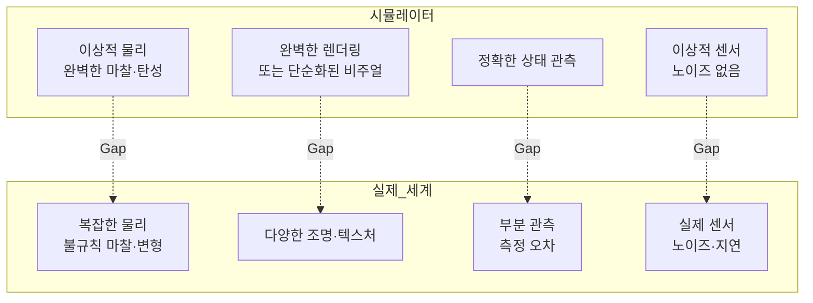
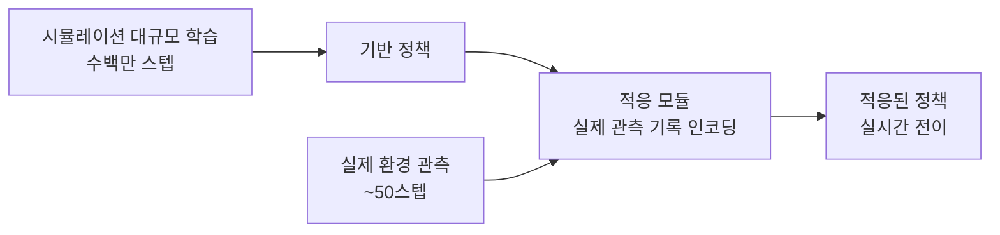
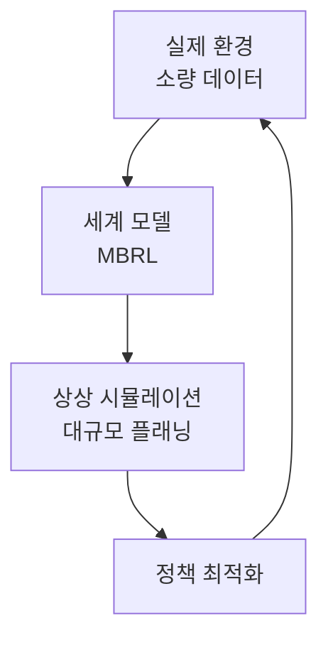

# 로봇 학습 Sim2Real

Sim2Real(Simulation-to-Real Transfer)은 시뮬레이터에서 학습한 로봇 정책을 실제 물리 세계에서 동작하도록 전이하는 기법이다. 실제 로봇 데이터 수집은 느리고 위험하며 비용이 높지만, 시뮬레이터는 빠르고 안전하게 수백만 번의 시도를 허용한다. Sim2Real은 이 두 환경의 차이(Reality Gap)를 극복하는 것이 핵심 과제다.

## Reality Gap의 원인



Reality Gap은 물리적 Gap, 시각적 Gap, 관측 Gap의 세 층위로 나뉜다. 이를 줄이는 방법이 Sim2Real 연구의 핵심이다.

## 핵심 접근 방법

### 1. 도메인 랜덤화 (Domain Randomization)

시뮬레이션 파라미터를 광범위하게 무작위화하여, 실제 세계가 그 분포 안에 포함되도록 강제한다. 정책이 다양한 환경에서 작동하면 실제 세계에서도 동작한다는 가정이다.

```python
# 도메인 랜덤화 예시 (OpenAI Gym 스타일)
def randomize_env(env):
    # 물리 파라미터 랜덤화
    env.set_friction(np.random.uniform(0.3, 1.5))
    env.set_mass(obj, np.random.uniform(0.5, 2.0))
    env.set_gravity(np.random.uniform(9.5, 10.1))
    # 시각 파라미터 랜덤화
    env.set_lighting(np.random.uniform(0.5, 2.0))
    env.set_texture(random.choice(texture_library))
    env.set_camera_noise(np.random.uniform(0, 0.05))
```

**물리 랜덤화**: 마찰 계수, 질량, 탄성, 관절 토크 한계  
**시각 랜덤화**: 텍스처, 조명, 카메라 위치/노이즈, 배경  
**센서 랜덤화**: 측정 노이즈, 지연(latency), 이상값(outlier)

### 2. 시스템 식별 (System Identification)

실제 시스템의 물리 파라미터를 역공학으로 추정하여 시뮬레이터를 보정한다.

- 실제 로봇의 움직임을 관측 → 파라미터 최적화
- Bayesian 최적화 또는 차별화 가능 시뮬레이터(differentiable simulator)를 통한 그래디언트 기반 식별
- [[model-based-rl]]의 세계 모델 학습과 연관

### 3. 적응 방법 (Adaptation Methods)

실제 데이터를 소량 활용하여 시뮬레이션 학습 정책을 빠르게 적응시킨다.

| 방법 | 원리 | 데이터 요구량 |
|------|------|-------------|
| RMA (Rapid Motor Adaptation) | 시뮬레이션 적응 모듈 + 실제 파인튜닝 | 수십~수백 보행 |
| DAGGER | 전문가 교정 + 재귀적 학습 | 중간 |
| 도메인 적응 (UDA) | 적대적 학습으로 도메인 정렬 | 레이블 없는 실제 데이터 |
| Meta-RL | 빠른 적응을 메타 학습 | 소수 사례 |



### 4. 렌더링 현실화 (Photorealistic Simulation)

시뮬레이터 자체를 실제에 가깝게 만드는 방향.

- **Isaac Sim / MuJoCo**: 물리 정확도 향상
- **NeRF/3DGS 기반 시뮬레이터**: 실제 환경 스캔 → 사실적 렌더링 환경 구축
- **Generative Sim**: 확산 모델로 사실적 훈련 이미지 증강

## [[sim2real-transfer]]의 심층 개념

Sim2Real은 [[sim2real-transfer]]라는 더 넓은 전이 학습 개념의 실용적 응용이다.

- **제로샷(Zero-shot) Sim2Real**: 실제 데이터 없이 시뮬레이션 정책 직접 배포
- **퓨샷(Few-shot) Sim2Real**: 소량 실제 데이터로 빠른 적응
- **점진적 Sim2Real**: 시뮬레이션 → 실제 환경의 난이도를 점진적으로 높임

## 로봇 유형별 Sim2Real 과제

| 로봇 유형 | 주요 Challenge | 대표 해결책 |
|----------|---------------|-----------|
| 사족 보행 | 지형 불규칙성, 슬립 | 물리 도메인 랜덤화 + RMA |
| 로봇 손 | 접촉 물리, 변형 | 촉각 센서 모델링 |
| 모바일 조작 | 시각 인식 + 조작 결합 | 시각 랜덤화 + RL |
| 양팔 조작 | 협조 제어, 유연 객체 | 데모 학습 + 모방 |

## [[model-based-rl]]과의 연계

[[model-based-rl]]은 Sim2Real의 접근 방향 중 하나를 제공한다. 실제 환경에서 수집한 데이터로 세계 모델을 학습하고, 그 모델 안에서 정책을 개선한다.



이는 Sim2Real의 반대 방향인 "실제 → 시뮬레이션 → 실제"의 루프를 형성한다.

## 실무 전략 요약

1. **먼저 시뮬레이션에서 완전히 동작 확인** — 시뮬레이터 버그와 알고리즘 버그를 분리
2. **도메인 랜덤화 단계적 도입** — 한 번에 모든 것을 랜덤화하면 학습이 불안정
3. **실제 환경 평가는 조기에** — Gap이 클수록 수정 비용이 기하급수적 증가
4. **적응 데이터를 소량이라도 수집** — 퓨샷 적응이 제로샷보다 훨씬 안정적
5. **시뮬레이터 물리 파라미터 문서화** — 재현성과 비교 실험을 위해 필수

## 관련 문서

- [[sim2real-transfer]] - Sim2Real의 개념적 배경 및 도메인 적응 이론
- [[model-based-rl]] - 세계 모델 기반 내부 시뮬레이션과의 연계
- [[diffusion-policy-robot]] - 실제 로봇 데모 데이터 기반 정책 학습
- [[rdt-1b-bimanual]] - Sim2Real을 적용한 대규모 로봇 파운데이션 모델
