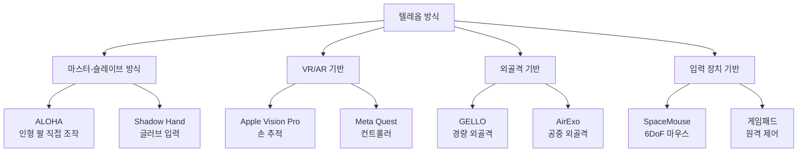
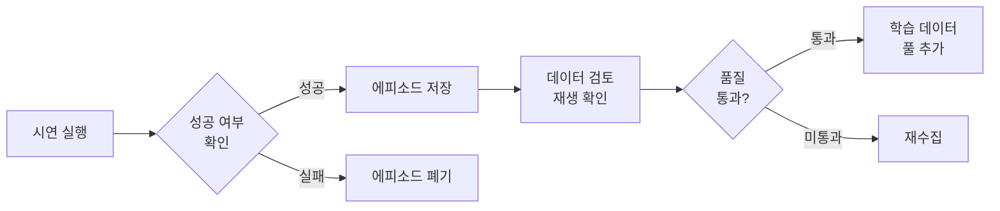

# 로봇 원격조작 데이터 수집 (Robot Teleoperation Data)

## 개요

로봇 원격조작(teleoperation) 데이터 수집은 인간 시연자가 다양한 인터페이스를 통해 로봇을 직접 제어하며 조작 시연을 기록하는 방법이다. 현대 로봇 모방 학습(imitation learning)의 핵심 데이터 공급원으로, 인간의 조작 능숙도와 직관을 로봇 정책에 직접 전달한다.

[[diffusion-policy]], [[action-chunking-transformer]] 등 최신 모방 학습 알고리즘들은 모두 고품질 텔레옵 시연 데이터에 크게 의존한다.

## 텔레옵 방식 분류

## ALOHA 시스템

ALOHA(A Low-cost Open-source Hardware System for Bimanual Teleoperation)는 Stanford 대학이 개발한 저비용 양팔 텔레옵 시스템으로, ACT([[action-chunking-transformer]]) 논문과 함께 발표됐다.

**구성 요소**:
- 마스터 로봇 2개: 시연자가 직접 잡고 움직이는 소형 팔
- 슬레이브 로봇 2개: 마스터 동작을 실시간으로 따르는 실제 작업 팔
- 4개 카메라: 1차 뷰 2개 + 손목 카메라 2개

마스터 팔을 움직이면 슬레이브 팔이 동일하게 따라하며, 모든 관절값과 카메라 영상이 동시 녹화된다.

**비용**: 원본 ALOHA 약 20,000 USD, 이후 저가 버전(SO-100 등)은 수백 달러 수준으로 하락.

## VR 기반 텔레옵

Apple Vision Pro나 Meta Quest를 사용한 VR 기반 텔레옵은 자연스러운 손 동작을 캡처한다.

**장점**:
- 직관적 조작 (물리적 로봇 팔 불필요)
- 공간 인식 능력 활용
- 원거리 원격 조작 가능

**단점**:
- 햅틱 피드백 부재로 접촉력 추정 어려움
- 지연(latency)이 정밀 조작에 영향
- 핸드 트래킹 정확도 한계

## 데이터 수집 품질 관리

고품질 데이터 수집을 위한 실무 원칙:

- **성공 에피소드만**: 실패 시연은 정책을 오염시킨다
- **일관된 속도**: 너무 빠르거나 느린 시연 회피
- **자연스러운 경로**: 인위적으로 최적화된 경로보다 자연스러운 인간 동작
- **다양한 초기 조건**: 물체 위치, 방향, 조명을 변화시켜 다양성 확보
- **오퍼레이터 수**: 가능하면 여러 오퍼레이터가 시연해 다양성 증가

## 데이터 요구량

태스크 복잡도에 따른 일반적인 시연 데이터 요구량 가이드라인이다.

| 태스크 유형 | 권장 에피소드 수 |
|-------------|-----------------|
| 단순 픽-앤-플레이스 | 50-100 |
| 복잡한 단일팔 조작 | 200-500 |
| 양팔 협업 태스크 | 500-1,000 |
| 장기 다단계 태스크 | 1,000+ |

## [[open-x-embodiment]]과의 관계

OXE 데이터셋의 대부분이 텔레옵 방식으로 수집된 데이터다. 22개 기관이 각자의 텔레옵 방식으로 데이터를 수집하고 표준화하여 공유했다. 이는 단일 기관이 수집 가능한 데이터 양의 한계를 뛰어넘는 방법이다.

## 자동 데이터 확장 방법

텔레옵의 비용을 줄이기 위한 보조 기법들이 있다.

- **데이터 증강**: 이미지 변환, 색상 지터링 등 시각 증강
- **궤적 미러링**: 좌-우 대칭 조작 데이터 생성
- **자율 롤아웃**: 학습된 정책이 성공한 에피소드를 추가 데이터로 사용 (DAgger 계열)
- **시뮬레이션 보완**: [[sim2real-transfer]] 기법으로 시뮬레이션 데이터와 혼합

## 관련 문서

- [[diffusion-policy]] - 텔레옵 데이터로 학습하는 핵심 알고리즘
- [[open-x-embodiment]] - 대규모 텔레옵 데이터 통합 프로젝트
- [[action-chunking-transformer]] - 텔레옵 데이터 기반 모방 학습 알고리즘
- [[sim2real-transfer]] - 실제 데이터와 시뮬레이션 데이터 혼합 전략
- [[lerobot-framework]] - 텔레옵 도구를 포함하는 오픈소스 프레임워크
