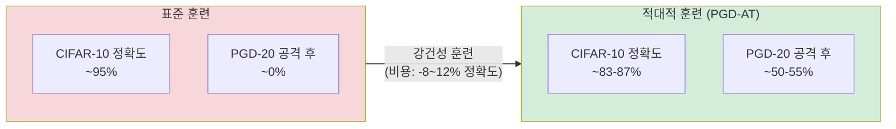

# 강건성-일반화 트레이드오프

강건성-일반화 트레이드오프(Robustness-Accuracy Tradeoff)는 딥러닝 모델에서 **적대적 강건성(adversarial robustness)을 높이면 자연 분포(natural distribution)에서의 정확도가 떨어지는** 현상을 지칭한다. Tsipras et al. (2019)이 이 현상을 이론적으로 분석했으며, [[adversarial-attacks-robustness|적대적 공격 연구]]의 핵심 난제 중 하나다.

## 현상의 직관적 이해

일반 모델은 미묘한 패턴(텍스처, 고주파 성분)을 학습해 분류 정확도를 높인다. 그러나 이러한 패턴들은 인간에게 의미 없어 보여도 모델 예측에 강하게 영향을 주므로, 작은 노이즈 섭동에 취약하다.

[[pgd-adversarial-training|PGD 적대적 훈련(Adversarial Training)]]으로 강건성을 높이면, 모델은 이 취약한 패턴 대신 더 "인간적인" 시맨틱 특징(형태, 구조)에 의존하게 된다. 이는 강건성을 높이지만, 동시에 자연 이미지 분류 정확도의 하락으로 이어진다.

## 이론적 배경

Tsipras et al.은 단순한 데이터 분포에서 이 트레이드오프가 **수학적으로 불가피(inherent)**함을 증명했다.

두 클래스 분류 문제를 가정하자. 클래스 $y \in \{-1, +1\}$에 대해:

$$x = y \cdot \eta + \epsilon$$

- $\eta$: 레이블과 강하게 상관된 단일 특징 (시맨틱)
- $\epsilon$: 레이블과 약하게 상관된 고차원 특징 벡터 (비시맨틱)

자연 정확도를 최적화하면 $\epsilon$을 활용하는 것이 유리하다($\epsilon$의 각 차원이 약간의 정보라도 담고 있으므로). 그러나 $\epsilon$은 섭동에 취약하므로 강건 모델은 $\epsilon$을 무시하고 $\eta$에만 의존하게 된다. 이 선택이 자연 정확도 손실로 이어진다.

## 주요 실험적 증거

CIFAR-10 기준으로 표준 훈련 모델은 자연 이미지에서 95% 정확도를 보이지만 [[pgd-adversarial-training|PGD 공격]]에 거의 무너진다. 적대적 훈련으로 강건성을 50% 이상으로 높이면 자연 정확도가 83-87%로 감소한다.

ImageNet 규모에서는 트레이드오프가 더 심각하다:
| 모델 | ImageNet 정확도 | $\ell_\infty$ 강건성 ($\epsilon=4/255$) |
|------|----------------|----------------------------------------|
| ResNet-50 (표준) | 76.1% | ~0% |
| ResNet-50 (AT) | ~64% | ~30-35% |

## 트레이드오프 곡선 해석

강건성과 정확도의 상충 관계는 단순한 이진 선택이 아니라 **파레토 프론티어(Pareto Frontier)**를 형성한다.

- **$\epsilon$ 크기 증가**: 더 강한 섭동에 견디도록 훈련할수록 정확도 손실이 커진다
- **훈련 데이터 증가**: 데이터가 많아지면 트레이드오프 곡선 자체가 개선된다 (더 적은 정확도 손실로 더 높은 강건성 달성)
- **모델 크기**: 더 큰 모델이 일반적으로 더 유리한 트레이드오프를 보인다

## 트레이드오프를 완화하는 접근법

### 1. 추가 데이터 활용

실제 데이터 또는 생성 모델(GAN, Diffusion)로 만든 합성 데이터를 보강하면 트레이드오프가 완화된다. 특히 반지도 학습(semi-supervised AT) 프레임워크에서 레이블 없는 데이터를 활용하는 연구가 활발하다.

### 2. 증류 기반 방법

일반 모델(teacher)의 지식을 강건 모델(student)에 전달하는 TRADES, ARD 등의 방법이 트레이드오프를 개선한다.

$$\mathcal{L} = \mathcal{L}_{CE}(f(x), y) + \beta \cdot \mathcal{L}_{KL}(f(x) \| f(x^{adv}))$$

TRADES(Zhang et al. 2019)는 자연 손실과 강건성 손실을 분리해 균형 조절 파라미터 $\beta$로 제어한다.

### 3. 인증 가능한 강건성

랜덤화 스무딩(Randomized Smoothing) 등으로 수학적으로 증명 가능한 강건성을 보장하되, 트레이드오프를 명시적으로 정량화한다.

## LLM과 언어 영역에서의 유사 현상

텍스트 적대적 공격(문자 치환, 동의어 교체 등)에서도 유사한 트레이드오프가 관찰된다. RLHF로 정렬된 모델이 표준 벤치마크 성능은 낮아지는 "alignment tax" 현상과 개념적으로 연결된다. 인간 선호도에 맞추면 일부 능력 측면에서 미세한 손실이 발생하는 것이 동일한 구조다.

## 실무 시사점

- **보안 중요 시스템**: 정확도 손실을 감수하고 강건성을 우선해야 함 (의료 이미지 분석, 자율주행 인식 등)
- **일반 서비스**: 자연 정확도 우선이 합리적 — 적대적 공격의 현실적 위협을 고려해 균형점 결정
- **연구 방향**: 트레이드오프의 이론적 하한이 존재하는지, 또는 더 나은 알고리즘으로 극복 가능한지가 핵심 미해결 문제

## 관련 문서

- [[adversarial-attacks-robustness]] - 적대적 공격의 종류와 방어 기법 전반
- [[pgd-adversarial-training]] - 트레이드오프를 직접 유발하는 PGD 기반 적대적 훈련
- [[generalization]] - 일반화 능력의 이론적 배경과 측정
