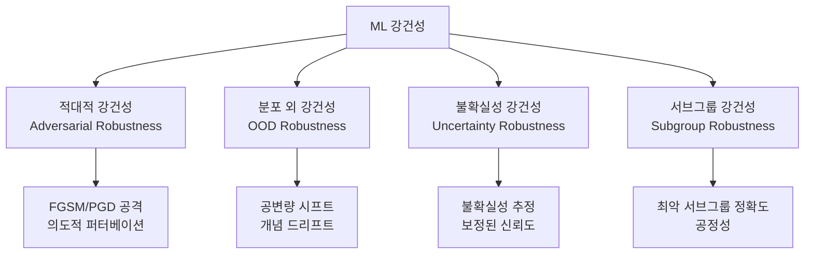
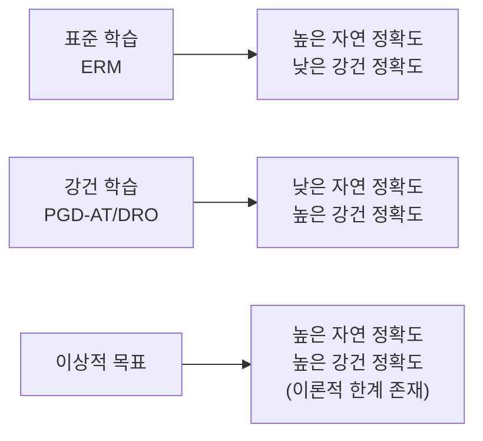

# ML 강건성 (Robustness)

## 개요

강건성(robustness)은 ML 모델이 다양한 방식의 입력 변화나 분포 이탈(distribution shift)에 직면했을 때 안정적으로 동작하는 능력이다. 강건한 모델은 훈련 분포 내에서만이 아니라, 예상하지 못한 입력, 부패(corruption), 의도적 공격 상황에서도 신뢰할 수 있는 예측을 제공한다.

강건성은 단일 개념이 아니라 여러 차원으로 구성된다:

| 강건성 유형 | 위협 | 예시 |
|------------|------|------|
| 적대적 강건성 | 의도적 퍼터베이션 | [[adversarial-attacks]], [[jailbreak-attacks]] |
| 분포 시프트 강건성 | 자연적 분포 변화 | 계절 변화, 카메라 다름 |
| 부패 강건성 | 노이즈, 흐릿함 | JPEG 압축, 가우시안 노이즈 |
| 롱테일 강건성 | 희귀 사례 | 드문 사건, 엣지 케이스 |
| 서브그룹 강건성 | 특정 집단 | 소수 인종, 저자원 언어 |

---

## 강건성의 다양한 차원



위 다이어그램은 ML 강건성의 네 가지 주요 차원을 나타낸다. 각 차원은 서로 다른 위협 모델과 평가 방법을 가진다.

---

## 분포 시프트 (Distribution Shift)

### 개념 정의

분포 시프트(distribution shift)는 학습 분포 $P_{train}(X, Y)$와 테스트/배포 분포 $P_{test}(X, Y)$가 다를 때 발생한다.

세 가지 주요 유형:

**1. 공변량 시프트(Covariate Shift):** 입력 분포가 변하지만 조건부 레이블 분포는 유지
$$P_{train}(X) \neq P_{test}(X), \quad P_{train}(Y|X) = P_{test}(Y|X)$$

예: 낮에 촬영된 이미지로 학습 -> 밤 이미지 테스트

**2. 레이블 시프트(Label Shift):** 레이블 분포가 변하지만 조건부 입력 분포는 유지
$$P_{train}(Y) \neq P_{test}(Y), \quad P_{train}(X|Y) = P_{test}(X|Y)$$

예: 의료 데이터에서 질병 유병률 변화

**3. 개념 드리프트(Concept Drift):** 조건부 레이블 분포 자체가 변함
$$P_{train}(Y|X) \neq P_{test}(Y|X)$$

예: 스팸 필터 - 스팸의 패턴이 시간에 따라 변화

### ImageNet-C / ImageNet-A / ImageNet-R 벤치마크

| 벤치마크 | 설명 | 측정 대상 |
|----------|------|-----------|
| ImageNet-C | 15가지 부패(noise, blur, weather) 적용 | 부패 오류율(mCE) |
| ImageNet-A | 자연적으로 어려운 이미지 | 자연 분포 외 강건성 |
| ImageNet-R | 만화, 회화, 스케치 등 스타일 변화 | 텍스처 편향 측정 |
| ImageNet-Sketch | 스케치 이미지 | 형태(shape) 일반화 |

---

## 적대적 강건성 (Adversarial Robustness)

의도적으로 설계된 퍼터베이션에 대한 내성이다. [[adversarial-attacks]] 페이지에서 공격을, [[adversarial-training]] 페이지에서 방어를 상세히 다룬다.

**핵심 지표: 강건 정확도(Robust Accuracy)**

$$\text{Robust Acc} = \mathbb{E}_{(x,y) \sim \mathcal{D}} \left[ \min_{\delta \in \mathcal{S}} \mathbf{1}[f(x+\delta) = y] \right]$$

표준 정확도와 강건 정확도 사이의 트레이드오프가 이론적으로 증명되어 있다 (Zhang et al., 2019).

---

## 불확실성 추정 (Uncertainty Estimation)

[[uncertainty-estimation|불확실성 추정]]은 강건성의 핵심 구성 요소다. 모델이 자신의 예측에 대한 신뢰도를 정확히 표현할 수 있어야 한다.

### 불확실성의 두 종류

**인식론적 불확실성(Epistemic Uncertainty):** 데이터 부족으로 인한 모델의 무지(ignorance). 더 많은 데이터로 줄일 수 있다.

**우연론적 불확실성(Aleatoric Uncertainty):** 데이터 자체의 내재적 노이즈. 아무리 많은 데이터로도 줄일 수 없다.

```python
import torch
import torch.nn as nn

class MCDropoutModel(nn.Module):
    """몬테카를로 드롭아웃으로 불확실성 추정"""
    def __init__(self, base_model: nn.Module, dropout_rate: float = 0.1):
        super().__init__()
        self.base_model = base_model
        self.dropout = nn.Dropout(p=dropout_rate)

    def forward(self, x: torch.Tensor) -> torch.Tensor:
        return self.dropout(self.base_model(x))

    def predict_with_uncertainty(
        self, x: torch.Tensor, n_samples: int = 50
    ) -> tuple[torch.Tensor, torch.Tensor]:
        self.train()  # 드롭아웃 활성화
        with torch.no_grad():
            predictions = torch.stack([
                torch.softmax(self.forward(x), dim=-1)
                for _ in range(n_samples)
            ])
        mean = predictions.mean(dim=0)
        variance = predictions.var(dim=0)
        return mean, variance
```

---

## 보정 (Calibration)

모델의 예측 신뢰도(confidence)가 실제 정확도와 일치하는 정도다.

**완벽한 보정:** 90% 신뢰도로 예측한 것의 90%가 실제로 맞아야 한다.

### 보정 측정: ECE (Expected Calibration Error)

$$ECE = \sum_{m=1}^{M} \frac{|B_m|}{n} \left| \text{acc}(B_m) - \text{conf}(B_m) \right|$$

- $B_m$: 신뢰도 구간 $m$에 속하는 예측들
- $\text{acc}(B_m)$: 해당 구간의 실제 정확도
- $\text{conf}(B_m)$: 해당 구간의 평균 신뢰도

```python
import numpy as np

def expected_calibration_error(
    confidences: np.ndarray,
    accuracies: np.ndarray,
    n_bins: int = 15
) -> float:
    bin_boundaries = np.linspace(0, 1, n_bins + 1)
    ece = 0.0
    n = len(confidences)

    for i in range(n_bins):
        mask = (confidences >= bin_boundaries[i]) & (confidences < bin_boundaries[i+1])
        if mask.sum() == 0:
            continue
        bin_accuracy = accuracies[mask].mean()
        bin_confidence = confidences[mask].mean()
        bin_weight = mask.sum() / n
        ece += bin_weight * abs(bin_accuracy - bin_confidence)

    return ece
```

### 보정 기법

| 기법 | 설명 | 복잡도 |
|------|------|--------|
| 온도 스케일링(Temperature Scaling) | 소프트맥스 온도 조정 | 매우 낮음 |
| 플랫 스케일링(Platt Scaling) | 시그모이드 교정 | 낮음 |
| 등방 회귀(Isotonic Regression) | 비모수 보정 | 중간 |
| 베이즈 모델 평균(Bayesian Model Averaging) | 후험 분포 통합 | 높음 |

온도 스케일링은 단순하지만 실용적이다:

```python
import torch

class TemperatureScaling(torch.nn.Module):
    def __init__(self):
        super().__init__()
        self.temperature = torch.nn.Parameter(torch.ones(1))

    def forward(self, logits: torch.Tensor) -> torch.Tensor:
        return logits / self.temperature

    def calibrate(self, val_logits: torch.Tensor, val_labels: torch.Tensor) -> float:
        optimizer = torch.optim.LBFGS([self.temperature], lr=0.01, max_iter=50)
        nll = torch.nn.CrossEntropyLoss()

        def eval_fn():
            optimizer.zero_grad()
            loss = nll(self.forward(val_logits), val_labels)
            loss.backward()
            return loss

        optimizer.step(eval_fn)
        return self.temperature.item()
```

---

## 서브그룹 강건성 (Subgroup Robustness)

전체 정확도가 높더라도 특정 서브그룹(소수 집단, 드문 조합)에서 성능이 크게 낮아질 수 있다. 이는 공정성(fairness) 문제와도 밀접히 연결된다.

### Worst-Group Accuracy

Sagawa et al. (2019, DRO)이 제안한 지표. 전체 평균 정확도 대신 가장 성능이 낮은 서브그룹의 정확도를 최적화한다.

$$\min_\theta \max_{g \in \mathcal{G}} \mathbb{E}_{(x,y) \sim P_g} [L(f_\theta(x), y)]$$

### 분산 강건 최적화 (DRO, Distributionally Robust Optimization)

최악 케이스 분포에 대해 최적화하는 일반 프레임워크다.

```python
import torch

def group_dro_loss(
    model_outputs: torch.Tensor,
    labels: torch.Tensor,
    group_ids: torch.Tensor,
    group_weights: torch.Tensor,
    step_size: float = 0.01
) -> torch.Tensor:
    loss_fn = torch.nn.CrossEntropyLoss(reduction='none')
    per_sample_loss = loss_fn(model_outputs, labels)

    n_groups = group_weights.shape[0]
    group_losses = torch.zeros(n_groups)
    for g in range(n_groups):
        mask = group_ids == g
        if mask.sum() > 0:
            group_losses[g] = per_sample_loss[mask].mean()

    # 지수 가중치 업데이트 (최악 그룹에 더 집중)
    group_weights = group_weights * torch.exp(step_size * group_losses.detach())
    group_weights /= group_weights.sum()

    return (group_weights * group_losses).sum(), group_weights
```

---

## 자연 정확도 vs. 강건성 트레이드오프

적대적 강건성뿐 아니라 OOD 강건성, 서브그룹 강건성에서도 자연 정확도와의 트레이드오프가 관찰된다.



이 트레이드오프를 완화하는 접근법:
- **더 많은 데이터**: 충분한 데이터가 있으면 트레이드오프 감소
- **사전학습(Pretraining)**: ImageNet 사전학습 모델이 스크래치보다 트레이드오프 작음
- **증강(Augmentation)**: AugMix, RandAugment, Mixup으로 OOD 강건성 향상
- **앙상블**: 여러 모델 앙상블로 강건성과 정확도 동시 향상

---

## 언어 모델의 강건성

LLM에서 강건성은 추가적인 차원을 가진다.

### 입력 표면 변화에 대한 강건성

동일한 의미의 질문을 다르게 표현했을 때 일관된 답변을 제공해야 한다.

```python
# 동일 의미, 다른 표현 -> 일관된 응답 요구
queries = [
    "파리의 수도는 어디인가요?",
    "파리는 어느 나라의 수도인가요?",
    "프랑스 수도가 파리인가요?",
    "What is the capital of France?"  # 언어 변환
]
```

### 할루시네이션(Hallucination) 강건성

사실과 다른 정보를 자신있게 생성하는 할루시네이션은 LLM 강건성의 핵심 과제다.

- **지식 경계 인식**: 모르면 "모른다"고 해야 함
- **사실 기반 답변**: RAG([[rag]])로 외부 지식을 근거로 사용
- **보정된 신뢰도**: 불확실한 답변에 낮은 신뢰도 표시

### [[jailbreak-attacks|탈옥]]/[[prompt-injection|주입]] 강건성

의도적 공격에 대한 정책 준수 능력. [[adversarial-training]] 기법을 LLM 정렬에 적용해 향상시킨다.

---

## 강건성 향상 기법 요약

| 기법 | 타겟 강건성 | 핵심 아이디어 |
|------|------------|---------------|
| 적대적 학습 | 적대적 | 공격 예시로 학습 |
| AugMix | OOD/부패 | 랜덤 증강 체인 혼합 |
| RandAugment | OOD | 자동 증강 정책 탐색 |
| Mixup / CutMix | OOD | 샘플 보간 |
| 온도 스케일링 | 보정 | 소프트맥스 온도 조정 |
| MC Dropout | 불확실성 | 베이즈 근사 |
| Deep Ensembles | 불확실성 | 앙상블 분산 |
| DRO / JTT | 서브그룹 | 최악 그룹 최적화 |
| 사전학습 + 파인튜닝 | 모든 유형 | 일반화된 표현 사용 |

---

## 벤치마크

### 비전 강건성 벤치마크

| 벤치마크 | 평가 대상 | 주요 지표 |
|----------|-----------|-----------|
| RobustBench | 적대적 강건성 | Robust Accuracy @ ε=8/255 |
| ImageNet-C | 부패 강건성 | mCE (Mean Corruption Error) |
| WILDS | 분포 시프트 (실제) | Worst-group / OOD 정확도 |
| DomainBed | 도메인 일반화 | 도메인 간 평균/최저 정확도 |

### NLP 강건성 벤치마크

| 벤치마크 | 평가 대상 |
|----------|-----------|
| AdvGLUE | 적대적 NLU |
| ANLI | 적대적 NLI |
| CheckList | 언어적 강건성 슬라이스 |
| WildBench | LLM 일반 능력 (다양한 스타일) |

---

## 실무 관점

**왜 중요한가?**
- 프로덕션 모델은 훈련 분포와 다른 입력을 반드시 만남
- 강건성 실패는 예측 불가능한 방식으로 시스템 손상
- 안전 중요 시스템(의료, 자율주행)에서 강건성 실패는 직접적 피해

**강건성 엔지니어링 체크리스트:**
1. 배포 전 ImageNet-C (부패), WILDS (실제 시프트) 등으로 OOD 성능 측정
2. 적대적 강건성이 필요하면 [[adversarial-training]] 적용 및 AutoAttack으로 평가
3. 신뢰도 보정: ECE 측정 후 온도 스케일링 또는 Platt Scaling 적용
4. 중요 서브그룹 식별 후 worst-group 정확도 별도 추적
5. LLM의 경우 동일 의미 다양한 표현에 대한 일관성 테스트 포함
6. 불확실성 추정 기능이 필요한 도메인은 Deep Ensembles 또는 MC Dropout 도입

---

## 관련 문서

- [[adversarial-attacks]] - 적대적 공격 기법 (강건성 평가의 도구)
- [[adversarial-training]] - 적대적 강건성 향상 훈련 기법
- [[out-of-distribution]] - 분포 외 탐지 (OOD 강건성과 밀접)
- [[uncertainty-estimation]] - 불확실성 추정 및 보정 상세
- [[jailbreak-attacks]] - LLM 탈옥 공격 (LLM 강건성 위협)
