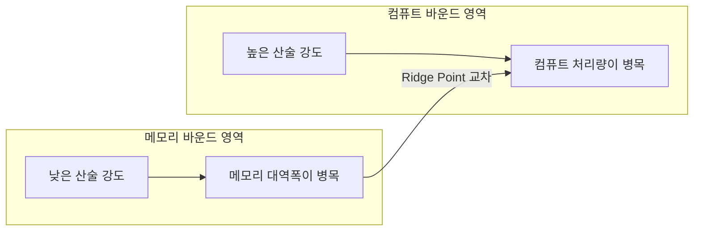
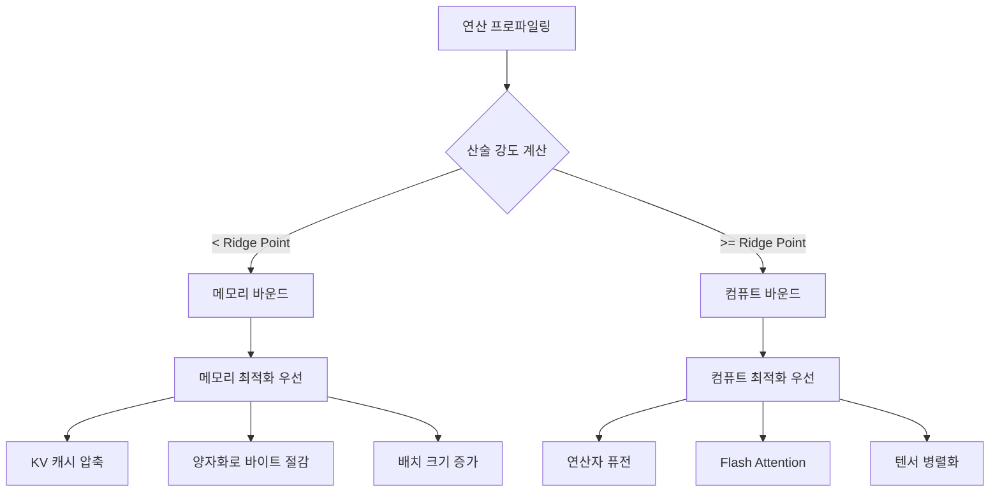

# 루프라인 모델 (Roofline Model)

루프라인 모델(Roofline Model)은 하드웨어의 두 가지 근본 제약 - **컴퓨트 처리량(compute throughput)**과 **메모리 대역폭(memory bandwidth)** - 을 기반으로 특정 연산의 성능 상한을 시각적으로 분석하는 도구다.

ML 추론 최적화에서 루프라인 모델은 "지금 병목이 연산인가, 메모리인가"를 진단하고 어디에 최적화 노력을 집중해야 할지를 명확하게 보여준다.

## 핵심 개념: 산술 강도 (Arithmetic Intensity)

**산술 강도(Arithmetic Intensity, AI)**는 메모리에서 불러온 바이트당 수행한 부동소수점 연산(FLOP) 수다.

$$\text{Arithmetic Intensity} = \frac{\text{FLOPs}}{\text{Bytes}} \quad [\text{FLOP/Byte}]$$

- **높은 산술 강도** = 연산이 많고 메모리 접근이 적음 (예: 대형 행렬 곱)
- **낮은 산술 강도** = 연산은 적고 메모리 접근이 많음 (예: element-wise 연산)

## 루프라인 곡선



루프라인 그래프의 x축은 산술 강도(FLOP/Byte), y축은 달성 가능한 성능(GFLOP/s)이다.

- **메모리 대역폭 상한선**: 기울기 = 메모리 대역폭 (GB/s). 낮은 산술 강도 영역
- **컴퓨트 상한선**: 수평선 = 피크 컴퓨트 (TFLOP/s). 높은 산술 강도 영역
- **Ridge Point**: 두 선이 만나는 지점. 이 값보다 산술 강도가 낮으면 메모리 바운드

### 현대 GPU 대표값 (A100 기준)

| 항목 | 값 |
|------|----|
| FP16 피크 성능 | 312 TFLOP/s |
| HBM2e 대역폭 | 2 TB/s |
| Ridge Point | 312T / 2T = 156 FLOP/Byte |

**의미**: 연산 하나당 156 바이트 미만을 메모리에서 읽는다면 메모리 바운드.

## LLM 추론에서의 적용

LLM 추론은 두 단계로 나뉘며, 루프라인 특성이 크게 다르다.

```mermaid
stateDiagram-v2
    [*] --> Prefill: 입력 토큰 처리
    Prefill --> Decode: KV 캐시 생성 완료
    Decode --> Decode: 자기회귀 생성
    Decode --> [*]: EOS 토큰

    state Prefill {
        description: 높은 산술 강도\n컴퓨트 바운드\nBatch 처리 유리
    }
    state Decode {
        description: 낮은 산술 강도\n메모리 바운드\nKV 캐시 로드가 지배
    }
```

### Prefill 단계

- 모든 입력 토큰을 동시에 처리 (행렬-행렬 곱, 높은 산술 강도)
- **컴퓨트 바운드** - GPU 연산 유닛이 병목
- 최적화: 플래시 어텐션(Flash Attention), 텐서 병렬화

### Decode 단계

- 토큰 1개씩 자기회귀 생성 (행렬-벡터 곱, 낮은 산술 강도)
- [[kv-cache-inference|KV 캐시]] 전체를 매 스텝마다 메모리에서 로드
- **메모리 바운드** - HBM 대역폭이 병목
- 최적화: 배치 증가(batching), KV 캐시 압축, 양자화

### 산술 강도 계산 예시 (LLM Decode)

```python
# 단순화된 Decode 스텝 산술 강도 추정
seq_len = 1024
hidden_dim = 8192
num_layers = 80
bytes_per_param = 2  # FP16

# KV 캐시 로드 바이트 (레이어 × 2(K,V) × 시퀀스 × 차원 × 바이트)
kv_cache_bytes = num_layers * 2 * seq_len * hidden_dim * bytes_per_param

# 연산량 (FFN + Attention per step, 근사)
flops_per_step = 2 * hidden_dim ** 2 * num_layers  # 근사

arithmetic_intensity = flops_per_step / kv_cache_bytes
# 일반적으로 1~10 FLOP/Byte -> 메모리 바운드
```

## 루프라인으로 병목 진단하기



## [[model-serving|모델 서빙]]과의 연계

루프라인 분석은 서빙 시스템 설계에 직결된다.

- **배치 크기**: 배치가 클수록 산술 강도 상승 → 컴퓨트 바운드로 이동
- **연속 배칭(continuous batching)**: 다수 요청을 동적으로 묶어 메모리 바운드 완화
- **투기적 디코딩(speculative decoding)**: 드래프트 모델로 다수 토큰 예측 후 검증 → decode 단계 산술 강도 향상

## 하드웨어 아키텍처 비교

| 하드웨어 | 피크 FLOP (FP16) | 메모리 대역폭 | Ridge Point |
|----------|-----------------|-------------|-------------|
| NVIDIA A100 | 312 TFLOP/s | 2 TB/s | 156 FLOP/Byte |
| NVIDIA H100 | 989 TFLOP/s | 3.35 TB/s | 295 FLOP/Byte |
| Apple M3 Max | ~14 TFLOP/s | 400 GB/s | 35 FLOP/Byte |
| Google TPU v4 | 275 TFLOP/s | 1.2 TB/s | 229 FLOP/Byte |

## 실무 활용

루프라인 분석을 실제로 적용하는 단계:

1. **프로파일링**: `nsys`, `ncu`, `torch.profiler`로 연산별 시간·메모리 측정
2. **산술 강도 계산**: 연산의 FLOPs / 메모리 접근 바이트
3. **루프라인 비교**: 이론적 상한 대비 실제 달성 성능 비율(utilization) 계산
4. **병목 파악 → 최적화 선택**: 메모리/컴퓨트 중 어디에 집중할지 결정

## 관련 문서

- [[model-serving]] - LLM 추론 서빙 아키텍처와 최적화 전략
- [[kv-cache-inference]] - KV 캐시 구조와 메모리 최적화
- [[scaling-laws]] - 모델 크기와 컴퓨트/성능의 관계
