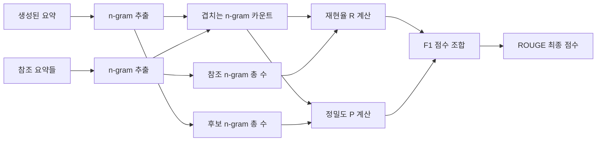
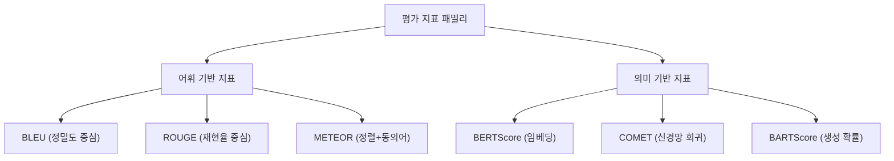

# ROUGE (Recall-Oriented Understudy for Gisting Evaluation)

ROUGE는 자동 요약(automatic summarization) 평가를 위해 2004년 Chin-Yew Lin이 제안한 평가 지표 패밀리다. [[bleu-metric|BLEU]]가 정밀도(precision) 중심인 것과 달리, ROUGE는 **재현율(recall) 중심**으로 설계되었다. 즉, 참조 요약에 포함된 중요 정보가 생성된 요약에 얼마나 포함되어 있는지를 측정한다.

> "ROUGE stands for Recall-Oriented Understudy for Gisting Evaluation. It includes measures to automatically determine the quality of a summary by comparing it to other (ideal) summaries." - Chin-Yew Lin, 2004

## 핵심 개념

### BLEU와의 근본적 차이

요약 평가에서는 정밀도보다 재현율이 더 중요한 경우가 많다. 짧은 요약도 참조의 핵심 내용을 모두 포함하면 좋은 요약이지만, BLEU는 참조 대비 짧은 후보에 불리하게 작동한다. ROUGE는 이 방향을 뒤집어 **참조에서 얼마나 많은 정보를 포착했는가**를 우선적으로 측정한다.

| 항목 | BLEU | ROUGE |
|------|------|-------|
| 기반 방향 | 정밀도 (Precision) | 재현율 (Recall) |
| 주 사용처 | 기계 번역 | 텍스트 요약 |
| 길이 편향 | 짧은 출력에 불리 | 긴 출력에 유리 |
| 표준 변형 | BLEU-4 | ROUGE-1, ROUGE-2, ROUGE-L |

## ROUGE 변형

ROUGE는 단일 지표가 아닌 여러 변형으로 구성된 패밀리다.

### ROUGE-N: n-gram 재현율

$$\text{ROUGE-N} = \frac{\sum_{S \in \text{References}} \sum_{\text{n-gram} \in S} \text{Count}_{\text{match}}(\text{n-gram})}{\sum_{S \in \text{References}} \sum_{\text{n-gram} \in S} \text{Count}(\text{n-gram})}$$

- **ROUGE-1**: 단어(unigram) 수준 겹침. 어휘 포함 여부 측정
- **ROUGE-2**: 2-gram 수준 겹침. 연속된 단어 쌍 포함 여부 측정
- 분모는 참조 요약의 n-gram 총 수, 분자는 매칭된 n-gram 수

**예시:**
- 참조: "고양이가 매트 위에 앉아 있다"
- 후보: "고양이가 매트 위에 있다"
- ROUGE-1: 겹치는 단어 수 / 참조 단어 수

### ROUGE-L: 최장 공통 부분 수열 (Longest Common Subsequence)

LCS(Longest Common Subsequence)를 기반으로 한 변형으로, n-gram이 연속되지 않아도 순서만 맞으면 매칭을 허용한다.

$$R_{LCS} = \frac{LCS(X, Y)}{m}$$
$$P_{LCS} = \frac{LCS(X, Y)}{n}$$
$$F_{LCS} = \frac{(1 + \beta^2) R_{LCS} P_{LCS}}{R_{LCS} + \beta^2 P_{LCS}}$$

여기서 $m$은 참조 길이, $n$은 후보 길이, $\beta$는 재현율과 정밀도의 상대적 가중치다. ROUGE-L은 어순을 고려하되, 연속성은 요구하지 않아 유연성이 높다.

### ROUGE-W: 가중 LCS

연속된 공통 부분 수열에 가중치를 부여하는 변형. 연속된 매칭을 비연속 매칭보다 높게 평가한다.

$$WLCS(X, Y) = f^{-1}\left(\sum_{x_i \in X}\sum_{y_j \in Y} w(c(i, j)) \right)$$

여기서 $c(i,j)$는 $x_i$, $y_j$에서 끝나는 연속 공통 수열의 길이이고 $w$는 가중 함수다. 실무에서는 ROUGE-L보다 덜 사용된다.

### ROUGE-S: Skip-bigram 공통 통계

문장 내에서 임의 간격으로 떨어진 단어 쌍을 bigram으로 간주하여 측정한다. 어순을 유지하면서도 중간 단어를 무시할 수 있어 패러프레이즈에 더 유연하다.

## 계산 흐름



ROUGE는 재현율이 핵심이지만, 실제 보고에서는 재현율(R), 정밀도(P), F1 세 값을 함께 리포팅하는 것이 일반적이다.

## 파이썬 구현 예시

```python
from rouge_score import rouge_scorer

scorer = rouge_scorer.RougeScorer(
    ['rouge1', 'rouge2', 'rougeL'],
    use_stemmer=True
)

reference = "고양이가 매트 위에 앉아 있었다. 개가 쫓아왔다."
candidate = "고양이가 매트 위에 있었다."

scores = scorer.score(reference, candidate)

for metric, score in scores.items():
    print(f"{metric}: P={score.precision:.3f}, R={score.recall:.3f}, F1={score.fmeasure:.3f}")
```

```python
# 다수 참조 문서 평가
from rouge_score import rouge_scorer

def evaluate_summary(candidate: str, references: list[str]) -> dict:
    """여러 참조 요약 대비 후보 요약의 ROUGE 점수를 계산한다."""
    scorer = rouge_scorer.RougeScorer(['rouge1', 'rouge2', 'rougeL'])
    scores = {}
    for ref in references:
        score = scorer.score(ref, candidate)
        for key, val in score.items():
            if key not in scores:
                scores[key] = []
            scores[key].append(val.fmeasure)
    # 참조별 최대값 취득 (ROUGE 표준)
    return {k: max(v) for k, v in scores.items()}
```

## ROUGE 변형별 사용 지침

| 변형 | 측정 내용 | 권장 사용처 |
|------|----------|------------|
| ROUGE-1 | 단어 수준 포함률 | 뉴스 요약, 빠른 스크리닝 |
| ROUGE-2 | 구문 연속성 | 문서 요약, 공식 벤치마크 |
| ROUGE-L | 순서 보존 LCS | 대화 요약, 구조 중요 태스크 |
| ROUGE-W | 연속 패턴 가중 | 세밀한 품질 구분 필요 시 |
| ROUGE-S | Skip-bigram | 패러프레이즈 허용 평가 |

### 벤치마크별 표준

- **CNN/DailyMail**: ROUGE-1, ROUGE-2, ROUGE-L F1 보고가 표준
- **XSum**: ROUGE-1, ROUGE-2, ROUGE-L 보고
- **대화 요약(SAMSum 등)**: ROUGE-1, ROUGE-2, ROUGE-L
- **학술 논문 요약**: ROUGE-1, ROUGE-2만으로 충분한 경우 많음

## 강점과 한계

### 강점

- **직관성**: 참조에서 얼마나 포착했는지 직관적으로 해석 가능
- **요약 특화**: 요약 태스크의 핵심 목표(정보 보존)와 잘 정렬
- **다중 참조 지원**: 여러 참조 요약을 수용하여 표현 다양성 반영
- **계산 효율**: 코퍼스 규모에서 빠른 평가 가능

### 한계

- **의미 무시**: [[bleu-metric|BLEU]]와 마찬가지로 동의어를 인식하지 못함
- **문장 수준 신뢰성 낮음**: 개별 문장보다 코퍼스 수준에서 안정적
- **긴 출력 편향**: 재현율 기반이므로 긴 요약이 짧은 요약보다 유리할 수 있음
- **언어 의존성**: 한국어, 중국어 등 분절 단위가 다른 언어에서 전처리가 중요
- **추상적 요약 평가 부적합**: 원문 단어를 재사용하지 않는 추상적 요약에는 과소평가 경향

## 다른 평가 지표와 비교



위 다이어그램은 주요 자동 평가 지표의 계보를 보여준다. ROUGE는 어휘 기반 지표의 대표적인 재현율 중심 방법이다.

## 실무 활용

### 언제 ROUGE를 쓰는가

- 텍스트 요약 모델의 공식 벤치마크 평가
- 요약 품질의 빠른 자동 스크리닝
- 학술 논문의 기준 지표 (비교 연구)
- 훈련 중 체크포인트 선택

### 함께 사용할 지표

ROUGE 단독으로는 의미적 품질을 포착하지 못한다. 실무에서는:

1. **ROUGE-1/2/L 조합**: 다양한 세밀도에서 어휘 겹침 측정
2. **+ [[bert-score|BERTScore]]**: 의미적 유사도 보완
3. **+ 인간 평가**: 최종 품질 검증 (일관성, 유창성, 사실성)
4. **+ [[ai-evaluation|사실 일관성 지표]]**: FactCC, QAEval 등으로 환각 감지

### 한국어 ROUGE 사용 시 주의사항

한국어는 교착어(agglutinative language)이므로 형태소 분석 후 ROUGE를 계산하는 것이 권장된다.

```python
from konlpy.tag import Okt
from rouge_score import rouge_scorer

def tokenize_korean(text: str) -> str:
    okt = Okt()
    return ' '.join(okt.morphs(text))

reference_tokenized = tokenize_korean("고양이가 매트 위에 앉아 있었다.")
candidate_tokenized = tokenize_korean("고양이가 매트 위에 있다.")

scorer = rouge_scorer.RougeScorer(['rouge1', 'rouge2', 'rougeL'])
scores = scorer.score(reference_tokenized, candidate_tokenized)
```

## 역사적 맥락

ROUGE는 2004년 ACL 워크샵에서 Chin-Yew Lin이 발표한 "ROUGE: A Package for Automatic Evaluation of Summaries"에서 제안되었다. DUC(Document Understanding Conference) 요약 대회에서 사람 평가와의 상관관계 분석을 통해 효과가 입증되었고, 이후 텍스트 요약 평가의 표준 지표로 자리잡았다.

LLM 시대에도 CNN/DailyMail, XSum 등 벤치마크에서 여전히 기본 지표로 활용되나, 추상적 요약 능력이 강해진 최신 LLM에서는 ROUGE의 한계가 더 두드러진다는 연구 결과들이 축적되고 있다.

## 관련 문서

- [[bleu-metric]] - 정밀도 기반 MT 평가 지표, ROUGE의 대응 개념
- [[bert-score]] - 임베딩 기반 시맨틱 유사도 측정
- [[ai-evaluation]] - AI 시스템 평가 개요 및 방법론
