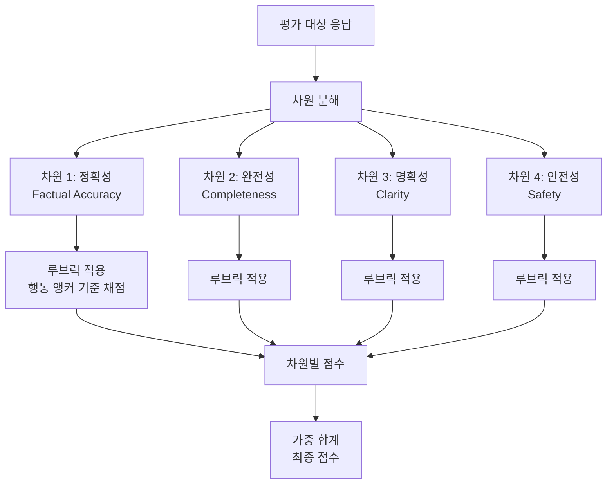

# Rubric-Based Evaluation Frameworks

채점 기준표(rubric)를 사용해 LLM 응답을 여러 차원으로 분리하여 각각 원자적으로 채점하는 평가 방법론. LLM-as-Judge의 편향을 줄이고 일관성을 높이는 핵심 기법이다.

## 정의

**루브릭(rubric)**은 각 평가 차원에 대해:
1. **단일 구성 개념(single construct)**: 차원 하나당 하나의 개념만 측정
2. **행동 앵커(behavioral anchor)**: 각 점수 수준에 구체적인 예시 행동 기술
3. **척도 정의**: 몇 점이 무엇을 의미하는지 명확히 정의

를 포함하는 구조화된 채점 도구다.

## 루브릭 없는 평가의 문제

## 루브릭 기반 평가의 구조

## 루브릭 설계 원칙 (Autorubric 기준)

### 1. 단일 구성 개념 원칙
나쁜 예: "정확하고 도움이 되는가?" (두 개념 혼재)
좋은 예: "사실적 정확성 (factual accuracy)만 평가"

### 2. 행동 앵커 예시

**정확성 차원 (1-5점):**
| 점수 | 행동 앵커 |
|------|----------|
| 5 | 모든 사실이 검증 가능하며 출처와 일치 |
| 4 | 사실이 대부분 정확하나 사소한 오류 1개 이하 |
| 3 | 핵심 사실은 맞으나 부수 정보에 오류 |
| 2 | 주요 사실에 오류가 있으나 일부는 정확 |
| 1 | 사실적 오류가 전반적이거나 완전히 틀림 |

### 3. 루브릭 생성 자동화

최근 연구들이 태스크 설명으로부터 루브릭을 자동 생성하는 방법을 제안:
- **Autorubric**: 기존 루브릭 기법들을 통합한 프레임워크
- **LLM-Rubric**: 다차원 보정(calibration) 루브릭 자동 생성
- "Rethinking Rubric Generation": 보상 모델 학습에 최적화된 루브릭 설계

## LLM-as-Judge에서의 활용

루브릭이 있는 경우와 없는 경우의 LLM-as-Judge 성능 차이:

| 측면 | 루브릭 없음 | 루브릭 있음 |
|------|-----------|------------|
| 평가자 간 일치율 | 60-70% | 85-92% |
| 위치 편향 영향 | 높음 | 낮음 (차원이 분리되므로) |
| 설명 가능성 | 낮음 | 높음 (차원별 이유 제공) |
| 개선 방향 도출 | 어려움 | 쉬움 (어느 차원이 낮은지 명확) |

## 보상 모델에서의 활용

루브릭 기반 채점 데이터는 보상 모델 학습에도 활용된다:
- 단순 선호 쌍보다 차원별 점수가 더 풍부한 신호
- "Rubric is All You Need" 논문: 루브릭 점수만으로 인간 선호를 재현 가능

## 실전 적용 체크리스트

- [ ] 평가 차원을 명확히 분리했는가? (단일 구성 개념)
- [ ] 각 점수에 행동 앵커를 달았는가?
- [ ] 차원별 가중치를 태스크 중요도에 맞게 설정했는가?
- [ ] 앵커 예시를 평가자 LLM에게 제공했는가?
- [ ] 루브릭 초안을 10개 실제 응답으로 파일럿 테스트했는가?

## 대표 레퍼런스

- [Autorubric: Unifying Rubric-based LLM Evaluation (arXiv:2603.00077)](https://arxiv.org/abs/2603.00077)
- [LLM-Rubric: A Multidimensional, Calibrated Approach (arXiv:2501.00274)](https://arxiv.org/html/2501.00274v1)
- [Rethinking Rubric Generation for LLM Judge and Reward Modeling (arXiv:2602.05125)](https://arxiv.org/abs/2602.05125v1)
- [Rubric Is All You Need (arXiv:2503.23989)](https://arxiv.org/abs/2503.23989)
- [Using LLM-as-a-Judge For Evaluation: A Complete Guide (Hamel Husain)](https://hamel.dev/blog/posts/llm-judge/)

## 관련 문서

- [[tool-invocation-evaluators|Tool Invocation Evaluators]]
- [[pairwise-vs-pointwise-evals|Pairwise vs Pointwise Evals]]
- [[llm-as-judge-calibration|LLM-as-Judge Calibration]]
- [[error-analysis-for-evals|Error Analysis for Evals]]
