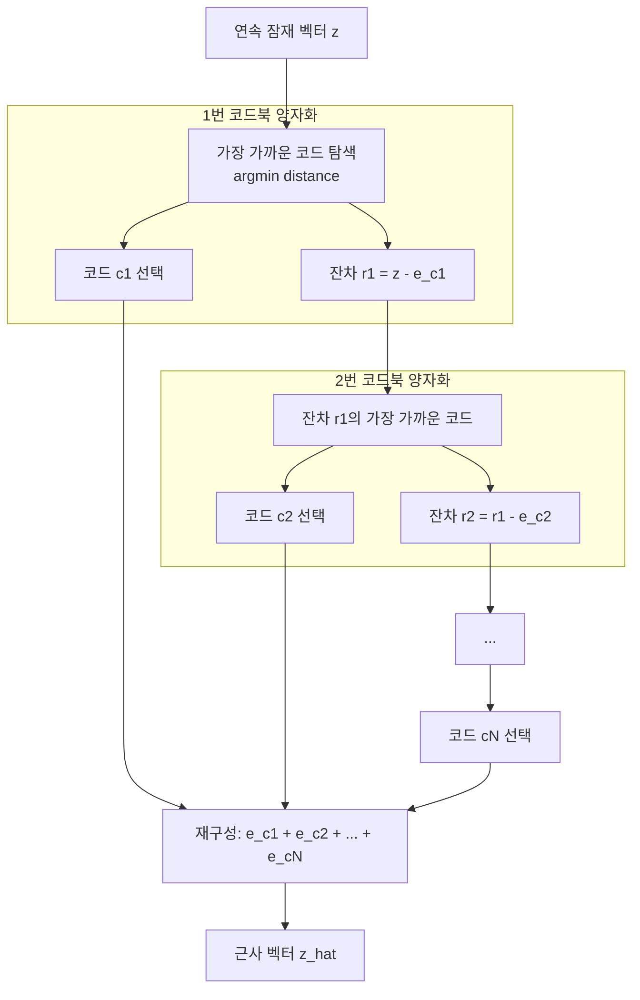

# RVQ (잔차 벡터 양자화, Residual Vector Quantization)

## 개요

RVQ(Residual Vector Quantization)는 연속 벡터를 복수의 이산 코드북으로 순차 근사하는 양자화 기법이다. 단일 코드북으로는 표현하기 어려운 세밀한 정보를 **잔차(residual)를 계층적으로 코딩**함으로써 높은 품질과 낮은 비트레이트를 동시에 달성한다. 오디오 코덱([[encodec-audio-tokenizer]], [[soundstream-neural-codec]]), 이미지 생성([[vq-vae]] 확장), 비디오 압축 등에 폭넓게 사용된다.

## 기본 벡터 양자화(VQ)의 한계

[[vq-vae]]의 기본 VQ는 하나의 코드북으로 연속 벡터를 가장 가까운 코드로 매핑한다.

- 코드북 크기 K가 크면 메모리와 학습 불안정성 증가
- 코드북 크기 K가 작으면 표현력 부족 → 복원 품질 저하
- 단일 코드북으로 다양한 비트레이트를 지원하기 어려움

RVQ는 이 한계를 **여러 작은 코드북의 순차 적용**으로 극복한다.

## RVQ 동작 원리

각 단계에서 이전 근사의 "오류(잔차)"를 다음 코드북이 보정한다. N개 코드북을 사용하면 N개 정수 인덱스 $(c_1, c_2, ..., c_N)$로 벡터를 표현할 수 있다.

## 수학적 표현

입력 벡터 **z**에 대해 N개 코드북 $\{E_1, E_2, ..., E_N\}$을 순차 적용:

$$\hat{z} = \sum_{n=1}^{N} e_{c_n}^{(n)}, \quad c_n = \arg\min_{k} \|r_{n-1} - e_k^{(n)}\|_2$$

- $r_0 = z$ (초기 잔차 = 입력 벡터)
- $r_n = r_{n-1} - e_{c_n}^{(n)}$ (n번 단계의 잔차)
- $e_k^{(n)}$: n번 코드북의 k번째 항목(embedding)

## 비트레이트 유연성

RVQ의 핵심 장점은 **런타임에 코드북 수를 조절**해 비트레이트를 유연하게 제어할 수 있다는 점이다.

| 코드북 수 | 비트레이트 (예: 75fps, 코드북 크기 1024) | 품질 |
|----------|----------------------------------------|------|
| 2 | 2 × 75 × 10 = 1500 bps ≈ 1.5 kbps | 음성 최소 품질 |
| 4 | 3.0 kbps | 음성 적정 품질 |
| 8 | 6.0 kbps | 고품질 음성 |
| 12 | 9.0 kbps | 음악 품질 |

동일 모델로 비트레이트만 달리해 다양한 응용에 대응 가능하다.

## 언어 모델링과의 호환성

RVQ 출력이 언어 모델([[audiolm-framework]], [[valle-zero-shot-tts]])에서 선호되는 이유:

1. **정수 인덱스**: 텍스트 토큰처럼 정수 시퀀스로 표현 가능
2. **계층적 중요도**: 1번 코드(coarse) → N번 코드(fine) 순으로 정보가 중요도 순 배열
3. **예측 가능한 길이**: 고정 프레임률로 가변 길이 오디오의 토큰 수가 예측 가능
4. **분리 예측**: AR 모델(1번 코드)과 NAR 모델(2-N번 코드)로 예측 분리 가능

## [[encodec-audio-tokenizer]]와 [[soundstream-neural-codec]]에서의 구현

두 모델 모두 RVQ를 핵심 양자화 모듈로 사용하되, 코드북 크기와 수는 다르게 설정한다.

- **코드북 크기**: 보통 1024개 항목 (10비트 = 코드북당 10bps@75fps)
- **코드북 업데이트**: EMA(지수이동평균) 기반으로 훈련 중 갱신
- **Commitment loss**: 인코더 출력이 코드에 가까이 유지되도록 $\beta \|z - \text{sg}[e]\|^2$ 항 추가

## 실무 관점

RVQ는 "이산화의 품질-비트 트레이드오프 문제"를 현실적으로 해결하는 핵심 도구다. 오디오 언어 모델을 구축할 때 RVQ 코드북 수는 중요한 하이퍼파라미터가 된다. 코드북 수가 많을수록 복원 품질은 좋아지지만 언어 모델이 예측해야 할 토큰 수가 늘어나 생성 속도가 느려지는 트레이드오프가 있다.

## 관련 문서

- [[vq-vae]] - RVQ의 기반이 된 벡터 양자화 VAE
- [[encodec-audio-tokenizer]] - Meta의 RVQ 기반 오디오 코덱
- [[soundstream-neural-codec]] - Google의 RVQ 기반 오디오 코덱
- [[audiolm-framework]] - RVQ 토큰을 언어 모델로 생성하는 프레임워크
- [[valle-zero-shot-tts]] - RVQ 토큰 기반 TTS 모델
