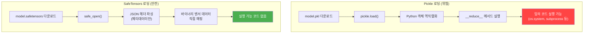
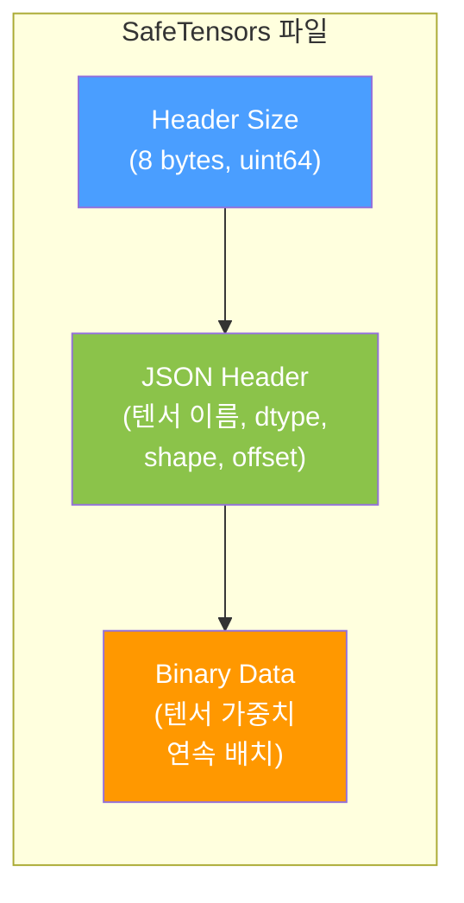

# SafeTensors (세이프텐서)

## 정의

**SafeTensors**는 HuggingFace가 개발한 딥러닝 모델 가중치의 안전한 직렬화 포맷이다. Python의 pickle 포맷이 가진 **임의 코드 실행(arbitrary code execution)** 취약점을 근본적으로 제거하면서, 동시에 빠른 로딩 속도와 메모리 효율성을 제공한다.

2025년 기준 HuggingFace Hub의 **기본 저장 포맷**이며, pickle 방식 저장은 deprecated 상태다. Transformers, Diffusers, MLX, llama.cpp 등 주요 ML 프레임워크가 모두 지원한다.

## 왜 필요한가: Pickle의 보안 문제



PyTorch의 기본 저장 방식인 `torch.save()`는 내부적으로 pickle을 사용한다. pickle은 Python 객체를 바이트 스트림으로 변환하는데, 역직렬화(load) 시 `__reduce__` 메서드를 통해 **임의 Python 코드를 실행**할 수 있다.

HuggingFace Hub에 누구나 모델을 업로드할 수 있는 상황에서, 악의적 pickle 파일이 다운로드한 사용자의 시스템에서 코드를 실행하는 공급망 공격(supply chain attack)이 현실적 위협이 되었다.

## 파일 구조

SafeTensors 파일은 극도로 단순한 구조를 가진다.

```
[8바이트: 헤더 크기 N (little-endian uint64)]
[N바이트: JSON 헤더 (메타데이터 + 텐서 정보)]
[나머지: 바이너리 텐서 데이터 (연속 배치)]
```



### JSON 헤더 예시

```json
{
  "__metadata__": {
    "format": "pt"
  },
  "embedding.weight": {
    "dtype": "F32",
    "shape": [32000, 4096],
    "data_offsets": [0, 524288000]
  },
  "layers.0.attention.wq.weight": {
    "dtype": "BF16",
    "shape": [4096, 4096],
    "data_offsets": [524288000, 557842432]
  }
}
```

헤더에는 각 텐서의 **이름, 데이터 타입, 형태(shape), 바이너리 데이터 내 오프셋**만 포함된다. 실행 가능한 코드나 Python 객체는 원천적으로 배제된다.

## 핵심 장점

### 1. 보안 (Security)

- **순수 데이터 포맷**: JSON 메타데이터 + 원시 바이너리 텐서. 코드 실행 경로가 존재하지 않음
- **엄격한 읽기 전용 설계**: 파일 파싱 시 어떤 Python 코드도 평가하지 않음
- **공급망 공격 방어**: HuggingFace Hub 등 공개 모델 저장소에서의 악성 모델 배포 차단

### 2. 성능 (Performance)

| 연산 | Pickle (PyTorch) | SafeTensors | 개선 |
|------|-----------------|-------------|------|
| CPU 로딩 | 기준 | ~2x 빠름 | 역직렬화 오버헤드 제거 |
| GPU 로딩 | 기준 | ~2-8x 빠름 | zero-copy + mmap |
| 메모리 사용 | 전체 복사 | lazy loading 가능 | 필요한 텐서만 로드 |

- **Zero-copy**: 파일을 메모리에 직접 매핑(mmap)하여 불필요한 복사 제거
- **Lazy loading**: 전체 모델을 로드하지 않고 필요한 텐서만 선택적 접근
- **Tensor slicing**: 텐서의 일부분만 로드 가능 (다중 GPU 분산 시 유용)

### 3. 프레임워크 호환성 (Portability)

동일 파일을 여러 프레임워크에서 로드할 수 있다:

- **PyTorch**: `safetensors.torch`
- **TensorFlow**: `safetensors.tensorflow`
- **JAX/Flax**: `safetensors.flax`
- **PaddlePaddle**: `safetensors.paddle`
- **NumPy**: `safetensors.numpy`
- **Rust**: `safetensors` (네이티브 Rust 구현)

## 사용법

### 저장

```python
import torch
from safetensors.torch import save_file

tensors = {
    "embedding": torch.zeros((2, 2)),
    "attention": torch.zeros((2, 3))
}
save_file(tensors, "model.safetensors")
```

### 로딩

```python
from safetensors import safe_open

tensors = {}
with safe_open("model.safetensors", framework="pt", device="cuda:0") as f:
    for key in f.keys():
        tensors[key] = f.get_tensor(key)
```

### 부분 로딩 (Tensor Slicing)

```python
from safetensors import safe_open

with safe_open("model.safetensors", framework="pt", device="cpu") as f:
    tensor_slice = f.get_slice("embedding")
    vocab_size, hidden_dim = tensor_slice.get_shape()
    # 절반만 로드
    partial = tensor_slice[:vocab_size // 2, :]
```

## 생태계 채택 현황

SafeTensors를 채택한 주요 프로젝트:

| 카테고리 | 프로젝트 |
|----------|---------|
| **HuggingFace** | Transformers, Diffusers, PEFT, Candle, Accelerate |
| **추론 엔진** | llama.cpp (변환), vLLM, TGI, MLX |
| **이미지 생성** | Stable Diffusion WebUI, ComfyUI, InvokeAI |
| **로컬 LLM** | LM Studio, Ollama (내부 변환), GPT4All |
| **학습 프레임워크** | ColossalAI, DeepSpeed |

## SafeTensors vs Pickle vs GGUF

| 특성 | SafeTensors | Pickle (.bin/.pt) | [[gguf-format\|GGUF]] |
|------|-------------|-------------------|------|
| 보안 | 코드 실행 불가 | **임의 코드 실행 가능** | 코드 실행 불가 |
| 속도 | 빠름 (zero-copy) | 보통 | 빠름 (mmap) |
| 양자화 | 미지원 | 미지원 | **내장 (2-8bit)** |
| 토크나이저 | 별도 파일 | 별도 파일 | **내장** |
| 주 용도 | GPU 학습/추론 | 레거시 | CPU/로컬 추론 |
| 프레임워크 | 범용 (PT/TF/JAX) | PyTorch 중심 | llama.cpp 생태계 |
| 분할 저장 | 지원 (sharded) | 지원 | 지원 |

## 분할 저장 (Sharded SafeTensors)

대규모 모델은 단일 파일에 담기 어려우므로, SafeTensors는 분할 저장을 지원한다.

```
model-00001-of-00003.safetensors
model-00002-of-00003.safetensors
model-00003-of-00003.safetensors
model.safetensors.index.json        # 텐서 -> 파일 매핑 인덱스
```

인덱스 파일이 각 텐서가 어느 샤드에 있는지 매핑하며, 다중 GPU 분산 로딩 시 각 GPU가 필요한 샤드만 로드할 수 있다.

## 관련 페이지

- [[gguf-format|GGUF Format]] -- 로컬 추론 특화 양자화 모델 포맷
- [[on-device-llm|On-Device LLM]] -- SafeTensors에서 GGUF로 변환하여 사용하는 맥락
- [[ai-supply-chain-security|AI Supply Chain Security]] -- pickle 공격을 포함한 ML 공급망 보안
- [[huggingface-hub|HuggingFace Hub]] -- SafeTensors의 기본 배포 플랫폼
- [[peft-library|PEFT Library]] -- LoRA 어댑터도 SafeTensors로 저장

## 참고 자료

- HuggingFace, "Safetensors Documentation" -- 공식 문서 및 API 레퍼런스
- GitHub huggingface/safetensors -- 오픈소스 구현 (Rust core + Python 바인딩)
- DeepWiki, "huggingface/safetensors" -- 아키텍처 분석 및 보안 모델 상세
