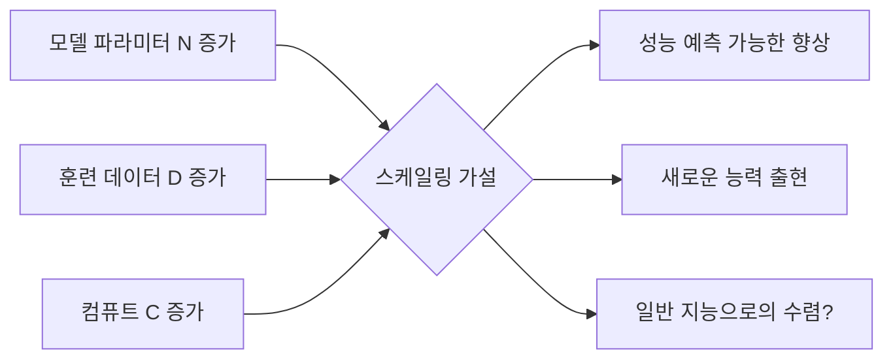
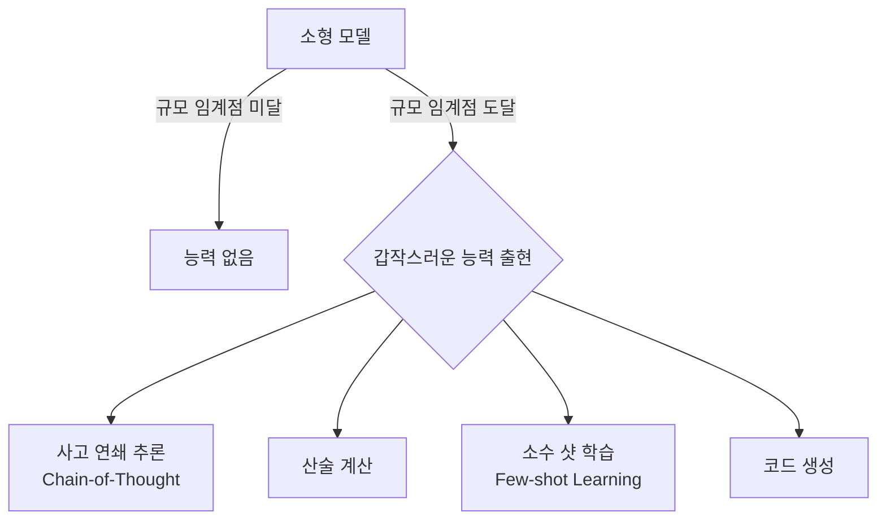
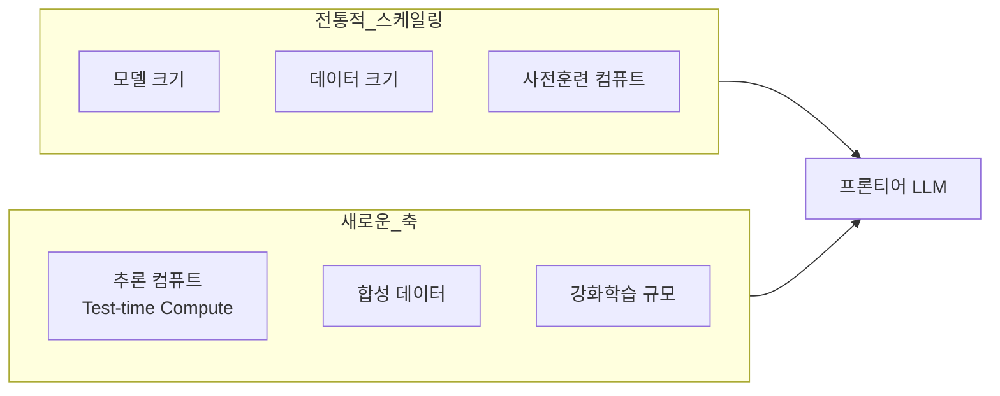

# 스케일링 가설 (Scaling Hypothesis)

스케일링 가설(Scaling Hypothesis)은 AI 연구의 핵심 믿음 중 하나로, **모델 크기, 데이터, 컴퓨트를 충분히 늘리면 현재 알고리즘만으로도 인공지능의 능력이 계속 향상된다**는 주장이다.

이 가설은 GPT-3(2020)의 등장 이후 주류가 되었으며, GPT-4, Claude, Gemini 등 프론티어 모델의 개발 전략을 정당화하는 핵심 논거다. [[scaling-laws|스케일링 법칙(scaling laws)]]이 이 가설의 수학적 근거를 제공하고, [[emergent-abilities|능력 출현(emergent abilities)]]이 가설의 가장 극적인 증거로 제시된다.

## 가설의 핵심 주장

가설을 지지하는 세 가지 관찰:

1. **예측 가능한 성능 향상**: 스케일 증가에 따른 손실 감소가 멱함수(power law)를 따름
2. **능력 출현**: 특정 규모 임계점에서 예상치 못한 새로운 능력이 갑작스럽게 발현
3. **알고리즘 혁신 불필요**: Transformer 아키텍처와 기본 사전훈련으로도 스케일만으로 향상

## 스케일링 법칙과의 관계

[[scaling-laws|Kaplan et al.(2020)의 스케일링 법칙]]은 스케일링 가설에 수학적 근거를 제공한다.

$$L(N) = \left(\frac{N_c}{N}\right)^{\alpha_N}, \quad L(D) = \left(\frac{D_c}{D}\right)^{\alpha_D}, \quad L(C) = \left(\frac{C_c}{C}\right)^{\alpha_C}$$

- $L$: 테스트 손실(낮을수록 좋음)
- $N$: 모델 파라미터 수
- $D$: 훈련 데이터 토큰 수
- $C$: 총 컴퓨트 (FLOPs)
- $\alpha$ 지수: 실험적으로 측정 (약 0.05-0.1 범위)

**Chinchilla 수정(2022)**: DeepMind는 기존 스케일링 법칙이 모델을 과도하게 키우고 데이터는 부족하게 쓰는 방향으로 치우쳤음을 발견. "최적 모델은 파라미터 수와 동일한 수의 토큰으로 훈련해야 한다"고 수정.

## 능력 출현 (Emergent Abilities)

[[emergent-abilities|능력 출현]]은 스케일링 가설의 가장 강력한 근거이자 가장 논쟁적인 현상이다.

### 능력 출현 사례

| 능력 | 출현 규모 (근사) | 설명 |
|------|----------------|------|
| 사고 연쇄 추론 | ~100B 파라미터 | 단계별 추론 가능 |
| 산술 연산 | ~13B 파라미터 | 기본 수학 |
| 다국어 번역 | ~1B 파라미터 | 미학습 언어 쌍 번역 |
| 인컨텍스트 학습 | ~175B 파라미터 | 예시로부터 학습 |

### 능력 출현에 대한 반론

2022-2023년 이후 일부 연구자들은 능력 출현이 환상일 수 있다고 주장한다.

- **측정 지표 인공물**: 이산적(discrete) 평가 지표가 연속적인 개선을 비선형으로 보이게 만듦
- **비선형 지표 효과**: 정확도(accuracy) 지표는 0.45 → 0.55 변화를 0 → 1로 표현

## 스케일링 가설에 대한 시각

### 지지 입장

- OpenAI, Anthropic, Google DeepMind 모두 스케일링이 AGI로 가는 핵심 경로라고 암묵적으로 동의
- GPT-4 → Claude 3 → Gemini Ultra의 단계별 능력 향상이 가설과 일치
- 스케일링 법칙이 실험 전에 결과를 예측하는 데 성공적으로 사용됨

### 회의적 입장

- **수확 체감**: 동일한 성능 향상을 위한 컴퓨트 비용이 기하급수적으로 증가
- **알고리즘 혁신 필요**: 단순 스케일링만으로는 특정 능력(예: 진정한 추론)에 한계
- **데이터 벽**: 고품질 인터넷 텍스트가 곧 소진될 것이라는 우려
- **물리적 한계**: 에너지 소비, 데이터센터 규모의 실질적 제약

## 최근 발전: 스케일링의 새로운 축

2024-2025년에는 전통적인 스케일링(사전훈련 컴퓨트) 외에 새로운 스케일링 축이 등장했다.

- **추론 시 컴퓨트 스케일링(Test-time Compute Scaling)**: o1, o3 등의 "thinking" 모델은 추론 단계에서 더 많은 컴퓨트를 사용하여 성능 향상
- **합성 데이터 스케일링**: 모델이 생성한 합성 데이터로 훈련 데이터 한계 극복 시도
- **RL 스케일링**: 수학, 코드 등 검증 가능한 도메인에서 강화학습 규모 확대

## 컴퓨트 거버넌스와의 연결

스케일링 가설이 맞다면, 대규모 컴퓨트 접근이 곧 AI 능력 접근이다. 이는 [[compute-governance|컴퓨트 거버넌스]]의 핵심 논거가 된다. "누가 얼마나 큰 훈련을 할 수 있는가"가 "누가 가장 강력한 AI를 만들 수 있는가"와 동치가 되기 때문이다.

## 실무적 함의

스케일링 가설을 믿는다면 실무적 전략이 달라진다.

| 믿는다면 | 믿지 않는다면 |
|----------|-------------|
| 데이터·컴퓨트 확보가 최우선 | 알고리즘 혁신에 투자 |
| 일반 목적 모델 훈련 | 도메인 특화 모델 집중 |
| 스케일 예측으로 ROI 계산 | 능력별 맞춤 접근 |
| 장기적 AGI 경쟁에 참여 | 현재 유용한 AI 구축 집중 |

## 관련 문서

- [[scaling-laws]] - 모델 크기·데이터·컴퓨트와 성능의 멱함수 관계
- [[emergent-abilities]] - 규모 임계점에서 갑작스럽게 출현하는 능력
- [[compute-governance]] - 대규모 AI 훈련 컴퓨트에 대한 규제 논의
- [[ai-reasoning-models]] - 추론 컴퓨트 스케일링의 최신 사례
