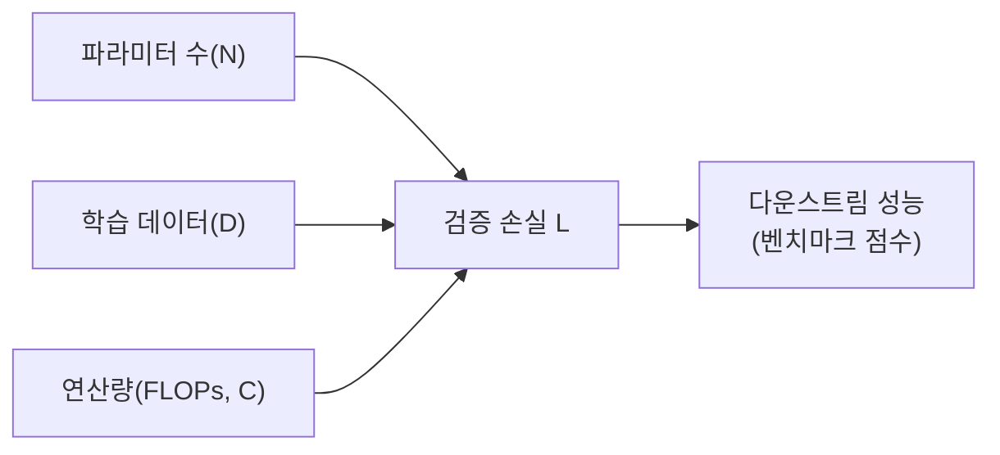
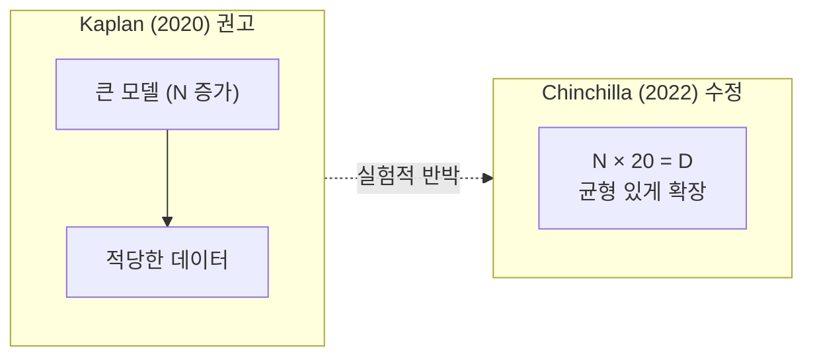
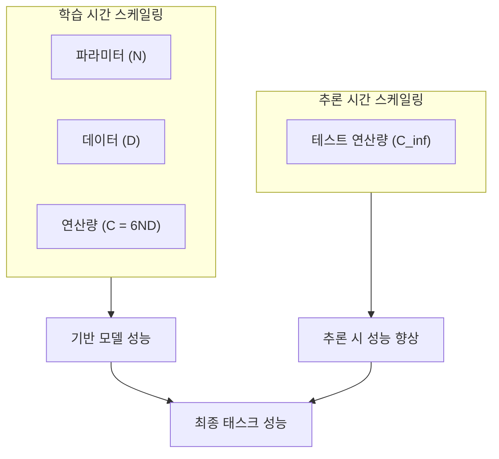
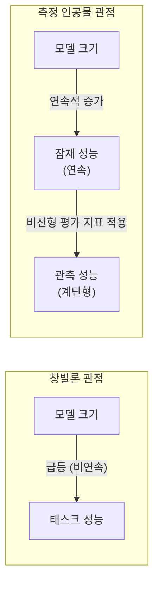

# 스케일링 법칙 (Scaling Laws)

## 개요

스케일링 법칙(Scaling Laws)은 신경망의 성능이 **모델 크기($N$), 데이터 양($D$), 학습 연산량($C$)** 과 어떤 수식적 관계를 갖는지를 설명하는 경험적 법칙이다. 2020년 Kaplan et al.의 선구적 연구 이후, 2022년 Hoffmann et al.의 Chinchilla 논문이 이를 수정·심화하면서 현대 LLM 개발의 핵심 설계 원칙이 되었다.

핵심 통찰은 단순하지만 강력하다: **더 큰 모델, 더 많은 데이터, 더 많은 연산은 예측 가능한 방식으로 성능을 향상시킨다.** 이 예측 가능성이 수십억 달러 규모의 모델 학습 투자를 정당화한다.



---

## 1. Kaplan et al. (2020) - OpenAI 스케일링 법칙

### 핵심 발견

OpenAI 연구팀이 발표한 "Scaling Laws for Neural Language Models" 논문은 다음의 멱함수(power law) 관계를 발견했다:

$$L(N) \approx \left(\frac{N_c}{N}\right)^{\alpha_N}, \quad \alpha_N \approx 0.076$$

$$L(D) \approx \left(\frac{D_c}{D}\right)^{\alpha_D}, \quad \alpha_D \approx 0.095$$

$$L(C) \approx \left(\frac{C_c}{C}\right)^{\alpha_C}, \quad \alpha_C \approx 0.050$$

여기서 $L$은 교차 엔트로피 손실(테스트 퍼플렉서티), $N$은 비임베딩 파라미터 수, $D$는 학습 토큰 수, $C$는 총 FLOPs다.

### 주요 함의 (당시)

1. **모델 크기가 데이터보다 중요**: 주어진 연산 예산에서 모델을 크게 키우고 데이터는 상대적으로 덜 늘리는 것이 최적
2. **수렴까지 학습할 필요 없음**: 손실이 멱함수적으로 떨어지므로 조기 중단해도 예측 가능
3. **아키텍처 세부사항은 덜 중요**: 레이어 수, 헤드 수 등보다 전체 파라미터 수가 더 중요

### 당시의 문제점

Kaplan 논문의 권고대로 GPT-3(175B)가 개발되었으나, 이후 연구에서 **학습 데이터 양이 충분하지 않았다**는 지적이 제기되었다.

---

## 2. Chinchilla (2022) - Hoffmann et al., DeepMind

### 패러다임 수정

"Training Compute-Optimal Large Language Models" 논문은 Kaplan의 결론을 뒤집었다. 더 정밀한 실험 설계로 **모델 크기와 데이터 양이 동등하게 중요**함을 보였다.

**Chinchilla 최적 법칙:**

$$N_{opt} \propto C^{0.50}, \quad D_{opt} \propto C^{0.50}$$

즉, 연산량이 10배 늘면 모델 크기도 ~3.16배, 데이터도 ~3.16배 늘려야 한다. 비율은 **파라미터당 약 20 토큰**.

$$D_{opt} \approx 20 \cdot N_{opt}$$

### 실증적 검증

| 모델 | 파라미터 | 학습 토큰 | Chinchilla 최적비 |
|------|---------|---------|----------------|
| GPT-3 | 175B | 300B | 비최적 (토큰 부족) |
| Gopher | 280B | 300B | 비최적 (토큰 부족) |
| Chinchilla | 70B | 1.4T | **최적** |
| LLaMA 1 (65B) | 65B | 1.4T | 개선됨 |
| LLaMA 2 (70B) | 70B | 2T | 과학습(추론 효율화) |

Chinchilla(70B)는 Gopher(280B)와 동일 연산으로 학습했음에도 성능이 우수했다.



### Chinchilla 이후 업계 변화

- GPT-4: 알려지지 않지만 더 많은 데이터 학습 추정
- LLaMA 계열: 추론 효율을 위해 의도적으로 Chinchilla 초과 학습
- **"과학습 모델"의 합리화**: 추론 시 토큰당 비용을 낮추려면 학습에 더 많은 데이터를 쓰는 것이 합리적

---

## 3. 스케일링의 세 가지 축

### 3.1 파라미터 스케일링 (N)

더 많은 파라미터 = 더 복잡한 패턴 학습 가능. 그러나 단순 확장만으로는 한계가 있다:

- 비선형 활성화 함수 포화
- 최적화 어려움 (큰 모델일수록 학습 불안정)
- 메모리/대역폭 병목

### 3.2 데이터 스케일링 (D)

토큰 수가 증가할수록 모델이 더 다양한 패턴을 학습한다. **데이터 품질도 중요**:

$$L \approx L_{irreducible} + \frac{A}{D^\alpha}$$

$L_{irreducible}$은 인간 언어 자체의 불확실성(엔트로피)으로 줄일 수 없는 손실.

### 3.3 연산량 스케일링 (C)

총 학습 FLOPs. Transformer에서:

$$C \approx 6ND$$

(포워드 패스 + 백워드 패스, 어텐션 플롭스 제외 근사치)

### 3.4 테스트 시간 컴퓨팅 스케일링 (C_inf)

[[reasoning-llm]]과 [[test-time-compute-scaling]]에서 다루는 네 번째 축. 추론 모델은 이를 통해 추가 성능을 얻는다.



---

## 4. 창발적 능력 (Emergent Abilities)

### 개념과 논쟁

2022년 Wei et al.은 특정 모델 크기 임계치를 넘었을 때 **갑자기 등장하는 능력**이 있다고 보고했다. 예:

- 산술 연산: ~100B 이하에서는 거의 0%, 특정 크기 초과 시 갑자기 ~80%
- 4자리 덧셈: 점진적 향상 없이 임계치에서 급등
- BIG-bench 일부 태스크들

이를 두고 두 가지 해석이 충돌한다:

**창발론 (Emergent Abilities Hypothesis)**:
- 양적 확장이 질적 변화를 일으킨다
- 새로운 기능이 예측 불가능하게 나타난다
- 이는 AI 안전 연구에 중요한 함의를 가진다

**측정 인공물 가설 (Schaeffer et al., 2023)**:
- "창발"은 비선형 평가 지표의 인공물
- 선형 또는 정규화 지표로 측정하면 성능은 사실 **연속적으로** 증가한다
- 평가 지표가 0/1 정확도일 때 임계 효과가 나타난 것처럼 보일 뿐



현재 합의: 진정한 창발적 능력이 존재할 수 있지만, 많은 사례는 측정 방법의 문제다.

---

## 5. 법칙의 한계와 최신 논의

### 5.1 데이터 벽 (Data Wall)

인터넷 텍스트 데이터는 유한하다. Chinchilla 최적 비율로 학습하면 2024-2025년 이미 인터넷의 고품질 텍스트를 소진할 수 있다는 추정이 있다. 해결책:

- 합성 데이터(Synthetic Data) 생성
- 멀티모달 데이터로 확장 (이미지, 비디오, 오디오)
- 코드 실행 결과, 시뮬레이션 데이터

### 5.2 미들 웨이트 가설

모든 파라미터가 동등하지 않다. MoE([[mixture-of-experts]])는 **조건부 연산**으로 실질적 파라미터 활성화를 줄이면서 총 파라미터를 늘린다. 이는 전통적 스케일링 법칙에 새로운 변수를 추가한다.

### 5.3 품질 대 양

Llama 3 405B 학습에서 Meta는 **데이터 품질 필터링**이 단순 양 증가보다 더 효과적임을 보고했다. 스케일링 법칙의 $D$는 "토큰 수"가 아니라 "유효 학습 정보량"에 가깝다.

---

## 6. 실무 적용

### 연산 최적 모델 크기 계산

```python
def compute_optimal_model(compute_budget_flops: float) -> dict:
    """
    Chinchilla 법칙 기반 최적 모델 크기와 데이터 양 계산.
    
    Args:
        compute_budget_flops: 총 학습 FLOPs
    
    Returns:
        최적 파라미터 수와 토큰 수
    """
    # Chinchilla 상수 (Hoffmann et al. 2022, Table A3)
    # C = 6ND 근사 사용 시
    # N_opt = (C / (6 * 20))^0.5 = (C/120)^0.5
    import math

    optimal_params = math.sqrt(compute_budget_flops / 120)
    optimal_tokens = 20 * optimal_params

    return {
        "optimal_params": optimal_params,
        "optimal_tokens": optimal_tokens,
        "token_per_param_ratio": optimal_tokens / optimal_params,
    }


# 예시: 1e23 FLOPs (대략 GPT-3 급 학습)
result = compute_optimal_model(1e23)
print(f"최적 파라미터: {result['optimal_params']/1e9:.1f}B")
print(f"최적 학습 토큰: {result['optimal_tokens']/1e12:.2f}T")
```

### 손실-성능 예측

```python
import numpy as np

def predict_loss(n_params: float, n_tokens: float) -> float:
    """
    Chinchilla 손실 예측 (근사).
    실제 상수는 논문의 Table A3 참조.
    """
    # Chinchilla 논문 추정 상수
    A = 406.4
    B = 410.7
    alpha = 0.34
    beta = 0.28
    E = 1.69  # 비환원 손실 (irreducible entropy)

    return E + A / (n_params ** alpha) + B / (n_tokens ** beta)


# 비교: 같은 연산량에서 큰 모델 vs 균형 모델
flops = 1e23
big_model_loss = predict_loss(n_params=175e9, n_tokens=flops / (6 * 175e9))
optimal_loss = predict_loss(n_params=6.7e9, n_tokens=flops / (6 * 6.7e9))
print(f"큰 모델(175B, 적은 데이터): 손실 = {big_model_loss:.4f}")
print(f"균형 모델(6.7B, 많은 데이터): 손실 = {optimal_loss:.4f}")
```

---

## 7. 스케일링 법칙 비교 요약

| 항목 | Kaplan et al. 2020 | Chinchilla 2022 | 최신 관점 (2024+) |
|------|------------------|----------------|----------------|
| 최적 N:D 비율 | N 우선 (D 부족 허용) | N:D ≈ 1:20 | 추론 효율 위해 1:30+ |
| 주요 병목 | 모델 크기 | 균형 확장 | 데이터 품질 |
| 스케일링 한계 | 미언급 | 미언급 | 데이터 벽 우려 |
| 테스트 시간 연산 | 고려 없음 | 고려 없음 | 새로운 축으로 부상 |
| 창발 예측 | 연속적 향상 | 연속적 향상 | 논쟁 진행 중 |

---

## 8. 신경망 스케일링의 직관

### 왜 멱함수인가

언어와 지식의 분포는 **Zipf 분포**를 따른다 — 소수의 패턴이 대부분의 데이터를 설명하고, 나머지는 긴 꼬리다. 모델이 커질수록 꼬리 분포까지 학습하게 되며, 이 과정이 멱함수적 손실 감소로 나타난다.

### 스케일링의 예측 불가능성

스케일링 법칙은 평균적 성능(손실)을 예측하지, **특정 태스크 출현**을 예측하지 않는다. 10배 더 큰 모델이 "더 낮은 손실"을 가질 것은 예측할 수 있지만, "파이썬 코드를 쓸 수 있을 것"은 예측할 수 없다.

---

## 관련 문서

- [[neural-scaling-laws]] - 신경망 스케일링 법칙 수학적 상세
- [[chinchilla-scaling-paper]] - Hoffmann et al. 2022 논문 요약
- [[emergent-abilities]] - 창발적 능력 연구와 논쟁
- [[test-time-compute-scaling]] - 추론 시점 컴퓨팅 스케일링
- [[reasoning-llm]] - 스케일링의 세 번째 축 활용
- [[transformative-ai-impact]] - 스케일링 법칙의 사회적 함의
- [[mixture-of-experts]] - 효율적 파라미터 스케일링 아키텍처
