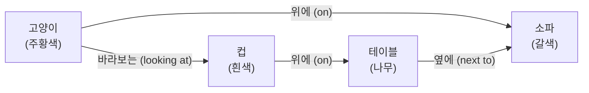
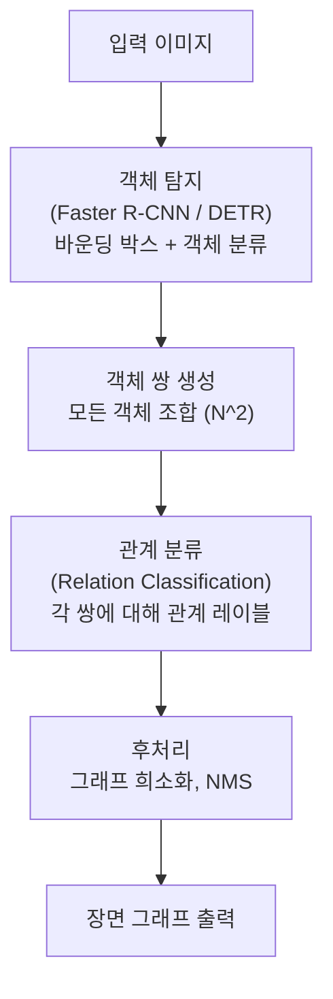
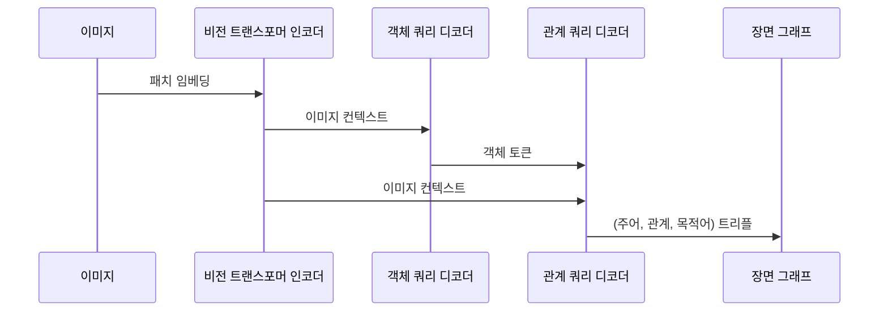

# 장면 그래프 생성 (Scene Graph Generation)

## 개요

장면 그래프(Scene Graph)는 이미지 내 객체(노드)와 객체 간 관계(엣지)를 명시적으로 표현하는 구조화된 그래프다. 장면 그래프 생성(Scene Graph Generation, SGG)은 이미지로부터 이 그래프를 자동으로 추출하는 태스크다.

예를 들어 "고양이가 소파 위에 앉아 있고 소파 옆에 테이블이 있다"는 장면은 다음과 같은 트리플 집합으로 표현된다:
- `(고양이, 위에, 소파)`
- `(소파, 옆에, 테이블)`
- `(고양이, 속성: 주황색)`

[[detr-detection-transformer]] 같은 객체 탐지 모델이 SGG의 기반이 되며, 추출된 장면 그래프는 [[knowledge-graph]] 구축, 이미지 캡셔닝, VQA 등에 활용된다.

## 그래프 구조

### 트리플 표현

장면 그래프의 기본 단위는 `(주어 객체, 관계, 목적어 객체)` 트리플이다.

위 다이어그램이 하나의 장면 그래프다. 노드는 객체(속성 포함), 방향 엣지는 관계를 나타낸다.

## SGG 파이프라인

### 단계별 설명

**1단계 - 객체 탐지**: [[detr-detection-transformer]] 또는 Faster R-CNN으로 이미지 내 모든 객체의 위치와 범주를 감지한다.

**2단계 - 관계 분류**: 탐지된 객체 쌍 $(O_i, O_j)$에 대해 관계 레이블을 예측한다. 관계 수가 많아 클래스 불균형이 심각하다 (예: "위에"가 다른 관계보다 100배 빈번).

**3단계 - 그래프 구성**: 예측된 트리플로 장면 그래프를 구성하고, 낮은 신뢰도의 관계를 필터링한다.

## 주요 모델 및 방법

### Graph-RCNN (2018)

객체 특징을 GCN(Graph Convolutional Network)으로 정제한 후 관계를 예측한다. 객체 간 공간적 관계와 의미적 호환성을 동시에 고려한다.

$$h_i^{(l+1)} = \sigma\left(\sum_{j \in \mathcal{N}(i)} W^{(l)} h_j^{(l)}\right)$$

### Motifs (2018)

이미지 내 객체 배치에 나타나는 통계적 패턴("motifs")을 활용한다. 예를 들어 "사람이 말을 타는" 패턴이 자주 등장하면 이를 사전 지식으로 활용한다.

### Transformer 기반 SGG (2021+)

[[detr-detection-transformer]] 구조를 SGG로 확장한다. 객체 탐지와 관계 예측을 end-to-end로 학습한다.

## 관계 유형과 클래스 불균형

Visual Genome 데이터셋 기준 관계는 50가지 이상이며, 분포가 매우 불균형하다.

| 빈도 | 관계 예시 | 비율 |
|------|-----------|------|
| 매우 높음 | on, has, wearing | ~60% |
| 중간 | holding, near, sitting on | ~25% |
| 낮음 | flying over, painted on | ~10% |
| 매우 낮음 | leaning against, growing on | ~5% |

**롱테일 문제(Long-tail problem)**가 SGG의 핵심 도전 과제다. BGNN(Bipartite Graph Neural Network), RTPB 등 불균형 완화 기법이 연구된다.

## 평가 지표

**Recall@K (R@K)**: 상위 K개 예측 트리플 중 정답이 포함된 비율. K=20, 50, 100이 표준이다.

**Mean Recall@K (mR@K)**: 각 관계 카테고리별 R@K의 평균. 클래스 불균형 영향을 줄인 평가다.

**SGDet (Scene Graph Detection)**: 객체 탐지 + 관계 분류를 동시에 평가. 가장 어려운 설정이다.

## 응용 분야

**이미지 검색**: "소파 위에 앉은 고양이" 같은 관계 기반 쿼리 처리. 단순 키워드보다 정밀한 의미 검색이 가능하다.

**이미지 캡셔닝 품질 개선**: 장면 그래프로 관계 정보를 명시적으로 제공해 더 정확한 캡션을 생성한다.

**VQA 추론 보조**: 질문이 공간 관계를 묻는 경우 장면 그래프가 답변 근거를 제공한다.

**[[knowledge-graph]] 구축**: 시각 데이터로부터 자동으로 트리플을 추출해 KG를 확장한다.

**로봇 조작**: 로봇이 "컵 옆에 있는 접시"를 인식하고 조작 계획을 수립하는 데 활용된다.

## 실무 적용 관점

**왜 중요한가**: 이미지 내 "무엇이 있는가"를 넘어 "어떤 관계를 맺고 있는가"를 이해하는 것은 고차원 시각 추론의 핵심이다. 장면 그래프는 이 정보를 기계가 처리 가능한 구조화된 형태로 제공한다.

**실무에서 어떻게 쓰이나**:
- 이커머스 이미지 검색: 착용 관계, 스타일 관계 기반 검색
- 자율주행: 도로 위 객체 간 관계(앞/뒤, 좌/우, 차선 내/외) 분석
- 보안 카메라: 이상 행동 탐지 (사람이 물건을 "숨기는" 관계)

## 관련 문서

- [[detr-detection-transformer]] - 장면 그래프 생성의 기반이 되는 객체 탐지 모델
- [[knowledge-graph]] - 장면 그래프로 구축되는 지식 그래프
- [[knowledge-graph-construction]] - 텍스트 기반 지식 그래프 구축과 비교
- [[visual-question-answering]] - 장면 그래프를 활용하는 VQA 추론
