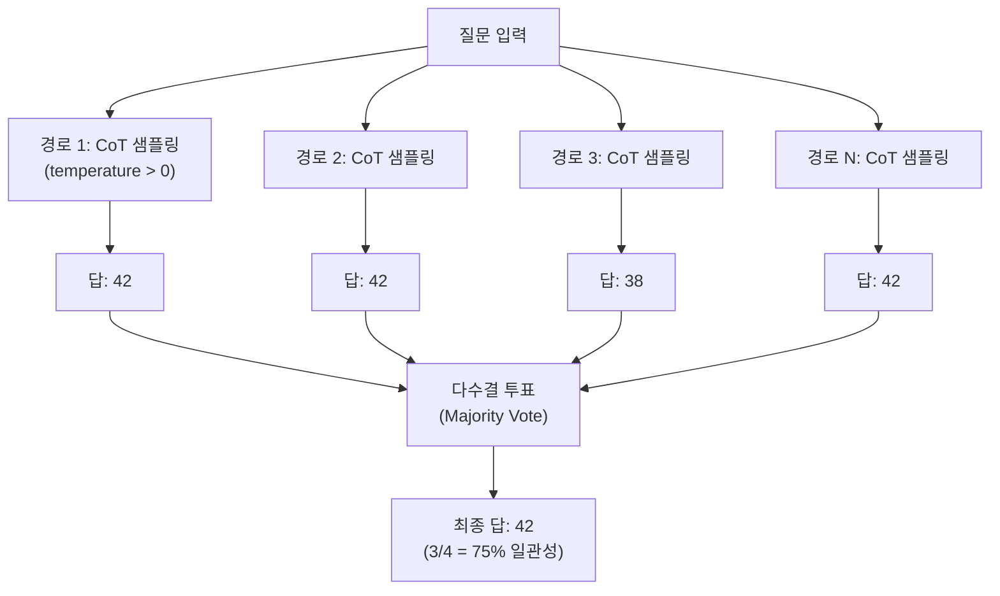
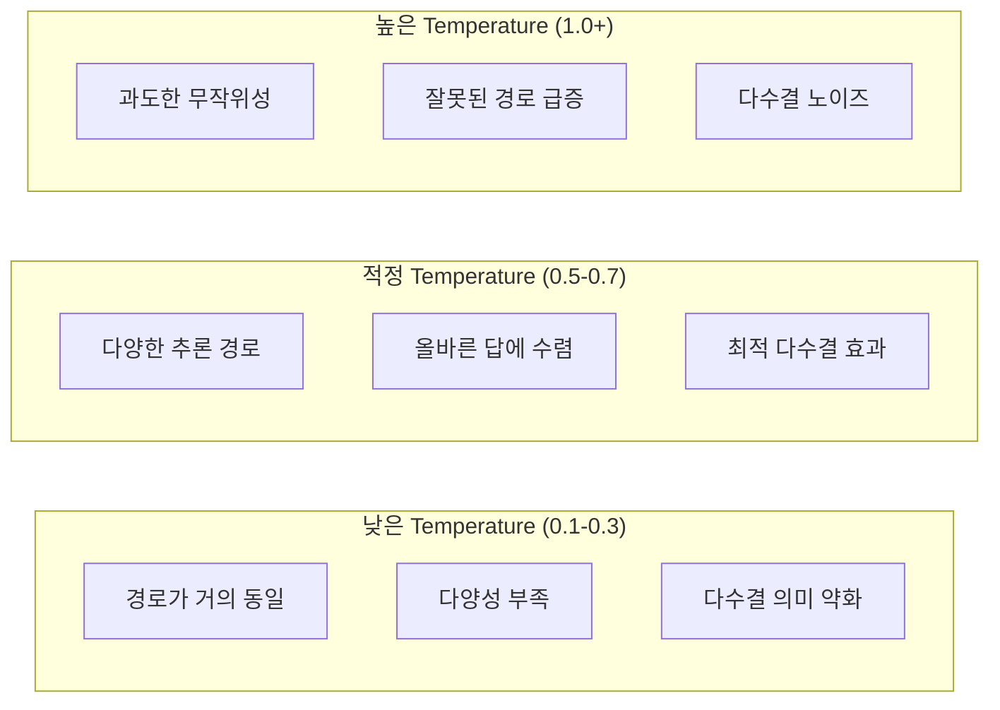

# Self-Consistency Decoding (자기 일관성 디코딩)

## 정의

**Self-Consistency(자기 일관성)**는 Wang et al. (2022)이 "Self-Consistency Improves Chain of Thought Reasoning in Language Models"에서 제안한 디코딩 전략이다. 핵심 아이디어는 단순하다: 동일한 질문에 대해 **다수의 Chain-of-Thought(CoT) 추론 경로를 샘플링**한 뒤, 최종 답변에 대해 **다수결 투표(majority vote)**로 가장 일관된 답을 선택한다.

이 접근은 "복잡한 추론 문제에는 올바른 답에 도달하는 경로가 여러 개 존재한다"는 직관에 기반한다. 하나의 greedy 경로만 따르면 중간에 오류가 발생했을 때 복구할 수 없지만, 여러 경로를 동시에 탐색하면 다수의 경로가 수렴하는 답이 올바를 확률이 높다.

## 핵심 메커니즘

위 다이어그램은 Self-Consistency의 전체 흐름을 보여준다. 질문 하나에 대해 N개의 독립적인 추론 경로를 생성하고, 각 경로의 최종 답을 모아 다수결로 선택한다.

### 알고리즘 단계

1. **프롬프트 구성**: [[chain-of-thought|CoT]] 프롬프트(few-shot 또는 zero-shot)를 준비한다
2. **다중 샘플링**: temperature를 0보다 큰 값(보통 0.5-1.0)으로 설정하여 동일 프롬프트에서 N개의 응답을 생성한다
3. **답변 추출**: 각 응답에서 최종 답변만 파싱한다 (중간 추론 과정은 투표에 사용하지 않음)
4. **다수결 집계**: 가장 많이 등장한 답변을 최종 출력으로 선택한다

## 왜 Greedy보다 우수한가

[[decoding-strategies|Greedy decoding]]은 매 토큰에서 최고 확률 토큰만 선택하므로, 추론 초반에 잘못된 방향으로 진입하면 전체 답이 틀어진다. Self-Consistency는 이 문제를 다양성(diversity)으로 해결한다.

| 방식 | 경로 수 | 다양성 | 오류 복원력 |
|------|---------|--------|------------|
| Greedy (T=0) | 1 | 없음 | 없음 |
| CoT + Greedy | 1 | 없음 | 없음 |
| Self-Consistency | N (보통 5-40) | temperature로 제어 | 다수결로 이상치 제거 |

### Wang et al. (2022) 실험 결과

GSM8K(초등 수학) 벤치마크에서의 성능 비교:

| 모델 | Greedy CoT | Self-Consistency (40 경로) | 향상폭 |
|------|-----------|---------------------------|--------|
| PaLM 540B | 56.5% | **74.4%** | +17.9%p |
| GPT-3 (code-davinci-002) | 65.6% | **78.7%** | +13.1%p |
| UL2 20B | 16.8% | **25.5%** | +8.7%p |

산술 추론(MultiArith, SVAMP), 상식 추론(CommonsenseQA, StrategyQA), 기호 추론 등 다양한 벤치마크에서 일관되게 greedy CoT를 상회했다.

## Temperature 다양화의 역할

Self-Consistency에서 temperature는 핵심 하이퍼파라미터다. [[decoding-strategies|디코딩 전략]]에서 temperature가 확률 분포의 날카로움을 조절하듯, 여기서는 **추론 경로의 다양성**을 조절한다.

이 다이어그램은 temperature 설정에 따른 Self-Consistency의 효과 변화를 보여준다. 너무 낮으면 경로가 거의 동일하여 다수결의 이점이 사라지고, 너무 높으면 잘못된 추론이 과도하게 발생한다.

실무에서 temperature 0.5-0.7이 가장 균형 잡힌 결과를 보인다. 이 범위에서 모델은 동일한 문제에 대해 서로 다른 접근법(예: 방정식을 세우는 방법 vs 역추적하는 방법)을 시도하면서도, 최종 답은 올바른 값으로 수렴하는 경향이 있다.

## 앙상블 관점에서의 이해

Self-Consistency는 본질적으로 **추론 경로에 대한 앙상블(ensemble)**이다. 전통적 머신러닝에서 여러 모델의 예측을 결합하여 단일 모델보다 나은 성능을 달성하는 것과 같은 원리가 작동한다. 차이점은 여러 모델 대신 **하나의 모델에서 확률적 샘플링으로 다양성을 확보**한다는 것이다.

이는 Random Forest에서 bootstrap sampling + 다수결 투표로 개별 decision tree보다 나은 성능을 달성하는 패턴과 구조적으로 유사하다.

## 한계와 비용 트레이드오프

### 비용 문제

Self-Consistency의 가장 큰 약점은 **추론 비용이 N배로 증가**한다는 점이다. 40개 경로를 샘플링하면 API 비용도 40배가 된다.

| 경로 수 | GSM8K 정확도 (PaLM 540B) | 비용 배수 | 한계 수익 |
|---------|-------------------------|----------|----------|
| 1 (greedy) | 56.5% | 1x | - |
| 5 | ~68% | 5x | 높음 |
| 10 | ~71% | 10x | 중간 |
| 20 | ~73% | 20x | 낮음 |
| 40 | 74.4% | 40x | 매우 낮음 |

경로 수가 늘어날수록 정확도 향상의 한계 수익이 체감한다. 실무에서는 5-10개 경로가 비용 대비 가장 효율적인 구간이다.

### 적용 한계

- **개방형 생성 태스크에는 부적합**: 요약, 번역 등 정답이 하나로 수렴하지 않는 과제에서는 다수결 투표가 의미를 잃는다
- **답변 형식 파싱 필요**: 각 경로에서 최종 답변을 정확히 추출해야 하므로, 자유 형식 응답에서는 파싱 오류가 발생할 수 있다
- **모든 경로가 틀리면 무력**: 모델 자체의 능력 한계를 넘는 문제에서는 아무리 많이 샘플링해도 올바른 답이 나오지 않는다

## 발전과 변형

### Universal Self-Consistency (USC)

Chen et al. (2023). 다수결 투표 대신 **LLM 자체가 여러 답변을 보고 가장 일관된 답을 선택**하도록 한다. 정답 형식이 정형화되지 않은 개방형 문제에도 적용 가능하다.

### Self-Consistency + Process Reward Models

[[test-time-compute-scaling|테스트 시점 컴퓨팅 스케일링]]의 맥락에서, 단순 다수결 대신 **프로세스 보상 모델(PRM)**이 각 경로의 추론 품질을 평가하여 가중 투표하는 방식이 연구되고 있다. 이는 Self-Consistency의 "모든 경로를 동등하게 취급한다"는 한계를 보완한다.

### Best-of-N Sampling과의 관계

Best-of-N은 N개 샘플 중 보상 모델 점수가 가장 높은 것을 선택하는 방식이다. Self-Consistency는 보상 모델 없이 답변의 빈도만으로 선택하므로, 추가 모델 없이도 적용 가능하다는 장점이 있다.

## 실무 가이드라인

1. **수학/논리 추론**: Self-Consistency가 가장 효과적인 영역. 5-10개 경로 권장
2. **분류/선택형 태스크**: 답이 소수의 선택지 중 하나인 경우 적합
3. **코드 생성**: 실행 결과로 정답 여부를 검증할 수 있으므로, 다수결 대신 실행 기반 검증이 더 효과적
4. **비용 민감 환경**: 3-5개 경로로 시작하여 정확도 향상을 측정한 후 경로 수를 조절
5. **추론 모델(o1/o3)**: 이미 내부적으로 다중 경로를 탐색하므로, 외부 Self-Consistency의 추가 효과가 제한적

## 관련 문서

- [[chain-of-thought]] -- Self-Consistency의 기반이 되는 추론 기법
- [[decoding-strategies]] -- temperature 및 디코딩 전략의 전체 맥락
- [[test-time-compute-scaling]] -- 추론 시점 컴퓨팅 확장의 넓은 프레임워크
- [[ai-reasoning-models]] -- 내부적으로 다중 경로를 탐색하는 추론 모델
- [[process-reward-models]] -- Self-Consistency와 결합 가능한 단계별 보상 모델
