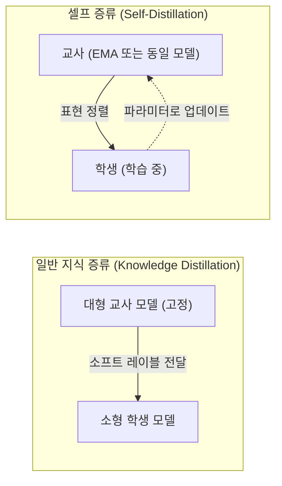
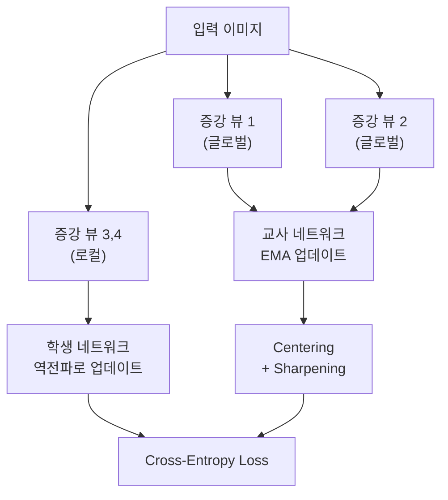
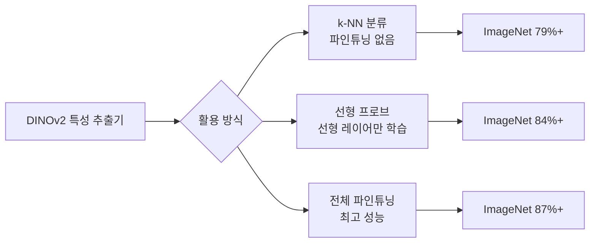

# 셀프 증류 (Self-Distillation)

## 개요

셀프 증류(self-distillation)는 **동일한 모델 아키텍처** 혹은 **같은 모델의 다른 버전**이 서로 교사(teacher)와 학생(student) 역할을 하며 자기 지도 학습(self-supervised learning)을 수행하는 패러다임이다. 일반적인 [[knowledge-distillation-theory]]가 서로 다른 크기의 교사-학생 모델을 사용하는 것과 달리, 셀프 증류는 외부 레이블이나 별도의 강한 교사 모델 없이 스스로 표현을 개선한다.

## 일반 지식 증류와의 차이

핵심 차이는 교사 모델이 외부에서 주어지는 것이 아니라, 학생 모델 자신(또는 그의 지수 이동 평균, EMA)이 교사 역할을 한다는 점이다.

## 핵심 메커니즘

### EMA 교사 (Exponential Moving Average Teacher)

학생 모델의 파라미터를 지수 이동 평균으로 추적해 교사 모델을 유지한다:

$$\theta_{\text{teacher}} \leftarrow m \cdot \theta_{\text{teacher}} + (1-m) \cdot \theta_{\text{student}}$$

모멘텀 $m$은 보통 0.996~0.9999로 설정해 교사가 느리게 변화하도록 한다. 이 느린 업데이트 덕분에 교사가 학생에게 안정적인 학습 신호를 제공한다.

### 붕괴 방지 (Collapse Prevention)

셀프 증류의 최대 위험은 **모드 붕괴(mode collapse)**: 학생이 상수 출력을 내도 교사와 일치하게 되는 퇴화 해. 이를 방지하는 메커니즘이 각 방법마다 다르다:

| 방법 | 붕괴 방지 전략 |
|------|-------------|
| BYOL | Stop-gradient + BN (배치 정규화) |
| DINO | Centering + Sharpening |
| SimSiam | Stop-gradient |
| DINOv2 | Sinkhorn-Knopp 정규화 |

## DINO: 비전 트랜스포머의 셀프 증류

DINO(Self-DIstillation with NO labels, Caron et al. 2021)는 ViT(Vision Transformer)에 셀프 증류를 적용해 레이블 없이도 강력한 시각 표현을 학습한다.

### 멀티 크롭 전략

- 큰 이미지 패치(global view) 2개 + 작은 패치(local view) 여러 개 생성
- 교사는 글로벌 뷰만, 학생은 모든 뷰를 처리
- "전체를 본 교사가 부분만 본 학생을 지도"하는 구조

### Centering + Sharpening

- **Centering**: 교사 출력에서 배치 평균을 빼서 특정 차원 지배를 방지
- **Sharpening**: 낮은 온도로 교사 출력을 날카롭게 해 정보량 증가

## DINOv2: 대규모 데이터로 강화

[[dinov2]](Oquab et al. 2023)는 DINO를 발전시켜:

- 대규모 큐레이션 데이터셋 LVD-142M(1.42억 장) 사용
- iBOT(이미지 마스킹 토큰 예측)와 DINO를 결합한 멀티 태스크 학습
- 더 큰 배치 크기와 개선된 정규화

결과적으로 DINOv2의 표현은 **파인튜닝 없이 k-NN 분류기만으로도** 기존 지도 학습 모델에 필적하는 성능을 보였다.

## LLM 맥락에서의 셀프 증류

셀프 증류 개념은 LLM 학습에도 확장되고 있다:

- **Self-Play Fine-Tuning(SPIN)**: 이전 버전의 모델이 생성한 데이터로 현재 모델을 파인튜닝
- **Constitutional AI**: 모델이 자신의 출력을 비판하고 개선하는 반복 루프
- **Speculative Decoding의 학습 응용**: 소형 드래프트 모델과 대형 모델 간 표현 정렬

[[knowledge-distillation-theory]]와 달리 외부 강사 없이 모델이 자기 개선 루프를 형성한다는 점에서 에이전트적 관점과도 연결된다.

## 관련 문서

- [[knowledge-distillation-theory]] - 지식 증류의 일반 이론
- [[dinov2]] - DINOv2 모델 상세 분석
- [[self-supervised-learning]] - 레이블 없는 표현 학습 전반
- [[vision-transformer]] - ViT 구조와 DINO의 관계
