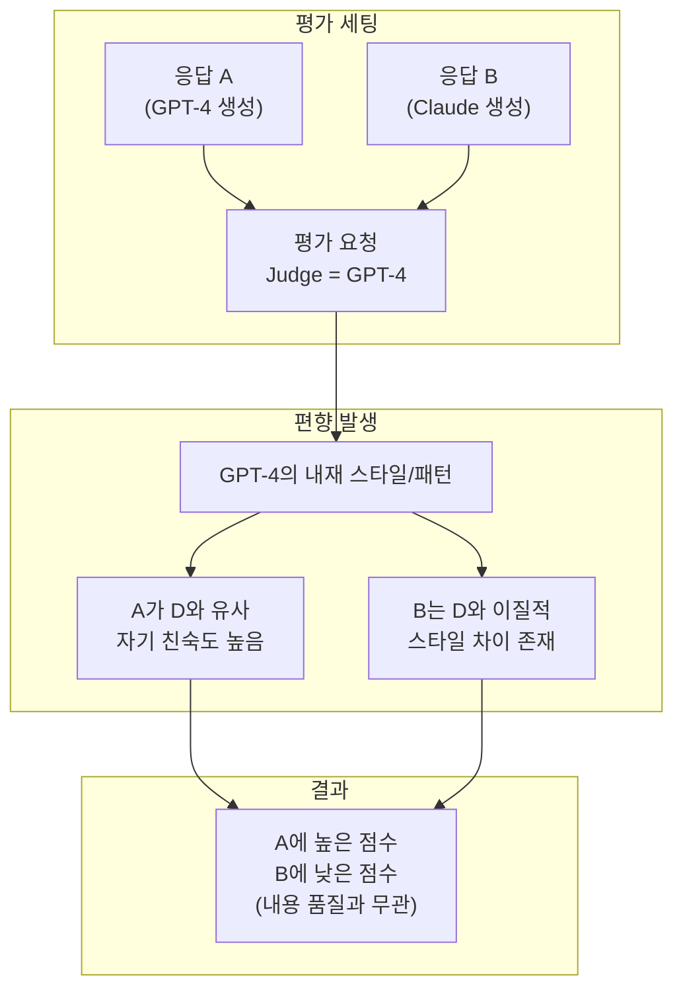
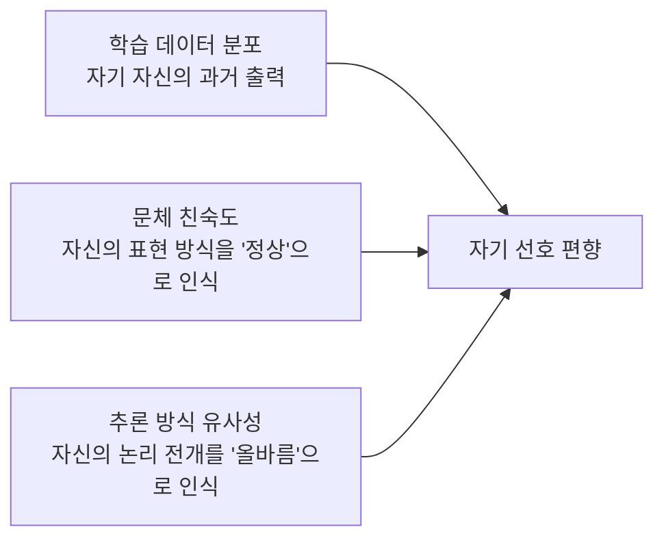
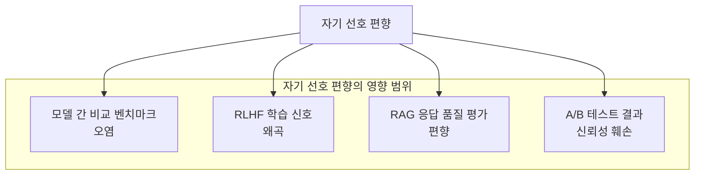
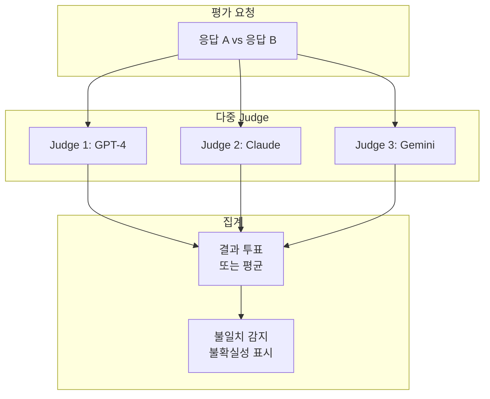
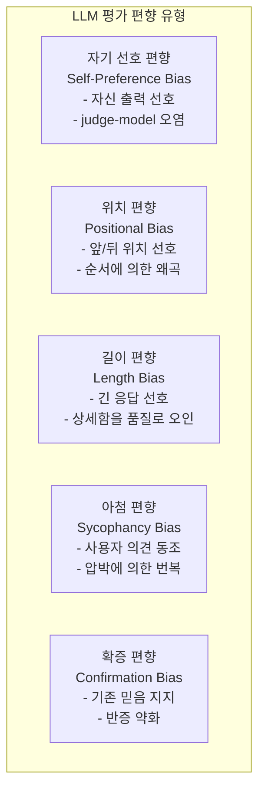

# LLM 자기 선호 편향 (Self-Preference Bias)

## 정의 / 본질

자기 선호 편향(self-preference bias)이란 LLM을 평가자(judge)로 사용할 때, **평가 대상 응답이 자신이 생성했을 법한 스타일과 내용일수록 더 높게 평가하는 경향**을 말한다. 쉽게 말해 "내가 쓴 것처럼 생긴 답변이 더 좋다"고 판단하는 편향이다.

이 현상은 LLM-as-Judge(LLM을 평가자로 사용하는 패러다임)가 보편화되면서 주목받기 시작했다. GPT-4로 GPT-4의 출력물을 평가하거나, Claude로 Claude의 출력물을 평가할 때 다른 모델의 출력물에 비해 체계적으로 높은 점수를 줄 수 있다는 문제다.

---

## 핵심 아이디어

### 자기 선호 편향의 메커니즘



평가자 모델이 자신과 같은 모델이 생성한 응답을 더 익숙하게 느끼고, 그 익숙함이 품질 평가에 혼입되는 구조다.

### 자기 선호 편향이 발생하는 원인



세 가지 원인이 복합적으로 작용한다:
1. 일부 모델은 자신의 출력물로 추가 학습된 경우가 있어 자기 데이터에 편향
2. 각 모델은 고유한 문체(어조, 길이, 형식 선호도)를 가지며, 익숙한 스타일을 더 좋다고 평가
3. 추론 방식(논리 전개, 단계 구분, 예시 선택)도 모델마다 달라 자신의 패턴을 선호

---

## 평가 신뢰성에 대한 위협

자기 선호 편향은 [[llm-as-judge]] 패러다임 전체의 신뢰성을 위협한다.



### 구체적 문제 시나리오

**시나리오 1: 벤치마크 오염**

LLM 리더보드에서 GPT-4를 judge로 사용해 GPT-4와 다른 모델을 비교하면, GPT-4가 체계적으로 유리해진다. 이는 공정한 비교를 불가능하게 만든다.

**시나리오 2: RLHF 피드백 루프**

모델 A의 응답으로 선호도 데이터를 생성할 때 모델 A를 judge로 쓰면, 모델 A가 선호하는 스타일로의 강화가 반복적으로 일어난다. 이는 모델이 자신의 스타일로 수렴하는 "자기 강화 루프"를 만든다.

**시나리오 3: 다양성 억압**

자기 선호 편향이 있는 judge는 스타일적으로 다양한 응답보다 자신과 유사한 균일한 응답을 선호하게 되어, 모델 다양성을 억압하는 방향으로 학습 신호를 제공할 수 있다.

---

## 연구 현황

Panickssery et al. (2024)의 "LLM Evaluators Recognize and Favor Their Own Generations" 논문에서 이 편향을 체계적으로 분석했다. 주요 발견:

- GPT-4, Claude, Llama 등 주요 모델 모두에서 자기 선호 편향이 관찰됨
- 편향의 강도는 모델마다 다름 - 일부 모델이 더 강한 자기 선호를 보임
- 블라인드 평가(응답 출처 숨김)에서도 편향이 유지됨 - 명시적 인식 없이도 발생

[교차검증 필요: 위 논문의 정확한 제목, 저자명, 발표 연도는 공식 출처에서 확인 바람]

---

## 완화 기법

### 기법 1: 다중 judge 앙상블 (Multi-Judge Ensemble)



서로 다른 모델을 judge로 사용하면 자기 선호 편향이 분산된다. 어떤 특정 모델도 judge 풀 전체를 지배하지 않도록 하는 것이 원칙이다.

```python
from typing import Literal

def ensemble_evaluation(
    response_a: str,
    response_b: str,
    question: str,
    judges: list,  # 서로 다른 LLM 클라이언트
) -> dict[str, int | float | str]:
    """다중 judge 앙상블 평가."""
    results = []
    for judge in judges:
        prompt = f"""질문: {question}

응답 1: {response_a}
응답 2: {response_b}

어느 응답이 더 좋습니까? 이유도 설명해주세요.
마지막 줄에 반드시 "선택: 1" 또는 "선택: 2" 또는 "선택: 동등"으로 끝내세요."""

        raw = judge.invoke(prompt).content
        if "선택: 1" in raw:
            results.append("A")
        elif "선택: 2" in raw:
            results.append("B")
        else:
            results.append("tie")

    votes = {"A": results.count("A"), "B": results.count("B"), "tie": results.count("tie")}
    winner = max(votes, key=votes.get)
    consistency = max(votes.values()) / len(judges)

    return {
        "winner": winner,
        "votes": votes,
        "consistency": consistency,
        "reliable": consistency >= 0.6,
    }
```

### 기법 2: 교차 평가 (Cross-Model Evaluation)

평가자 모델과 생성자 모델을 의도적으로 다르게 구성한다.

| 생성 모델 | Judge 모델 | 신뢰도 |
|-----------|-----------|--------|
| GPT-4 | GPT-4 | 낮음 (자기 평가) |
| GPT-4 | Claude | 중간 |
| GPT-4 | Claude + Gemini 앙상블 | 높음 |

### 기법 3: 스타일 블라인드 평가

응답을 평가하기 전에 스타일적 특성(길이, 어조, 형식)을 정규화(normalize)해서 내용만으로 평가하게 한다.

```python
def normalize_response_style(response: str, llm) -> str:
    """응답 스타일을 중립적으로 정규화."""
    prompt = f"""다음 응답의 내용(facts, arguments)은 유지하되,
스타일을 완전히 중립적으로 재작성해줘:
- 길이: 200-300자
- 어조: 중립적, 사실적
- 형식: 단락 없이 연속 문장

원본: {response}"""
    return llm.invoke(prompt).content
```

### 기법 4: 기준선 비교 (Reference-Based Evaluation)

주관적 비교 대신 **정해진 정답이나 기준(gold standard)** 과의 거리를 평가한다. 자기 선호 편향은 상대 비교에서 강하게 나타나므로, 절대 기준 평가로 전환하면 편향을 줄일 수 있다.

```python
def reference_based_eval(
    response: str,
    gold_reference: str,
    judge,
    criteria: list[str],
) -> dict[str, float]:
    """기준 응답 대비 절대 평가."""
    scores = {}
    for criterion in criteria:
        prompt = f"""기준 답변: {gold_reference}

평가 대상: {response}

'{criterion}' 기준으로 평가 대상이 기준 답변 대비 몇 점입니까?
1-5점으로 채점하고 숫자만 답하세요."""

        raw = judge.invoke(prompt).content.strip()
        try:
            scores[criterion] = float(raw)
        except ValueError:
            scores[criterion] = 3.0  # 파싱 실패 시 중간값
    return scores
```

### 기법 5: 평가 지시문 명시화

평가자에게 자기 선호 편향 가능성을 명시적으로 인지시키는 메타 지시문을 추가한다.

```python
ANTI_SELFPREF_SYSTEM = """당신은 공정한 AI 응답 평가자입니다.

중요한 주의사항:
- 어떤 모델이 생성했는지와 무관하게 내용만 평가하세요
- 자신의 스타일이나 선호를 기준으로 삼지 마세요
- 다른 스타일이라도 내용이 정확하면 높게 평가하세요
- 길이가 짧아도 핵심을 정확히 담았으면 좋은 응답입니다"""
```

---

## 자기 선호 편향 vs 관련 편향 비교



| 편향 유형 | 트리거 | 주요 영향 | 완화 방법 |
|-----------|--------|-----------|-----------|
| 자기 선호 | judge == 생성 모델 | 벤치마크 오염 | 다중 judge |
| 위치 | 입력 내 위치 | RAG 정확도 | 위치 무작위화 |
| 길이 | 응답 길이 차이 | 장황한 응답 선호 | 길이 정규화 |
| 아첨 | 사용자 압박 | 의견 번복 | 일관성 모니터링 |
| 확증 | 전제 포함 입력 | 잘못된 정보 강화 | 강제 반론 요청 |

---

## 한계 / 비판

### 1. 측정의 어려움

자기 선호 편향은 실제로 출처를 모른 채 평가하는 블라인드 세팅에서도 나타난다. "이 응답이 GPT-4 것이다"라는 정보 없이도 스타일적 유사성으로 편향이 발생하므로, 단순히 출처 정보를 숨기는 것만으로는 충분하지 않다.

### 2. 인간 judge와의 비교

흥미롭게도 인간 평가자도 일부 자기 선호 편향과 유사한 패턴을 보인다(자신의 작문 스타일과 유사한 텍스트를 선호하는 경향). 따라서 "인간 평가로 돌아가면 해결된다"는 주장도 완전하지 않다.

### 3. 완화의 비용

다중 judge 앙상블은 평가 비용을 N배 증가시킨다. 대규모 평가 파이프라인에서 실용적 적용에는 비용 제약이 따른다.

---

## 관련 문서

- [[llm-as-judge]] - LLM을 평가자로 사용하는 패러다임 전반
- [[evaluation-bias]] - LLM 평가의 다양한 편향 유형 카탈로그
- [[ai-evaluation]] - AI 모델 평가 방법론 전반
- [[positional-bias-llm]] - 위치 기반 평가 편향
- [[confirmation-bias-llm]] - 확증 편향 (다른 유형의 체계적 편향)
- [[sycophancy]] - LLM 아첨 현상과의 관계
