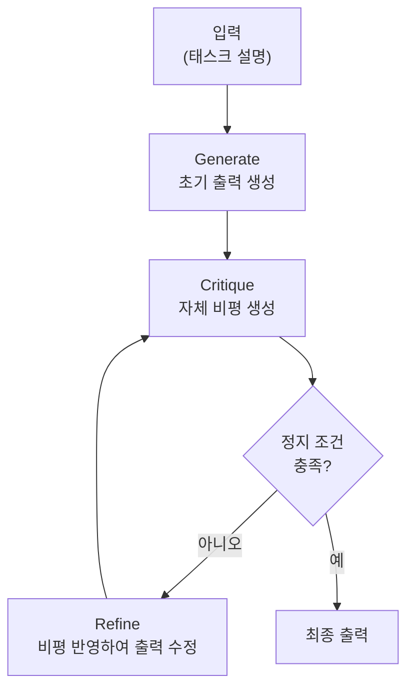
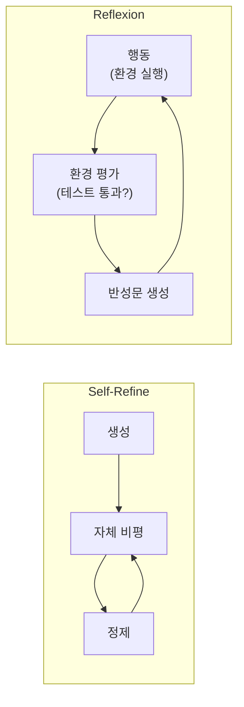

# Self-Refine (자기 정제)

## 정의

**Self-Refine**은 Madaan et al. (2023)이 "Self-Refine: Iterative Refinement with Self-Feedback"에서 제안한 프롬프팅 프레임워크다. **단일 LLM이 외부 피드백 없이** 자체 출력을 반복적으로 개선하는 방식이다. Generate -> Critique -> Refine의 3단계 루프를 통해, 초기 생성물의 품질을 점진적으로 끌어올린다.

[[reflexion]]이 환경과의 상호작용 실패를 반성하는 것과 달리, Self-Refine은 **환경 실행 없이** LLM 자체의 비평 능력만으로 출력을 개선한다.

## 왜 중요한가

- 별도의 피드백 소스(인간 평가, 환경 실행, 보상 모델) 없이 **동일한 LLM 하나로** 품질 개선이 가능하다
- 코드 최적화, 텍스트 개선, 수학 풀이 등 다양한 태스크에 범용적으로 적용된다
- [[test-time-compute|테스트 타임 컴퓨트]] 스케일링의 가장 단순한 구현 형태 중 하나다
- 현대 [[ai-reasoning-models|추론 모델]]의 내부 반복 메커니즘과 원리를 공유한다

## 핵심 루프: Generate -> Critique -> Refine



이 다이어그램은 Self-Refine의 3단계 반복 루프를 보여준다. Critique와 Refine이 정지 조건을 충족할 때까지 반복된다.

### 1단계: Generate (초기 생성)

입력 태스크에 대해 LLM이 초기 출력을 생성한다. 이 단계는 기존의 zero-shot 또는 few-shot 프롬프팅과 동일하다.

```
태스크: 다음 코드의 시간 복잡도를 O(n)으로 개선하라.

초기 출력:
def find_duplicate(nums):
    for i in range(len(nums)):
        for j in range(i+1, len(nums)):
            if nums[i] == nums[j]:
                return nums[i]
    return None
```

### 2단계: Critique (자체 비평)

동일한 LLM이 자신의 출력을 비평한다. 비평은 구체적인 문제점과 개선 방향을 포함해야 한다.

```
비평:
- 현재 코드는 이중 루프로 O(n^2) 시간 복잡도를 가진다
- 해시셋을 사용하면 한 번의 순회로 중복을 찾을 수 있다
- 빈 입력에 대한 엣지 케이스 처리가 없다
- 변수명이 관례적이지만, 타입 힌트가 누락되었다
```

### 3단계: Refine (정제)

비평 내용을 반영하여 출력을 수정한다. 이전 출력과 비평 모두를 컨텍스트에 포함한다.

```
정제된 출력:
def find_duplicate(nums: list[int]) -> int | None:
    if not nums:
        return None
    seen = set()
    for num in nums:
        if num in seen:
            return num
        seen.add(num)
    return None
```

## 정지 조건

Self-Refine은 무한 루프에 빠지지 않도록 정지 조건이 필요하다.

| 조건 | 설명 |
|------|------|
| **비평 없음** | Critique 단계에서 "개선할 점이 없다"고 판단 |
| **최대 반복 횟수** | N회(보통 3-5회) 반복 후 강제 종료 |
| **품질 수렴** | 연속된 두 출력 간 차이가 임계값 이하 |
| **비평 반복** | 같은 비평이 반복되면 모델 능력의 한계로 판단 |

## Reflexion과의 비교

Self-Refine과 [[reflexion]]은 모두 "자기 개선" 패턴이지만, 핵심 차이가 존재한다.



이 다이어그램은 Self-Refine(내부 비평 루프)과 Reflexion(환경 실행 피드백 루프)의 구조적 차이를 보여준다.

| 측면 | Self-Refine | Reflexion |
|------|-------------|-----------|
| 피드백 소스 | LLM 자체 비평 (내부) | 환경 실행 결과 (외부) |
| 환경 필요 | 불필요 | 필수 (테스트, 게임 등) |
| 적용 태스크 | 텍스트, 코드, 수학 등 생성 태스크 | 코딩, 질의응답, 의사결정 등 검증 가능 태스크 |
| 단일 에피소드 내 | 반복 가능 (같은 에피소드 내 3-5회) | 에피소드 간 반복 (시도 1 -> 반성 -> 시도 2) |
| 비평 신뢰도 | LLM 자체 평가 능력에 의존 | 환경의 객관적 평가에 의존 |

## 실험 결과 (Madaan et al. 2023)

7가지 태스크에서 검증:

| 태스크 | Base GPT-4 | Self-Refine (3회 반복) | 개선폭 |
|--------|-----------|----------------------|--------|
| 코드 최적화 | 45.3% | **58.2%** | +12.9%p |
| 수학 추론 (GSM8K) | 85.0% | **91.4%** | +6.4%p |
| 대화 응답 품질 | 7.1 | **8.3** | +1.2 |
| 감성 반전 | 65% | **80%** | +15%p |
| 두문자어 생성 | 40% | **67%** | +27%p |
| 코드 가독성 | 6.2 | **7.8** | +1.6 |
| 리뷰 응답 | 6.5 | **7.9** | +1.4 |

대부분의 태스크에서 2-3회 반복으로 유의미한 개선이 관찰되었다.

## 한계

### 1. 자기 비평의 신뢰성 문제

LLM이 자기 출력을 정확하게 비평하지 못하는 경우가 있다. 특히:
- **환각 비평**: 실제로는 올바른 부분을 잘못되었다고 지적
- **표면적 비평**: 근본적 오류는 놓치고 사소한 스타일 문제만 지적
- **[[self-evaluation-bias|자기 평가 편향]]**: 자신의 출력에 관대한 경향

### 2. 수렴하지 않는 경우

비평과 정제가 **진동(oscillation)**하는 경우가 있다:
```
출력 A -> 비평: "너무 장황하다" -> 출력 B (간결)
-> 비평: "설명이 부족하다" -> 출력 C (장황)
-> 비평: "너무 장황하다" -> ...
```

### 3. 비용 문제

1회 생성 대비 3-5배의 LLM 호출이 필요하다. 대규모 배치에서는 비용이 선형으로 증가한다.

### 4. 소형 모델의 한계

Self-Refine은 모델 능력에 강하게 의존한다. 소형 모델은 비평 자체가 부정확하여 오히려 성능이 하락할 수 있다. GPT-4급 이상에서 효과가 안정적이다.

## 실무 적용 패턴

### 코드 리뷰 자동화

```
Generate: LLM이 코드 작성
Critique: "이 코드는 에러 처리가 누락되었고, 변수명이 불명확하다"
Refine: 에러 처리 추가 + 변수명 개선
Critique: "엣지 케이스 테스트가 필요하다"
Refine: 엣지 케이스 처리 추가
```

### 기술 문서 작성

```
Generate: 초안 작성
Critique: "용어 정의가 누락, 예시가 부족, 구조가 비논리적"
Refine: 용어 정의 추가 + 예시 보강 + 구조 재배치
```

### 프롬프트 최적화

Self-Refine 자체를 프롬프트 개선에 적용할 수 있다. 초기 프롬프트를 생성하고, LLM이 프롬프트의 약점을 비평하고, 개선된 프롬프트를 생성하는 메타 루프다.

## 관련 문서

- [[reflexion]] -- 환경 실행 기반 자기반성 패턴. Self-Refine과 상보적 관계
- [[test-time-compute]] -- Self-Refine이 실현하는 추론 시간 컴퓨트 스케일링
- [[ai-reasoning-models]] -- 내부 반복 메커니즘을 학습 단계에서 내재화한 모델
- [[generator-evaluator-architecture]] -- Generate-Critique를 모듈로 분리한 아키텍처 패턴
- [[chain-of-thought]] -- Self-Refine의 각 단계에서 활용되는 추론 기법
