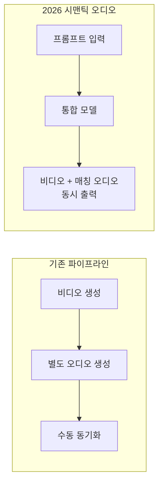

# 시맨틱 오디오 생성 (Semantic Audio Generation)

비디오 콘텐츠에 의미적으로 매칭(semantically matched)된 오디오를 동시에 생성하는 기술. 단일 모델이 비디오 + 완벽히 매칭된 오디오를 한 번에 생성하며, 장면의 의미를 이해하여 적절한 소리, 음악, 대화를 만들어낸다. 2026년 AI 비디오 생성의 가장 흥미로운 발전 중 하나다.

## 왜 중요한가

- **제작 혁명**: 비디오 콘텐츠 제작 시간 70% 단축
- **end-to-end 생성**: 기존의 비디오 생성 -> 별도 오디오 생성 -> 수동 동기화 3단계를 단일 모델로 통합
- **멀티모달 AI의 성숙**: 시각과 청각의 의미적 연결을 학습한 모델이 등장

## 핵심 혁신

이 다이어그램은 기존 파이프라인과 2026 시맨틱 오디오 생성의 차이를 보여준다. 3단계 분리 파이프라인이 단일 모델의 동시 생성으로 대체되었다.

## 주요 모델

| 모델 | 특징 |
|------|------|
| Seedance 2.0 | 15초 동기화 오디오-비디오. 듀얼 채널 스테레오 |
| Kling 3.0 | 네이티브 오디오 통합. 다국어/방언 지원 |
| MAI-Voice-1 | 60초 음성을 1초 만에 생성. 감정 표현 보존 |
| Veo 3 | Google. 오디오 통합 비디오 생성 |

## 기술적 난제

4가지 핵심 동기화 문제를 해결해야 한다:

| 난제 | 설명 |
|------|------|
| 시간적 동기화 | 입 모양과 음성, 물체와 소리의 정확한 시간 일치 |
| 물리적 일관성 | 재질, 거리에 따른 소리 변화 반영 |
| 감정 일관성 | 시각적 분위기와 오디오 톤의 일치 |
| 긴 형식 일관성 | 15초 이상에서의 일관된 오디오 스토리 유지 |

## 응용 분야

- **콘텐츠 제작**: 제작 시간 70% 단축. 1인 크리에이터의 제작 역량 확장
- **마케팅**: 다국어 광고를 자동 생성. Kling 3.0의 다국어/방언 지원 활용
- **교육**: 설명 영상에 자동으로 매칭된 나레이션/배경음 생성
- **게임**: 동적 오디오-비주얼 생성으로 실시간 콘텐츠 변형

## 관련 문서

- [[multimodal-architectures]] -- 멀티모달 아키텍처 개요
- [[ai-hot-topics-2026-04]] -- 2026년 4월 AI 핫토픽
