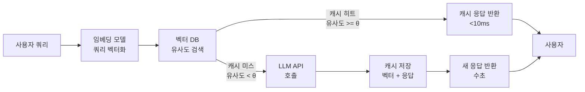
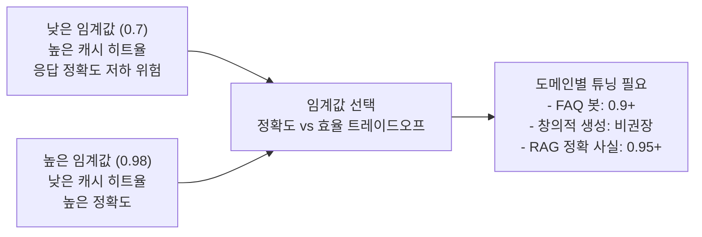
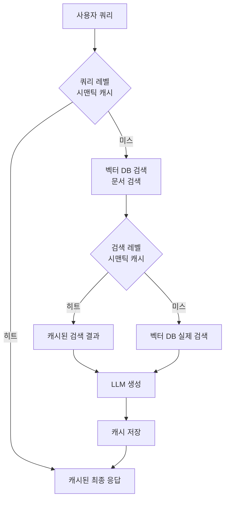

# 시맨틱 캐시 (Semantic Cache)

## 개요

시맨틱 캐시(Semantic Cache)는 의미적으로 유사한 쿼리에 대해 LLM 응답을 재사용하는 캐싱 기법이다. 전통적인 정확 문자열 매칭(exact-match cache)과 달리, 쿼리를 임베딩 벡터로 변환하고 유사도를 측정하여 의미가 같으면 캐시된 응답을 반환한다.

**핵심 아이디어**: "What is the capital of France?"와 "프랑스의 수도는?"은 문자열이 달라도 의미가 같으므로, 동일한 응답을 캐시에서 반환할 수 있다.

LLM API 비용 절감([[api-cost-management]])과 응답 지연 감소가 주된 목적이며, 특히 반복적인 질문이 많은 챗봇, 고객 지원, RAG([[rag]]) 파이프라인에서 효과적이다.

## 왜 시맨틱 캐시인가

### 전통적 캐시의 한계

```python
# 정확 문자열 매칭 캐시
cache = {}

def query_llm_exact(prompt):
    if prompt in cache:      # 완전히 같은 문자열만 히트
        return cache[prompt]
    response = llm.generate(prompt)
    cache[prompt] = response
    return response

# 다음 두 쿼리는 캐시 미스
query_llm_exact("What is Python?")
query_llm_exact("What is Python programming language?")  # 다른 키
```

### 시맨틱 캐시의 해결

```python
# 시맨틱 캐시: 의미 유사도 기반
def query_llm_semantic(prompt, threshold=0.95):
    embedding = embed(prompt)
    similar = vector_db.search(embedding, top_k=1)
    if similar and similar[0].score >= threshold:
        return similar[0].cached_response  # 의미 유사 -> 캐시 히트
    response = llm.generate(prompt)
    vector_db.insert(embedding, response)
    return response
```

## 시스템 아키텍처



위 다이어그램은 시맨틱 캐시의 전체 요청 처리 흐름을 보여준다. 캐시 히트 시 LLM 호출을 완전히 건너뛴다.

## 핵심 구성 요소

### 1. 임베딩 모델

쿼리를 의미론적 벡터 공간으로 변환한다. 선택 기준:

| 모델 | 벡터 차원 | 특징 | 사용 사례 |
|------|-----------|------|-----------|
| `text-embedding-ada-002` (OpenAI) | 1536 | 고품질, API 기반 | 프로덕션 일반 |
| `sentence-transformers/all-MiniLM-L6-v2` | 384 | 경량, 로컬 | 비용 민감 |
| `BAAI/bge-large-en` | 1024 | 오픈소스 고성능 | 영어 특화 |
| `intfloat/multilingual-e5-large` | 1024 | 다국어 | 한국어 포함 |

[[embedding-models]] 참조.

### 2. 유사도 메트릭

캐시 히트 여부를 결정하는 거리/유사도 함수:

| 메트릭 | 수식 | 특징 |
|--------|------|------|
| 코사인 유사도 | $\frac{a \cdot b}{\|a\| \|b\|}$ | 벡터 방향 비교, 크기 무관 |
| L2 거리 | $\|a - b\|_2$ | 유클리드 거리, 크기 영향 |
| 내적 (Dot Product) | $a \cdot b$ | 정규화된 벡터에서 코사인과 동일 |

대부분의 시맨틱 캐시는 코사인 유사도를 사용하며, **임계값(threshold) $\theta$**를 조정하여 정밀도와 재현율을 조절한다.

### 3. 벡터 저장소

캐시 벡터의 빠른 근사 최근접 이웃(ANN) 검색:

| 저장소 | 특징 | 권장 규모 |
|--------|------|-----------|
| **FAISS** | Meta 개발, 인메모리, 초고속 | 백만 건 이하 단일 서버 |
| **Redis** + RedisVL | 인메모리 + 영속성 | 실시간 저지연 |
| **Qdrant** | 필터링 강력, 단독 서버 | 수천만 건 |
| **Pinecone** | 관리형 서비스, 운영 부담 최소 | 대규모 SaaS |
| **Chroma** | 임베디드, 개발 편의 | 프로토타이핑 |

## GPTCache: 오픈소스 시맨틱 캐시 라이브러리

GPTCache는 시맨틱 캐시의 대표적 오픈소스 구현체다. 다양한 임베딩 모델, 벡터 DB, 유사도 평가기를 플러그인 방식으로 조합할 수 있다.

### 기본 사용 예시

```python
from gptcache import cache
from gptcache.adapter import openai
from gptcache.embedding import Onnx
from gptcache.manager import CacheBase, VectorBase, get_data_manager
from gptcache.similarity_evaluation import SearchDistanceEvaluation

# 임베딩 모델 초기화 (ONNX 경량 모델)
onnx = Onnx()

# 데이터 매니저: SQLite(메타데이터) + FAISS(벡터)
data_manager = get_data_manager(
    CacheBase("sqlite"),
    VectorBase("faiss", dimension=onnx.dimension)
)

# 캐시 초기화
cache.init(
    embedding_func=onnx.to_embeddings,
    data_manager=data_manager,
    similarity_evaluation=SearchDistanceEvaluation(),
    similarity_threshold=0.8  # 이 값 이상이면 캐시 히트
)
cache.set_openai_key()

# OpenAI 호환 인터페이스 (내부적으로 캐시 처리)
response = openai.ChatCompletion.create(
    model='gpt-3.5-turbo',
    messages=[{'role': 'user', 'content': 'What is Python?'}]
)
```

### 고급 설정: 커스텀 임베딩 + Redis

```python
from gptcache.embedding import Huggingface
from gptcache.manager import VectorBase

# 한국어 지원 임베딩
hf_embedder = Huggingface(model="BAAI/bge-m3")

data_manager = get_data_manager(
    CacheBase("redis", url="redis://localhost:6379"),
    VectorBase("qdrant", location="http://localhost:6333",
               collection_name="semantic_cache",
               dimension=hf_embedder.dimension)
)

cache.init(
    embedding_func=hf_embedder.to_embeddings,
    data_manager=data_manager,
    similarity_threshold=0.85,
    # TTL: 24시간 후 캐시 만료
    config=Config(similarity_threshold=0.85, max_size=10000, clean_size=1000)
)
```

## 임계값(Threshold) 튜닝

임계값은 시맨틱 캐시의 가장 중요한 하이퍼파라미터다.



### 임계값 선택 가이드라인

| 애플리케이션 유형 | 권장 임계값 | 이유 |
|------------------|-------------|------|
| FAQ / 헬프데스크 챗봇 | 0.90 - 0.93 | 유사 질문이 많고 표준 답변 존재 |
| 정보 검색 (RAG) | 0.93 - 0.97 | 사실 정확도가 중요 |
| 코드 생성 | 0.97 - 0.99 | 문맥 변화에 민감 |
| 창의적 생성 | 사용 비권장 | 동일 프롬프트도 다른 응답이 바람직 |

### 실험적 튜닝 방법

```python
def evaluate_threshold(eval_dataset, embedder, threshold):
    """임계값별 캐시 히트율과 오류율 측정"""
    hits = 0
    errors = 0
    for query, expected in eval_dataset:
        emb = embedder(query)
        similar = vector_db.search(emb, top_k=1)
        if similar and similar[0].score >= threshold:
            hits += 1
            if not is_acceptable(similar[0].response, expected):
                errors += 1
    return {
        'hit_rate': hits / len(eval_dataset),
        'error_rate': errors / max(hits, 1)
    }

# 임계값 스윕
for theta in [0.80, 0.85, 0.90, 0.93, 0.95, 0.97]:
    metrics = evaluate_threshold(eval_data, embedder, theta)
    print(f"θ={theta}: 히트율={metrics['hit_rate']:.2%}, 오류율={metrics['error_rate']:.2%}")
```

## 프롬프트 캐시 vs 시맨틱 캐시

두 개념은 구별된다:

| 항목 | 프롬프트 캐시 (Prompt Cache) | 시맨틱 캐시 (Semantic Cache) |
|------|------------------------------|------------------------------|
| 주체 | LLM 제공사 (Anthropic, OpenAI) | 애플리케이션 레이어 |
| 작동 방식 | KV 캐시에 반복 프롬프트 접두어 저장 | 임베딩 유사도로 완전히 동일한 응답 재사용 |
| 대상 | 동일 프롬프트의 다른 완성 | 유사 프롬프트의 완전 재사용 |
| 비용 절감 | 입력 토큰 비용 50-90% 절감 | 전체 API 호출 제거 |
| 구현 위치 | LLM 서버 내부 | 애플리케이션/미들웨어 |

두 기법을 **함께** 사용하면 시너지 효과: 캐시 미스 시 프롬프트 캐시로 입력 비용 절감, 캐시 히트 시 API 호출 완전 제거.

## RAG 파이프라인과의 통합

[[rag]] 시스템에서 시맨틱 캐시는 두 레벨에서 적용 가능하다:



- **쿼리 레벨 캐시**: 전체 쿼리-응답 쌍을 캐시 (가장 효율적)
- **검색 레벨 캐시**: 유사 쿼리의 검색 결과를 캐시 (부분 절감)

## 캐시 무효화 (Cache Invalidation)

지식 업데이트나 모델 변경 시 캐시 무효화 전략이 필요하다:

```python
class SemanticCacheManager:
    def __init__(self, ttl_seconds=86400):
        self.ttl = ttl_seconds

    def invalidate_by_topic(self, topic_keyword):
        """특정 주제 관련 캐시 일괄 삭제"""
        topic_emb = embed(topic_keyword)
        related = vector_db.search(topic_emb, top_k=100, score_threshold=0.85)
        for entry in related:
            vector_db.delete(entry.id)

    def invalidate_by_source(self, source_id):
        """특정 소스 문서 업데이트 시 관련 캐시 삭제"""
        entries = metadata_db.filter(source_id=source_id)
        for entry in entries:
            vector_db.delete(entry.vector_id)
            metadata_db.delete(entry.id)

    def invalidate_expired(self):
        """TTL 만료 항목 정리"""
        expired = metadata_db.filter(created_at__lt=now() - self.ttl)
        for entry in expired:
            vector_db.delete(entry.vector_id)
```

## LangChain 통합

```python
from langchain.globals import set_llm_cache
from langchain_community.cache import RedisSemanticCache
from langchain_openai import OpenAIEmbeddings

# LangChain의 시맨틱 캐시 (Redis + OpenAI 임베딩)
set_llm_cache(
    RedisSemanticCache(
        redis_url="redis://localhost:6379",
        embedding=OpenAIEmbeddings(),
        score_threshold=0.2  # Redis: 낮을수록 유사 (L2 거리)
    )
)

# 이후 모든 LLM 호출에 자동 캐싱 적용
from langchain_openai import ChatOpenAI
llm = ChatOpenAI(model="gpt-4")
response = llm.invoke("파이썬이란 무엇인가?")  # 자동 캐싱
```

## 성능 지표 및 모니터링

```python
class CacheMetrics:
    def __init__(self):
        self.hits = 0
        self.misses = 0
        self.total_latency_saved = 0  # ms
        self.total_cost_saved = 0     # USD

    @property
    def hit_rate(self):
        total = self.hits + self.misses
        return self.hits / total if total > 0 else 0

    def record_hit(self, latency_ms, tokens_saved, cost_per_token):
        self.hits += 1
        self.total_latency_saved += latency_ms
        self.total_cost_saved += tokens_saved * cost_per_token

    def report(self):
        return {
            'hit_rate': f"{self.hit_rate:.1%}",
            'latency_saved_avg_ms': self.total_latency_saved / max(self.hits, 1),
            'cost_saved_usd': f"${self.total_cost_saved:.4f}"
        }
```

### 실제 효과 벤치마크 (일반적 수치)

| 애플리케이션 | 캐시 히트율 | 응답 속도 개선 | 비용 절감 |
|-------------|-------------|----------------|-----------|
| 고객 지원 FAQ 봇 | 40-70% | 95%+ | 40-70% |
| 내부 지식 RAG | 20-40% | 90%+ | 20-40% |
| 코드 어시스턴트 | 10-25% | 90%+ | 10-25% |
| 범용 챗봇 | 5-15% | 90%+ | 5-15% |

## 한계점

1. **동의어/표현 변이**: 임베딩 모델의 품질에 의존. 도메인 특화 표현이 많으면 파인튜닝된 임베딩 필요
2. **맥락 의존성**: "오늘 날씨는?"은 시간에 따라 답이 달라지지만 캐시는 시간을 모름 (TTL로 완화)
3. **개인화 응답**: 사용자별로 다른 응답이 필요하면 사용자 ID를 캐시 키에 포함해야 함
4. **창의적 태스크**: 변동성이 핵심 가치인 경우 캐시가 오히려 해롭다
5. **임베딩 일관성**: 임베딩 모델을 바꾸면 전체 캐시 재구축 필요

## 왜 중요한가

1. **API 비용 절감**: GPT-4급 모델 호출 비용은 높으므로, 40-70%의 반복 쿼리를 캐시로 처리하면 비용이 극적으로 감소
2. **응답 지연 감소**: LLM 호출(수 초)을 캐시 조회(10ms 이하)로 대체
3. **처리량 확대**: API rate limit 제약을 우회하여 더 많은 동시 요청 처리 가능
4. **일관성 향상**: 동일 질문에 동일 응답을 보장하여 사용자 경험 개선

## 관련 문서

- [[rag]] - 시맨틱 캐시가 가장 효과적으로 적용되는 파이프라인
- [[embedding-models]] - 시맨틱 캐시의 핵심 구성 요소인 임베딩 모델
- [[api-cost-management]] - LLM API 비용 최적화 전략 중 하나로서의 시맨틱 캐시
