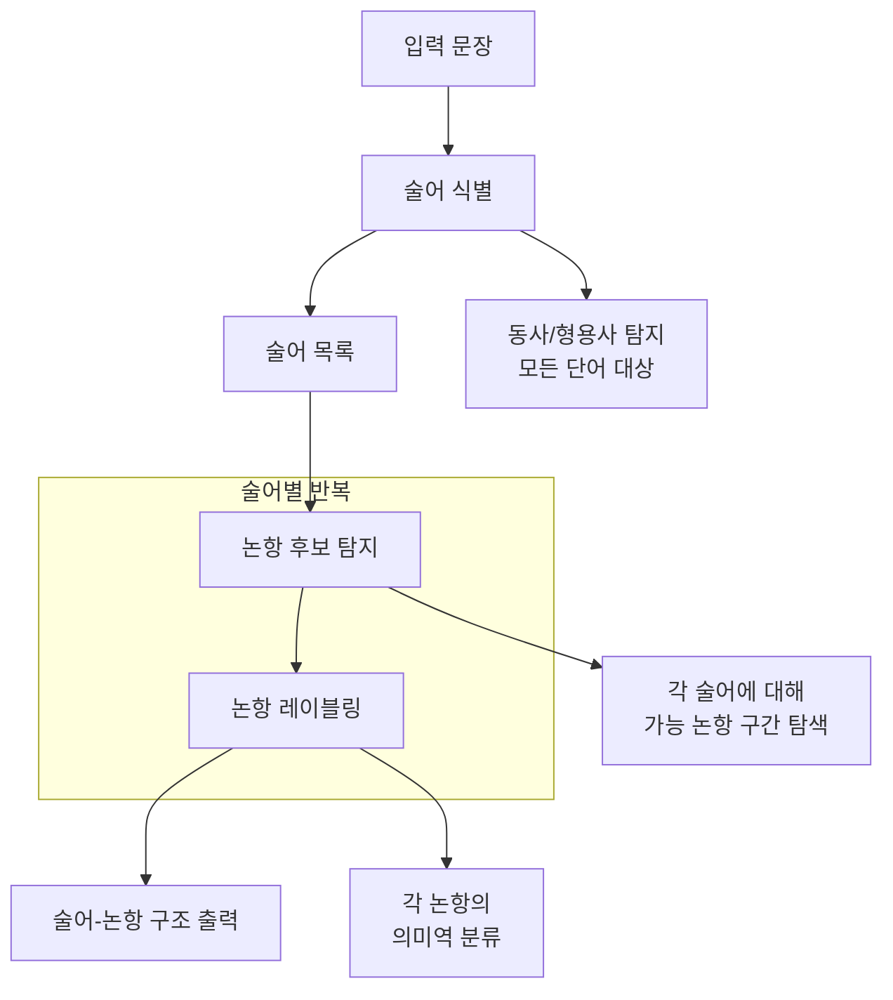

# 의미역 결정 (Semantic Role Labeling)

의미역 결정(SRL, Semantic Role Labeling)은 문장에서 술어(predicate)와 그것에 참여하는 논항(argument) 사이의 의미역 관계를 식별하는 NLP 태스크다. "철수가 서울에서 빵을 샀다"에서 술어 "샀다"에 대해 "철수가(구매자, A0)", "빵을(구매 대상, A1)", "서울에서(장소, AM-LOC)"를 레이블링하는 것이 SRL이다. [[dependency-parsing]]이 문법 구조를 파악한다면, SRL은 "누가 무엇을 어떻게 어디서 했는가"라는 의미 구조를 파악한다. [[bert]] 기반 모델이 현재 SOTA를 주도한다.

## 왜 중요한가

의존 구문 분석은 "who did what to whom"을 문법 레이블(nsubj, dobj)로만 표현하지만, SRL은 동사의 의미적 역할을 명시적으로 레이블링해 더 풍부한 의미 표현을 제공한다:

- **사건 추출(Event Extraction)**: 뉴스에서 "누가 무엇을 언제 어디서 했는가" 자동 추출
- **질의응답**: "누가 이 회사를 설립했나요?" → SRL로 설립 술어의 A0 논항 추출
- **정보 검색**: 사건 참여자 기반의 의미 검색
- **기계번역 평가**: 번역 결과의 의미역 구조가 원문과 일치하는지 검증
- **요약 품질 평가**: 중요 사건의 참여자 정보가 요약에 보존되는지 확인

## 의미역 프레임워크

### PropBank
동사 중심의 의미역 스킴. 각 동사 별 프레임(frameset)을 정의하고 번호 부여 논항(ARG0~ARG5)과 수식 논항(AM-*)을 사용한다.

| 논항 | 일반적 의미 |
|------|-----------|
| ARG0 (A0) | 행위자(Agent), 원인 |
| ARG1 (A1) | 피동자(Patient), 주제 |
| ARG2 (A2) | 도구, 속성, 착점 |
| AM-LOC | 장소 수식어 |
| AM-TMP | 시간 수식어 |
| AM-MNR | 방식 수식어 |
| AM-NEG | 부정 수식어 |

### FrameNet
구체적 의미 프레임 기반. "Buying" 프레임은 Buyer, Goods, Seller, Money 등의 프레임 요소(Frame Element)를 정의한다. PropBank보다 풍부하나 커버리지가 낮다.

## SRL 처리 흐름



## 트랜스포머 기반 SRL

현대 SRL 시스템은 BERT 계열 인코더를 사용한다. 대표적인 접근 방식:

### 술어 중심 접근 (Predicate-centered)
각 술어를 특수 토큰으로 마킹한 후 전체 문장을 인코딩하고, 각 토큰에 대해 해당 술어 기준의 의미역 레이블을 분류한다.

```python
# 술어 마킹 예시
# "철수가 [PRED] 샀다 빵을 서울에서"
# 각 토큰에 대해: O / A0 / O / A1 / AM-LOC 예측

from transformers import AutoModelForTokenClassification

# 술어 정보를 포함한 입력으로 SRL 수행
model = AutoModelForTokenClassification.from_pretrained(
    "bert-base-uncased",
    num_labels=len(srl_labels)  # BIO 형식 SRL 레이블 수
)
```

### 스팬 기반 접근 (Span-based)
모든 가능한 스팬(연속 구간)에 대해 의미역 레이블을 예측하는 방식. He et al.(2018)의 엔드투엔드 SRL이 대표적이다.

### 의존 구문 활용 (Syntax-aware)
[[dependency-parsing]] 결과를 추가 피처로 활용하면 SRL 성능이 향상된다. 특히 장거리 논항 탐지에서 의존 트리의 경로 정보가 유효하다.

## 주요 데이터셋 및 벤치마크

| 데이터셋 | 언어 | 특징 |
|---------|------|------|
| CoNLL-2005 | 영어 | PropBank 기반 SRL 벤치마크 |
| CoNLL-2012 | 영어 | OntoNotes 기반, 다장르 |
| Universal PropBank | 다국어 | UD + PropBank 통합 |
| KLUE-NA | 한국어 | 한국어 술어논항 구조 |

CoNLL-2012 기준 최신 BERT 기반 모델은 F1 85-88% 수준이다.

## 구체적 예시 분석

문장: "구글이 2015년 딥마인드를 영국에서 인수했다."

| 토큰 | 술어: 인수하다 |
|------|--------------|
| 구글이 | ARG0 (인수자) |
| 2015년 | AM-TMP (시간) |
| 딥마인드를 | ARG1 (인수 대상) |
| 영국에서 | AM-LOC (장소) |
| 인수했다 | 술어 (V) |

## 한국어 SRL의 특수성

한국어는 격조사가 의미역 정보를 명시적으로 표현하는 경우가 많다("을/를" → 대상, "에서" → 장소). 그러나 동일 격조사가 맥락에 따라 다른 의미역을 가질 수 있어("에서"가 장소/출처/비교 등) 단순 규칙으로는 처리가 어렵다.

또한 술어 후보가 용언(동사+형용사) 전체이므로 술어 식별 단계에서 한국어 형태소 분석이 선행되어야 한다.

## SRL vs. 의존 구문 분석 비교

| 측면 | 의존 구문 분석 | SRL |
|------|--------------|-----|
| 분석 대상 | 문법적 관계 | 의미적 역할 |
| 레이블 | nsubj, obj, amod | ARG0, ARG1, AM-LOC |
| 특성 | 언어-독립적 경향 | 동사별 프레임 의존 |
| 활용 | 구문 기반 피처 | 사건/논항 추출 |

## 실무 적용 관점

- **사건 추출 파이프라인**: SRL은 명시적 사건 구조화의 핵심으로, 뉴스 분석·금융 리포트 요약·법률 문서 분석에 활용
- **RAG 강화**: 청크 내 핵심 사건의 참여자 정보를 메타데이터로 저장하면 "누가 무엇을 했나" 유형 질의에 정밀한 검색이 가능
- **LLM 시대의 SRL**: GPT-4 수준의 LLM은 프롬프트만으로도 상당한 SRL 성능을 보이나, 도메인 특화 미세 조정 모델이 의료·법률 같은 전문 도메인에서는 여전히 우위

## 관련 문서

- [[dependency-parsing]] - SRL과 상보적 관계인 의존 구문 분석
- [[bert]] - 현대 SRL 모델의 핵심 인코더
- [[relation-extraction]] - SRL 결과를 활용하는 관계 추출
- [[named-entity-recognition]] - SRL 논항의 개체 유형 식별
- [[coreference-resolution]] - 동일 개체의 의미역이 문서 전반에 일관적으로 연결
