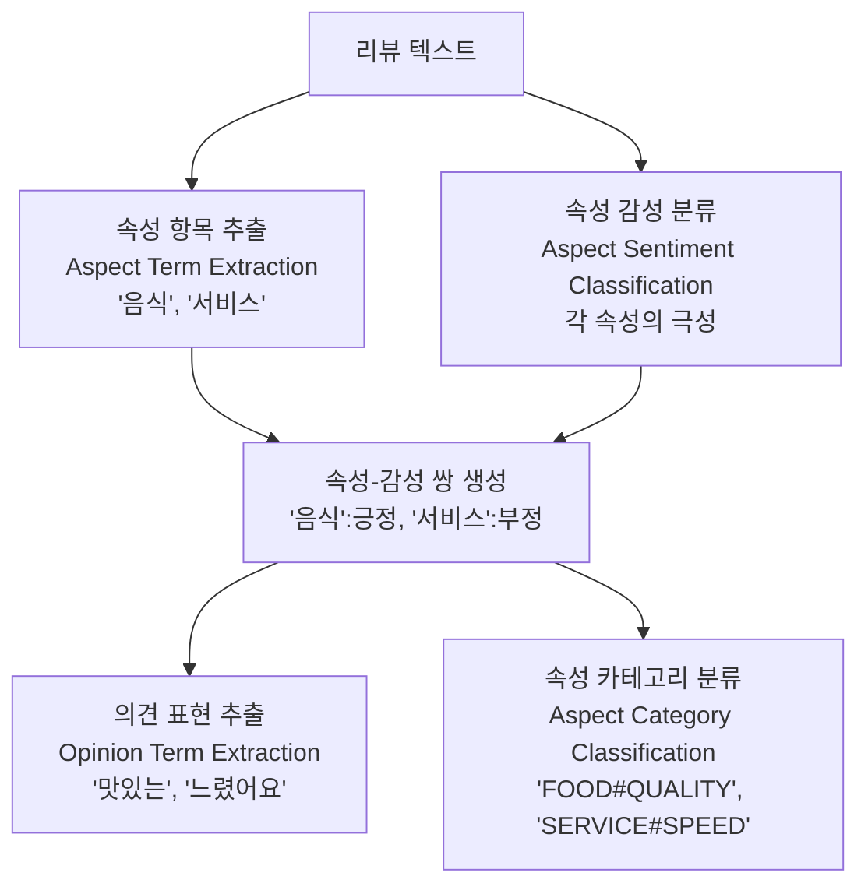

# 관점 기반 감성 분석 (Aspect-Based Sentiment Analysis, ABSA)

**관점 기반 감성 분석(Aspect-Based Sentiment Analysis, ABSA)**은 텍스트에서 **특정 속성(aspect)이나 관점에 대한 감성 극성(sentiment polarity)**을 세밀하게 파악하는 NLP 태스크다. 단순히 문서 전체를 긍정/부정으로 분류하는 [[text-classification]]을 넘어, "배터리 수명은 좋지만 카메라는 별로다"처럼 동일 텍스트 내에서 속성별로 다른 감성을 구분한다.

## 왜 ABSA인가

일반 감성 분석의 한계:
- "음식은 맛있는데 서비스가 너무 느렸어요" -> 전체 극성: 중립 or 긍정? 어느 쪽도 정확하지 않다
- 리뷰 데이터에서 어떤 속성이 문제인지 파악할 수 없으면 비즈니스 개선이 어렵다

ABSA는 이 문제를 해결하여 속성 단위의 인사이트를 제공한다.

## 태스크 분해

ABSA는 여러 서브태스크로 구성된다:



| 서브태스크 | 약어 | 설명 |
|-----------|------|------|
| 속성 항목 추출 | ATE | 텍스트에서 속성 표현 span 추출 |
| 속성 감성 분류 | ASC | 주어진 속성에 대한 감성 극성(긍정/부정/중립) 분류 |
| 속성 카테고리 분류 | AC | 속성을 사전 정의된 카테고리로 매핑 |
| 의견 항목 추출 | OTE | 속성을 평가하는 의견 표현 추출 |
| 엔드-투-엔드 ABSA | E2E-ABSA | 위 태스크를 동시에 수행 |

## 핵심 접근 방식

### 파이프라인 방식

속성 추출 -> 감성 분류 순서로 처리. 각 단계를 독립 모델로 학습한다. 속성 추출에는 BIO 태깅 기반 시퀀스 레이블링이 일반적이다.

### [[bert]] 기반 접근

**BERT와 그 변형 모델**이 ABSA에서 강력한 성능을 보인다. 대표적인 방식:

1. **속성-문장 쌍 입력**: `[CLS] 리뷰 텍스트 [SEP] 속성 [SEP]`를 BERT에 입력하여 해당 속성의 감성을 CLS 토큰으로 분류
2. **어텐션 기반 의견 추출**: 속성 토큰에 대한 어텐션 분포를 활용하여 관련 의견 표현 탐지
3. **구조적 그래프 방식**: 의존 구문 트리를 기반으로 그래프 신경망(GNN)으로 속성-의견 관계 모델링

```python
# BERT 기반 ABSA 예시 (개념 수준)
# 입력: 리뷰 문장 + 속성
text = "음식은 맛있는데 서비스가 너무 느렸어요"
aspect = "서비스"

# 토큰화 및 인코딩
input_ids = tokenizer(
    text, aspect,
    return_tensors="pt",
    truncation=True
)

# 감성 분류
logits = model(**input_ids).logits
# 출력: [부정, 중립, 긍정] 중 "부정"
```

### 생성 모델 기반

최근 T5, GPT 계열 모델로 ABSA 결과를 직접 생성하는 방식이 주목받는다. 입력 텍스트를 받아 `(속성, 감성 극성, 의견 표현)` 형태의 트리플 시퀀스를 생성한다.

## 대표 데이터셋

| 데이터셋 | 도메인 | 언어 | 제공 정보 |
|----------|--------|------|-----------|
| SemEval-2014 Task 4 | 레스토랑, 노트북 | 영어 | ATE + ASC |
| SemEval-2015/2016 | 레스토랑 | 영어 | AC + ASC |
| ACOS | 레스토랑, 노트북 | 영어 | 4-tuple (aspect, category, opinion, sentiment) |
| MAMS | 레스토랑 | 영어 | 모든 문장에 속성별 상이한 감성 포함 |

## 도전 과제

1. **암묵적 속성(Implicit Aspect)**: "배달이 늦었다"에서 '서비스'가 명시적으로 등장하지 않지만 서비스에 대한 부정 평가다.
2. **제로샷 속성**: 학습 데이터에 없는 새로운 속성 카테고리 처리
3. **다국어 ABSA**: 한국어 등 비영어권 ABSA 데이터셋 부족
4. **중첩 속성**: 하나의 표현이 여러 속성에 동시에 해당하는 경우

## 실무 활용

- **이커머스 리뷰 분석**: 상품의 속성별(배송, 품질, 가격) 평점 자동 산출
- **호텔/레스토랑 피드백**: 특정 서비스 속성에 대한 고객 불만 자동 탐지
- **NPS 분석**: 추천 점수와 함께 어떤 속성 때문인지 자동 파악
- **경쟁사 분석**: 경쟁 제품의 속성별 강약점 자동 비교

## 관련 문서

- [[text-classification]] - 문서 수준 감성 분석, ABSA의 기반이 되는 분류 태스크
- [[bert]] - ABSA의 현대적 접근에서 핵심적으로 활용되는 사전학습 모델
- [[named-entity-recognition]] - 속성 항목 추출(ATE)과 구조적으로 유사한 시퀀스 레이블링 접근
