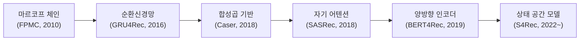
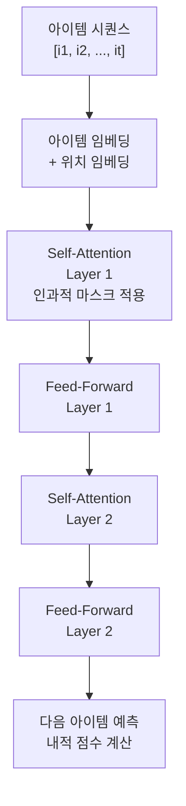
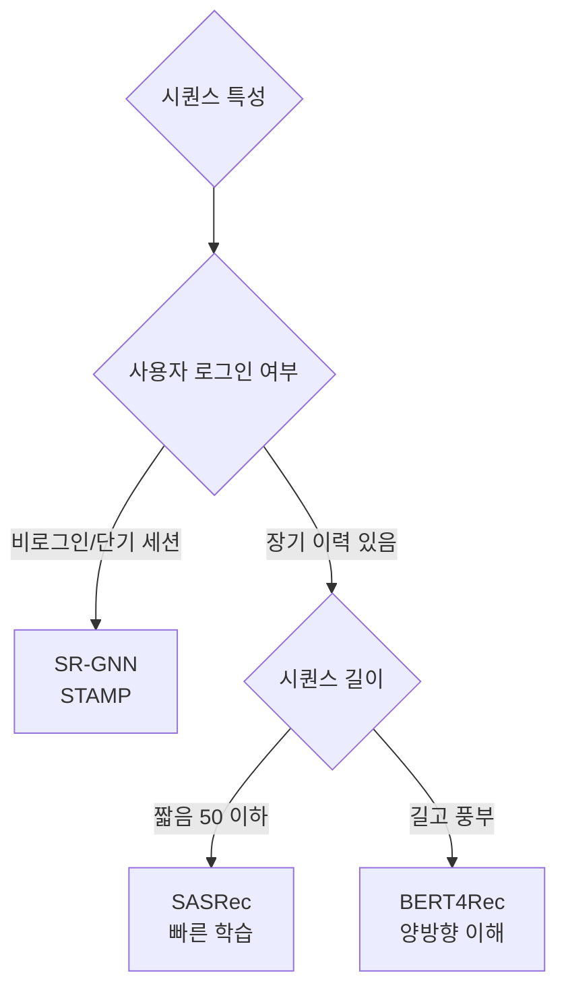

# 순차 추천 (Sequential Recommendation)

순차 추천(Sequential Recommendation)은 사용자의 **행동 이력을 시계열 시퀀스로 모델링**하여 다음 아이템을 예측하는 추천 패러다임이다. 전통적인 협업 필터링이 "사용자가 어떤 아이템을 좋아하는가"를 묻는다면, 순차 추천은 "사용자가 지금까지 이런 순서로 행동했으니 다음에 무엇을 할 것인가"를 묻는다.

## 왜 순차성이 중요한가

사용자 행동에는 명확한 시간적 패턴이 존재한다:

- 뉴스: 속보 기사 → 관련 심층 분석 기사
- 쇼핑: 카메라 검색 → 렌즈 → 가방 → 메모리카드
- 영상: 입문 강의 → 중급 → 심화 → 프로젝트 영상

이런 의존성을 무시하면 "사용자가 액션 영화를 좋아한다"는 일반화에 그치지만, 시퀀스를 반영하면 "이 사용자는 지금 SF로 관심이 이동하는 중이다"를 알 수 있다.

## 모델 발전 계보

## 주요 모델 상세

### SASRec (Self-Attentive Sequential Recommendation, 2018)

트랜스포머 디코더 구조를 추천에 적용한 모델. 단방향(left-to-right) 어텐션으로 미래 정보 누출 없이 다음 아이템을 예측한다.

**구조:**

**핵심 특징:**
- 인과적 마스킹(causal masking): 위치 $t$는 $\leq t$ 위치만 참조
- 짧은 시퀀스에서도 병렬 계산 가능 (RNN 대비 학습 속도 우위)
- 레이어 정규화 + 드롭아웃으로 안정적인 학습

### BERT4Rec (2019)

BERT의 Masked Language Model(MLM) 사전학습 전략을 추천으로 전이. 양방향 어텐션으로 시퀀스 내 더 풍부한 컨텍스트를 활용한다.

**Cloze Task 방식:**

시퀀스 내 랜덤 아이템을 `[MASK]` 토큰으로 대체하고, 양방향 컨텍스트를 보고 해당 아이템을 맞추도록 학습:

$$[i_1, i_2, [MASK], i_4, i_5] \rightarrow \text{예측: } i_3$$

추론 시에는 마지막 위치를 `[MASK]`로 설정하여 다음 아이템 예측.

**SASRec vs. BERT4Rec 비교:**

| 항목 | SASRec | BERT4Rec |
|------|--------|----------|
| 어텐션 방향 | 단방향 (left-to-right) | 양방향 |
| 학습 목표 | Next-Item Prediction | Cloze (MLM) |
| 추론 방식 | 마지막 히든 상태 | [MASK] 위치 |
| 강점 | 빠른 학습, 실시간 추론 | 풍부한 컨텍스트 활용 |

## 세션 기반 추천 (Session-based Recommendation)

로그인하지 않은 사용자, 또는 세션 내 단기 의도만 반영하는 경우:

- **GNN 기반**: SR-GNN (2019) - 세션 내 아이템 그래프를 GNN으로 모델링
- **어텐션 기반**: STAMP (2018) - 장기 선호 + 현재 관심 어텐션 결합
- **특성**: 사용자 ID 없이 현재 세션 아이템 시퀀스만 사용

세션 기반 추천은 [[cold-start-problem]]의 한 해결책이기도 하다. 사용자 ID 없이 행동 맥락만으로 추천할 수 있기 때문이다.

## 시퀀스 표현의 핵심 요소

### 위치 임베딩 (Positional Embedding)

[[transformer-architecture]]에서와 동일하게, 아이템 순서 정보를 주입하기 위해 위치 임베딩을 더한다:

$$\mathbf{h}_t = \mathbf{e}_{i_t} + \mathbf{p}_t$$

학습 가능한 위치 임베딩을 주로 사용하며, 최대 시퀀스 길이를 사전에 설정해야 한다.

### 시퀀스 길이 처리

사용자별 행동 수가 매우 다양하므로:
- 최대 길이 $N$ 초과 시 최근 $N$개만 사용 (sliding window)
- 짧은 시퀀스는 `[PAD]` 토큰으로 패딩 + 패딩 위치 마스킹

### 부정 샘플링

추천 아이템 후보가 수백만 개일 때, 전체 softmax는 비현실적이다. 인-배치 네거티브 또는 인기도 기반 네거티브 샘플링을 활용한다.

## 실무 고려사항

**데이터 특성별 모델 선택:**

**시간 정보 활용:**

단순 순서 외에 타임스탬프를 활용하면 성능이 향상된다. 아이템 간 경과 시간, 시간대(요일/시간), 계절성 등을 추가 피처로 주입할 수 있다.

## 관련 문서

- [[recommendation-systems-dl]] - 딥러닝 추천 시스템 전체 맥락
- [[transformer-architecture]] - Transformer 구조의 Self-Attention 상세
- [[ncf-neural-collaborative]] - 시퀀스 비의존적 협업 필터링 모델
- [[cold-start-problem]] - 신규 사용자를 위한 콜드 스타트 전략
