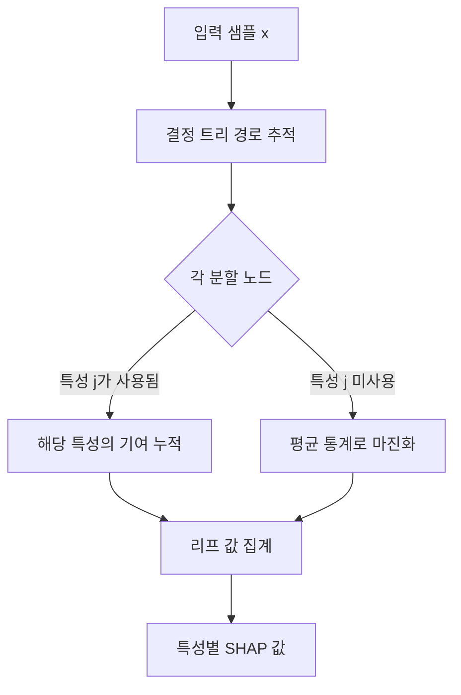
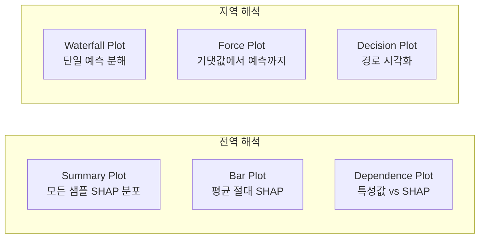

# SHAP 특성 중요도

SHAP(SHapley Additive exPlanations)은 게임 이론의 Shapley 값을 머신러닝 모델 해석에 적용한 프레임워크다(Lundberg & Lee, 2017). 모든 모델에 적용 가능한 단일 예측 설명 방법론으로, 각 특성이 특정 예측에 얼마나 기여했는지를 **일관성, 지역성, 더미 속성**을 만족하는 유일한 방식으로 정량화한다.

## Shapley 값의 직관

게임 이론에서 Shapley 값은 협력 게임(cooperative game)에서 각 플레이어의 공정한 보상을 계산한다. ML에 대입하면:
- 플레이어 = 특성
- 게임 = 예측 모델
- 보상 = 모델의 예측값 (기준값 대비 차이)

**Shapley 값의 핵심 속성**:
1. **효율성(Efficiency)**: 모든 특성의 SHAP 값 합 = 예측값 - 기댓값
2. **대칭성(Symmetry)**: 동일한 기여 특성은 동일한 값
3. **더미(Dummy)**: 기여 없는 특성은 0
4. **단조성(Monotonicity)**: 더 많이 기여하면 더 높은 값

## Shapley 값 계산

특성 $j$의 Shapley 값 $\phi_j$는 가능한 모든 특성 부분집합 $S$에 걸친 한계 기여의 가중 평균이다:

$$\phi_j = \sum_{S \subseteq F \setminus \{j\}} \frac{|S|!(|F|-|S|-1)!}{|F|!} \left[ f_{S \cup \{j\}}(x_{S \cup \{j\}}) - f_S(x_S) \right]$$

이 계산은 특성 수 $|F|$에 대해 지수적으로 복잡하다. 실용적 근사 알고리즘이 필요하다.

## TreeSHAP: 트리 모델을 위한 정확한 근사

TreeSHAP(Lundberg et al., 2020)은 결정 트리, XGBoost, LightGBM, CatBoost 등 트리 기반 모델에 대해 $O(TL^2 D)$ 시간에 정확한 Shapley 값을 계산한다 (T: 트리 수, L: 리프 수, D: 깊이).

핵심 아이디어는 각 트리 경로를 따라가며 특성이 없는 경우의 예측을 훈련 데이터 분포에서 마진화(marginalization)하는 것이다.

## 시각화 유형

**Summary Plot**: y축 특성, x축 SHAP 값, 점 색깔 = 특성값. 단일 시각화에 전역 중요도 + 방향성 + 분포 정보를 모두 담는다.

**Waterfall Plot**: 기준값(base value, 훈련 데이터 평균 예측)에서 시작해 각 특성의 기여를 더하고 빼며 최종 예측에 도달하는 과정을 보여준다.

## SHAP vs 기존 중요도 방법

| 방법 | 전역/지역 | 모델 무관 | 상호작용 포착 | 편향 |
|------|-----------|-----------|---------------|------|
| 불순도 기반 (Gini) | 전역 | 아니오 | 불완전 | 고카디널리티 편향 |
| Permutation | 전역 | 예 | 아니오 | 다중공선성 취약 |
| LIME | 지역 | 예 | 부분적 | 로컬 근사 오차 |
| **SHAP** | 전역+지역 | 예 | 완전 | 공리적 정의 |

## SHAP 상호작용 값

SHAP는 두 특성 간 교호작용을 별도로 계산하는 SHAP Interaction Values도 지원한다:

$$\phi_{ij} = \sum_{S \subseteq F \setminus \{i,j\}} \frac{|S|!(|F|-|S|-2)!}{2(|F|-1)!} \nabla_{ij}(S)$$

이를 통해 [[tabular-feature-interaction]] 에서 다루는 교호작용 효과를 정량화할 수 있다.

## 한계

- **상관된 특성**: 특성 간 상관이 높을 때 SHAP 값 해석에 주의 필요. 공변량을 마진화하는 방식에 따라 interventional SHAP vs observational SHAP로 나뉜다.
- **계산 비용**: 트리 외 모델(딥러닝 등)에서는 KernelSHAP 등 근사를 사용해야 해 느리다.
- **인과 해석 주의**: SHAP는 상관관계를 측정하며 인과관계(causal effect)가 아니다. [[data-shapley]] 와는 다른 개념이다.

## 실무 워크플로우

[[tabular-ml]] 프로젝트에서 SHAP 활용 흐름:

1. XGBoost/LightGBM 학습 완료
2. `shap.TreeExplainer(model)` 생성
3. `explainer.shap_values(X_test)` 계산
4. Summary Plot으로 전역 특성 중요도 파악
5. 이상 예측 샘플에 Waterfall/Force Plot 적용
6. Dependence Plot으로 비선형 관계 탐색

## 관련 문서

- [[tabular-ml]] - 테이블 ML 전반 및 해석 가능성 요구사항
- [[data-shapley]] - 데이터 기여도 측정의 Data Shapley (별개 개념)
- [[tabular-feature-interaction]] - SHAP가 정량화하는 특성 교호작용
- [[xgboost-internals]] - TreeSHAP가 특히 효율적으로 작동하는 XGBoost
- [[tabnet-architecture]] - 모델 내재적 해석성 제공하는 TabNet (SHAP와 보완)
