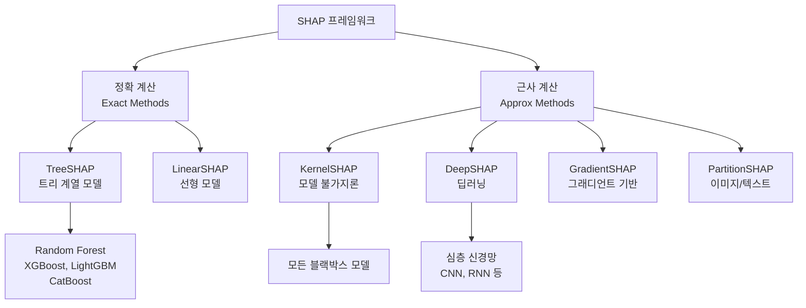

# SHAP (SHapley Additive exPlanations)

## 개요

SHAP은 게임 이론의 Shapley 값(Shapley values)을 머신러닝 모델 예측 설명에 적용한 통합 프레임워크다. Scott Lundberg와 Su-In Lee가 2017년 NeurIPS에서 발표한 이래, 모델 불가지론적(model-agnostic)이면서도 수학적으로 일관된 특성 기여도 분해 방법론으로 자리잡았다.

핵심 아이디어는 "모델이 특정 예측을 내리는 데 각 입력 특성이 얼마나 기여했는가"를 게임 이론적으로 공정하게 계산하는 것이다. 단순히 특성 중요도(feature importance) 순위를 매기는 것과 달리, SHAP은 **개별 예측** 단위의 기여도를 제공한다.

> "SHAP values are the only additive feature attribution method consistent with three desirable properties: local accuracy, missingness, and consistency."
> - Lundberg & Lee, 2017

## 게임 이론적 기반: Shapley 값

SHAP의 수학적 토대는 1953년 Lloyd Shapley가 고안한 협력 게임 이론(cooperative game theory)에 있다.

- **협력 게임 구조**: 여러 플레이어가 연합(coalition)을 이루어 공동의 보상(payout)을 생성할 때, 각 플레이어의 공정한 몫을 계산
- **ML에 대입**: 플레이어 = 특성(feature), 게임 = 모델의 예측 함수, 보상 = 기준 예측 대비 실제 예측 차이

Shapley 값 $\phi_i$는 가능한 모든 특성 부분집합에 걸쳐 특성 $i$의 한계 기여(marginal contribution)를 가중 평균한 값이다:

$$\phi_i = \sum_{S \subseteq F \setminus \{i\}} \frac{|S|!(|F|-|S|-1)!}{|F|!} \left[ f(S \cup \{i\}) - f(S) \right]$$

- $F$: 전체 특성 집합
- $S$: 특성 $i$를 제외한 부분집합
- $f(S)$: 부분집합 $S$의 특성만 사용했을 때의 모델 예측 기댓값

## 4가지 핵심 속성

Shapley 값이 유일하게 만족하는 공리적 속성들이 SHAP을 "유일한" 선택지로 만든다.

| 속성 | 설명 | 의미 |
|------|------|------|
| **효율성 (Efficiency)** | 모든 SHAP 값의 합 = 예측값 - 기준(baseline) 예측값 | 기여도가 완전히 분배됨 |
| **대칭성 (Symmetry)** | 동일한 기여를 하는 두 특성은 동일한 SHAP 값을 가짐 | 공정한 분배 |
| **더미 (Dummy)** | 예측에 아무 영향 없는 특성의 SHAP 값 = 0 | 무관한 특성 배제 |
| **일관성 (Consistency)** | 모델이 바뀌어 특성 기여가 늘면, 해당 특성의 SHAP 값도 늘거나 같음 | 순위 역전 없음 |

이 속성들을 모두 만족하는 특성 기여도 분해 방법은 Shapley 값이 **유일**하다는 것이 수학적으로 증명되어 있다.

## SHAP 분류 체계



위 다이어그램은 SHAP의 구현 변형들이 어떤 모델 유형을 대상으로 하는지를 보여준다.

## 주요 변형: TreeSHAP

**TreeSHAP**은 트리 계열 모델(의사결정 트리, 랜덤 포레스트, XGBoost, LightGBM, CatBoost 등)에 특화된 정확 계산 알고리즘이다.

### 계산 복잡도 비교

| 방법 | 복잡도 | 특성 수 1000개 기준 |
|------|--------|---------------------|
| 브루트포스 Shapley | $O(2^n)$ | 불가 |
| KernelSHAP | $O(TK^2)$ | 수 분 |
| **TreeSHAP** | $O(TLD^2)$ | 밀리초 수준 |

- $T$: 트리 수, $L$: 리프 수, $D$: 트리 깊이, $K$: 샘플 수

TreeSHAP은 2019년 Lundberg 등이 발표한 논문에서 $O(TLD^2)$의 다항 시간 알고리즘을 제시하여, 대규모 트리 앙상블에서도 실시간 설명이 가능해졌다.

### 두 가지 TreeSHAP 모드

1. **interventional SHAP** (기본): 특성 독립성을 가정, 결측 특성을 훈련 데이터 분포에서 marginalize
2. **path-dependent SHAP**: 트리 분기 경로를 이용, 훈련 데이터 없이도 계산 가능. 속도 빠르나 특성 상관관계 무시

## 주요 변형: KernelSHAP

**KernelSHAP**은 모든 종류의 모델에 적용 가능한 범용 근사 알고리즘이다. LIME의 로컬 선형 근사 아이디어를 기반으로 하되, Shapley 값 공리를 만족하는 커널 가중치를 사용한다.

### 핵심 메커니즘

1. 입력 샘플 $x$에서 특성 마스킹(masking)으로 연합 부분집합 $z' \in \{0,1\}^M$ 샘플링
2. 각 부분집합에 대해 모델 예측 $f(h_x(z'))$ 계산 (마스킹된 특성은 배경 데이터로 대체)
3. Shapley 커널 가중치 $\pi_{x'}(z') = \frac{(M-1)}{|z'|!(M-|z'|)!\binom{M}{|z'|}}$로 가중 선형 회귀
4. 선형 회귀 계수가 각 특성의 SHAP 값

### KernelSHAP 코드 예시

```python
import shap
import numpy as np

# 모델이 블랙박스인 경우 (예: sklearn Pipeline)
explainer = shap.KernelExplainer(
    model.predict_proba,
    shap.sample(X_train, 100)  # 배경 데이터 100개 샘플
)

# 설명할 샘플에 대한 SHAP 값 계산
shap_values = explainer.shap_values(X_test[:10], nsamples=500)

# 양성 클래스(인덱스 1)에 대한 워터폴 플롯
shap.plots.waterfall(explainer.expected_value[1], shap_values[1][0], X_test.iloc[0])
```

## 주요 변형: DeepSHAP

**DeepSHAP**은 DeepLIFT와 Shapley 값을 결합한 딥러닝 전용 근사 방법이다.

- 역전파(backpropagation) 방식으로 SHAP 값 근사
- 기준점(baseline)으로부터 활성화 차이를 레이어별로 전파
- 완전 정확하지 않으나 신경망에서 빠른 근사값 제공

## 시각화 도구

`shap` 라이브러리는 다양한 내장 시각화를 제공한다.

| 플롯 | 목적 | 입력 |
|------|------|------|
| `waterfall_plot` | 단일 예측의 특성별 기여 분해 | 단일 샘플 |
| `beeswarm_plot` | 전체 데이터셋의 SHAP 분포 + 특성값 색상 | 전체 SHAP 행렬 |
| `bar_plot` | 평균 절대값 기준 전체 특성 중요도 | 전체 SHAP 행렬 |
| `dependence_plot` | 특정 특성의 SHAP값 vs 특성값 산점도 | 단일 특성 |
| `force_plot` | 단일 예측의 인터랙티브 시각화 | 단일/다수 샘플 |
| `decision_plot` | 여러 샘플의 SHAP 경로 비교 | 다수 샘플 |

### TreeSHAP 사용 예시

```python
import shap
import xgboost as xgb

model = xgb.XGBClassifier().fit(X_train, y_train)

# TreeExplainer - 정확한 계산, 빠른 속도
explainer = shap.TreeExplainer(model)
shap_values = explainer.shap_values(X_test)

# 전체 특성 중요도 (beeswarm)
shap.summary_plot(shap_values, X_test, plot_type="beeswarm")

# 단일 예측 분해 (waterfall)
shap.plots.waterfall(
    shap.Explanation(
        values=shap_values[0],
        base_values=explainer.expected_value,
        data=X_test.iloc[0],
        feature_names=X_test.columns.tolist()
    )
)
```

## SHAP vs LIME 비교

[[lime]]과의 주요 차이점:

| 항목 | SHAP | LIME |
|------|------|------|
| 이론적 근거 | 게임 이론, Shapley 공리 | 로컬 선형 근사 |
| 일관성 보장 | 공리적으로 보장 | 보장 없음 (샘플링에 의존) |
| 안정성 | 높음 (결정적) | 낮음 (샘플링 무작위성) |
| 계산 비용 | 모델 유형에 따라 다름 (TreeSHAP은 빠름) | 항상 느림 (모델 호출 수백~수천 번) |
| 전역 설명 | beeswarm/bar plot으로 가능 | 기본적으로 로컬만 |
| 텍스트/이미지 지원 | PartitionSHAP으로 가능 | 기본 지원 |
| 특성 상호작용 | SHAP Interaction Values 제공 | 미지원 |

## SHAP Interaction Values

TreeSHAP은 단순 SHAP 값을 넘어 **특성 쌍 간 상호작용(interaction effects)**도 계산할 수 있다.

$$\phi_{ij}^{interact} = \sum_{S \subseteq F \setminus \{i,j\}} \frac{|S|!(|F|-|S|-2)!}{2(|F|-1)!} \delta_{ij}(S)$$

여기서 $\delta_{ij}(S) = f(S \cup \{i,j\}) - f(S \cup \{i\}) - f(S \cup \{j\}) + f(S)$.

```python
# 상호작용 값 계산 (TreeSHAP만)
shap_interaction = explainer.shap_interaction_values(X_test)
# shap_interaction.shape = (n_samples, n_features, n_features)

# 상호작용 행렬 시각화
shap.summary_plot(shap_interaction, X_test)
```

## 글로벌 vs 로컬 설명

SHAP은 두 레벨의 설명을 통일된 프레임워크로 제공한다.

**로컬 설명 (Local Explanation)**: 특정 예측 $x_i$에 대해 각 특성의 기여도를 분해.
```
예측값 = 기준값 + SHAP_특성1 + SHAP_특성2 + ... + SHAP_특성n
```

**글로벌 설명 (Global Explanation)**: 데이터셋 전체의 SHAP 값을 집계하여 모델 전반적 동작 이해.
- 평균 |SHAP| = 특성 중요도 순위
- beeswarm plot = 특성 값과 기여도의 관계

## 한계점

1. **계산 비용**: KernelSHAP은 특성 수와 샘플 수가 늘어날수록 급격히 느려짐 ($O(TK^2n^2)$)
2. **특성 독립성 가정**: 기본 SHAP은 특성 간 상관관계를 고려하지 않음. 다중공선성이 있는 경우 해석 왜곡 가능
3. **인과성 부재**: SHAP 값은 예측에 대한 기여도이지, 인과 관계를 나타내지 않음 ([[causal-inference]] 참조)
4. **배경 데이터 민감성**: KernelSHAP과 DeepSHAP은 배경 데이터(baseline) 선택에 따라 결과가 달라짐
5. **LLM 적용 한계**: 토큰 수가 많은 텍스트 모델에서는 계산 비용이 폭발적으로 증가

## 실무 적용 패턴

### 모델 디버깅

```python
# SHAP 값이 비정상적으로 큰 특성 식별
mean_abs_shap = np.abs(shap_values).mean(axis=0)
top_features = pd.Series(mean_abs_shap, index=X.columns).nlargest(10)

# 특정 예측 오류 케이스 분석
wrong_predictions = X_test[y_pred != y_test]
shap_wrong = explainer.shap_values(wrong_predictions)
shap.summary_plot(shap_wrong, wrong_predictions)
```

### 규제 준수 (Regulatory Compliance)

- EU AI Act, GDPR "설명 권리(right to explanation)" 조항 대응
- 금융권 신용 모델에서 거절 사유 제공 (예: "소득 대비 부채 비율이 높아 -0.3 기여")

### 특성 선택 (Feature Selection)

```python
# SHAP 기반 특성 선택
selector = shap.utils.OpportunisticTreeExplainer(model)
shap_values = selector(X_train)

# 평균 절대 SHAP이 임계값 이하인 특성 제거
important_features = X_train.columns[mean_abs_shap > threshold]
```

### 모델 모니터링

```python
# 프로덕션 환경에서 SHAP 분포 드리프트 감지
def detect_shap_drift(ref_shap, curr_shap, threshold=0.1):
    ref_mean = np.abs(ref_shap).mean(axis=0)
    curr_mean = np.abs(curr_shap).mean(axis=0)
    drift = np.abs(curr_mean - ref_mean) / (ref_mean + 1e-8)
    return drift > threshold
```

## 텍스트 및 이미지 모델 적용

### 텍스트 (PartitionSHAP)

```python
# 텍스트 분류 모델의 토큰 수준 설명
explainer = shap.Explainer(model.predict, masker=shap.maskers.Text(tokenizer))
shap_values = explainer(["This product is excellent but expensive"])
shap.plots.text(shap_values[0])
```

### 이미지 (GradientSHAP / PartitionSHAP)

```python
# CNN 이미지 분류 설명 (슈퍼픽셀 단위)
masker = shap.maskers.Image("inpaint_ns", X[0].shape)
explainer = shap.Explainer(model, masker, output_names=class_names)
shap_values = explainer(X[:4], max_evals=500, batch_size=50)
shap.image_plot(shap_values)
```

## 왜 중요한가

1. **단일 통합 프레임워크**: 어떤 모델(트리, 신경망, 선형, 블랙박스)에도 동일한 방식으로 설명 제공
2. **수학적 보장**: Shapley 공리가 "공정한" 설명임을 보장 — [[explainable-ai]]의 핵심 도구
3. **개별 예측 단위 설명**: 집계 수준이 아닌 샘플 단위 디버깅 가능
4. **오픈소스 생태계**: `shap` 라이브러리가 sklearn, XGBoost, LightGBM, PyTorch, TensorFlow와 직접 통합
5. **규제 대응**: EU AI Act, GDPR 등 AI 투명성 요구사항에 기술적으로 대응 가능

## 관련 문서

- [[explainable-ai]] - XAI 전체 프레임워크와 SHAP의 위치
- [[lime]] - 대안적 로컬 설명 방법론, SHAP과 보완 관계
- [[causal-inference]] - SHAP 기여도와 인과성의 차이
- [[shap-feature-importance]] - 특성 중요도에 특화된 TreeSHAP 상세 설명
