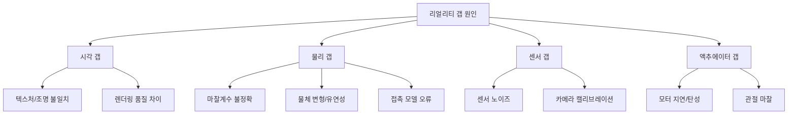

# Sim-to-Real 전이 (Sim2Real Transfer)

## 개요

Sim-to-Real(Sim2Real) 전이는 **시뮬레이션 환경에서 학습한 정책을 실제 물리 세계의 로봇에 배포**할 때 발생하는 도메인 갭(domain gap) 문제와, 이를 극복하기 위한 기법들을 통칭한다.

시뮬레이션은 데이터 수집 비용이 거의 없고, 위험한 실험도 안전하게 수행할 수 있으며, 병렬 환경으로 빠른 학습이 가능하다. 그러나 실제 세계와의 물리적 불일치로 인해 시뮬레이션에서 잘 동작하는 정책이 실제 로봇에서 실패하는 현상이 빈번하다. 이 불일치를 "리얼리티 갭(reality gap)"이라고 한다.

## 도메인 갭의 원인

## 주요 극복 기법

### 1. 도메인 랜덤화 (Domain Randomization)

시뮬레이션에서 물체 색상, 조명, 텍스처, 마찰계수, 물체 질량 등의 파라미터를 무작위로 변화시켜 정책을 학습한다. 다양한 시뮬레이션 조건에 적응한 정책은 실제 환경의 불확실성에도 강건(robust)해진다.

- **시각적 랜던화**: 조명 방향/강도, 물체 색상, 배경 텍스처, 카메라 포즈
- **물리적 랜덤화**: 질량, 마찰계수, 탄성계수, 관절 댐핑

### 2. 도메인 적응 ([[domain-adaptation]])

시뮬레이션과 실제 도메인 간의 표현 공간을 정렬하는 방법이다.

- **렌더링 스타일 전이**: 시뮬레이션 이미지를 실제처럼 보이게 변환 (CycleGAN 등)
- **도메인 불변 특징 학습**: 두 도메인 모두에서 작동하는 잠재 표현 학습
- **실제-시뮬 정렬**: 역방향으로 실제 이미지를 시뮬레이션 스타일로 변환

### 3. 적응적 파인튜닝 (Adaptive Fine-Tuning)

소량의 실제 로봇 데이터로 시뮬레이션 학습 모델을 파인튜닝한다. 시뮬레이션에서 광범위하게 사전학습 후 실제 데이터를 소량만 사용하여 실제 환경에 적응시킨다.

### 4. 시스템 식별 (System Identification)

실제 로봇의 물리 파라미터를 측정하거나 학습을 통해 추정하고, 이를 시뮬레이션에 반영해 간극을 좁힌다.

### 5. 현실적 시뮬레이터 개선

Isaac Lab, MuJoCo, Genesis 등 물리 시뮬레이터들이 정확도를 높이고 있다. 특히 **접촉 역학(contact dynamics)** 시뮬레이션 품질이 [[manipulation-dexterity]] 관련 태스크에서 매우 중요하다.

## 성공 사례

| 시스템 | 태스크 | Sim2Real 기법 |
|--------|--------|---------------|
| OpenAI Dactyl | 큐브 조작 (손) | 도메인 랜덤화 |
| Google RT-1/2 | 픽-앤-플레이스 | 실제 데이터 혼합 |
| DeepMind 파쿠르 에이전트 | 장애물 달리기 | 적응적 모션 모방 |
| ANYmal 보행 로봇 | 계단 오르기 | 물리 랜덤화 + 특권 학습 |

## 모델 기반 RL과의 관계

[[model-based-rl]]에서 학습하는 세계 모델(world model)은 넓은 의미에서 시뮬레이터다. 모델 기반 RL은 내재적 시뮬레이션(학습된 모델 내부)과 실제 세계 간의 Sim2Real 문제를 다룬다고 볼 수 있다.

## 실무 고려사항

Sim2Real을 실무에서 적용할 때 주요 고려사항은 다음과 같다.

- **시뮬레이터 선택**: 태스크 복잡도에 맞는 물리 정확도와 렌더링 품질의 트레이드오프
- **랜덤화 범위**: 너무 넓은 랜덤화는 학습을 어렵게 하고, 너무 좁으면 전이가 실패한다
- **실제 데이터 수집 비용**: 파인튜닝용 실제 데이터를 [[robot-teleoperation-data]] 방식으로 효율적으로 수집하는 전략
- **평가 지표**: 시뮬레이션 성능과 실제 성능 간의 상관관계를 사전에 검증

## 관련 문서

- [[domain-adaptation]] - 도메인 적응 일반 기법
- [[model-based-rl]] - 학습된 세계 모델 기반 계획
- [[manipulation-dexterity]] - 정밀 조작에서 Sim2Real의 중요성
- [[robot-teleoperation-data]] - 실제 파인튜닝 데이터 수집
- [[lerobot-framework]] - Sim2Real 워크플로우를 지원하는 프레임워크
