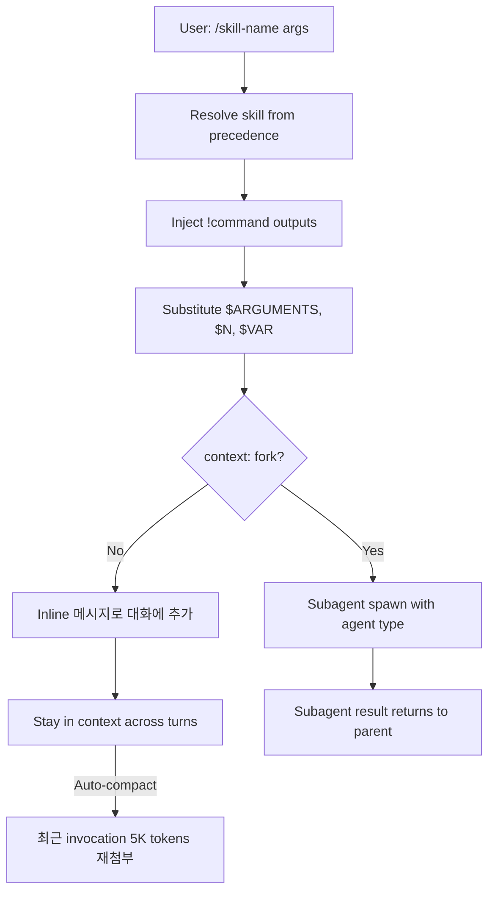

# Skill System Architecture

LLM 에이전트의 절차적 지식과 사용자 명령을 패키징하는 표준이 **Skill** (구 slash command)이다. 하나의 SKILL.md 파일과 부속 리소스로 구성된 디렉토리를 모델이 자동 또는 사용자 명령으로 invoke한다. AgentSkills.io 같은 오픈 표준이 등장하며 도구 간 호환성이 확보되고 있다.

> 기존 [[agent-skills]], [[agent-skills-specification]] 와 차별화 — 이 페이지는 source-agnostic한 skill 시스템의 구조적 패턴(invocation 매트릭스, dynamic context injection, fork context)에 집중한다. 특정 구현 디테일은 entity 페이지에서 다룬다.

## 1. 핵심 정의

> "A skill is a markdown file with instructions that Claude loads into its context — either when you invoke it directly with /skill-name or automatically when it detects the skill is relevant to your task."

### 디렉토리 구조

```
my-skill/
  SKILL.md           # 메인 instructions (필수)
  template.md        # 템플릿
  examples/sample.md # 예시 출력
  scripts/validate.sh # 실행 스크립트
```

SKILL.md는 frontmatter + 본문으로 구성. 본문은 사용자 명령 시 또는 모델이 자동으로 로드된다.

## 2. 우선순위 4계층

| Location | Path 관례 | Scope |
|----------|-----------|-------|
| Enterprise | managed settings | 조직 전체 |
| Personal | `~/.claude/skills/<name>/SKILL.md` | 모든 프로젝트 |
| Project | `.claude/skills/<name>/SKILL.md` | 해당 프로젝트만 |
| Plugin | `<plugin>/skills/<name>/SKILL.md` | 플러그인 활성 시 |

> "Enterprise overrides personal, and personal overrides project. Plugin skills use a `plugin-name:skill-name` namespace, so they cannot conflict with other levels."

플러그인 skill은 `plugin-name:skill-name` 네임스페이스로 호출하여 충돌 회피. 예: `/codex:rescue`, `/discord:access`.

## 3. Frontmatter Reference

```yaml
---
name: my-skill
description: What this skill does
disable-model-invocation: true
allowed-tools: Read Grep
---
```

| Field | Required | 설명 |
|-------|----------|------|
| `name` | No | 슬래시 커맨드명 (생략 시 디렉토리명) |
| `description` | Recommended | 모델이 자동 invoke 결정에 사용. 첫 1,536자만 listing에 표시 |
| `when_to_use` | No | trigger phrase 추가 |
| `argument-hint` | No | 자동완성 힌트 |
| `arguments` | No | named positional arguments |
| `disable-model-invocation` | No | true면 사용자만 invoke 가능 |
| `user-invocable` | No | false면 모델만 invoke (background knowledge) |
| `allowed-tools` | No | skill 활성 시 권한 자동 grant |
| `model` | No | 임시 모델 override |
| `effort` | No | `low\|medium\|high\|xhigh\|max` |
| `context` | No | `fork` 시 forked subagent에서 실행 |
| `agent` | No | `context: fork` 시 사용할 agent type |
| `hooks` | No | skill 라이프사이클 전용 hooks |
| `paths` | No | glob 패턴 매칭 시에만 자동 invoke |
| `shell` | No | `bash`(default) or `powershell` |

## 4. Invocation 제어 매트릭스

| Frontmatter | 사용자 invoke | 모델 invoke | Description in context |
|-------------|--------------|---------------|------------------------|
| (default) | Yes | Yes | Always |
| `disable-model-invocation: true` | Yes | No | Not in context (사용자 invoke 시에만 로드) |
| `user-invocable: false` | No | Yes | Always |

## 5. String Substitutions

| Variable | 설명 |
|----------|------|
| `$ARGUMENTS` | 전체 argument string |
| `$ARGUMENTS[N]` / `$N` | 0-based index 접근 |
| `$<name>` | frontmatter `arguments` 에 선언된 named arg |
| `${SESSION_ID}` | 세션 ID |
| `${EFFORT}` | 현재 effort 레벨 |
| `${SKILL_DIR}` | 이 SKILL.md 디렉토리 절대경로 |

> "Indexed arguments use shell-style quoting, so wrap multi-word values in quotes."

## 6. Dynamic Context Injection (`!` 백틱)

### 인라인 명령
```markdown
---
name: summarize-changes
description: Summarizes uncommitted changes
---

## Current changes

!`git diff HEAD`

## Instructions
Summarize the changes above...
```

> "The `!`<command>`` syntax runs shell commands before the skill content is sent to Claude. The command output replaces the placeholder, so Claude receives actual data, not the command itself."

### 멀티라인 fenced block
````markdown
## Environment
```!
node --version
npm --version
git status --short
```
````

### 정책으로 비활성화
`"disableSkillShellExecution": true` 설정 시 모든 shell 실행이 `[shell command execution disabled by policy]` 로 대체. 단 bundled/managed skill은 영향 안 받음.

## 7. Skill Content 라이프사이클



> "When you or Claude invoke a skill, the rendered SKILL.md content enters the conversation as a single message and stays there for the rest of the session."

### Auto-compaction 동작

> "Re-attaches the most recent invocation of each skill after the summary, keeping the first 5,000 tokens of each. Re-attached skills share a combined budget of 25,000 tokens."

- 가장 최근 invocation만 재첨부
- 각 skill 5K 토큰 보존
- 25K 토큰 공동 budget
- 최근 invoke 부터 채움 → 오래된 것은 drop

→ [[context-window-management|컨텍스트 윈도우 관리]] 와 직접 연결.

## 8. context: fork 패턴 (서브에이전트 위임)

```yaml
---
name: deep-research
description: Research a topic thoroughly
context: fork
agent: Explore
---

Research $ARGUMENTS thoroughly:
1. Find relevant files using Glob and Grep
2. Read and analyze the code
3. Summarize findings with specific file references
```

| 접근법 | System prompt | Task | Also loads |
|--------|---------------|------|------------|
| Skill `context: fork` | agent type (Explore/Plan) | SKILL.md 본문 | CLAUDE.md |
| Subagent `skills:` field | subagent body | delegation message | preloaded skills + CLAUDE.md |

→ [[subagent-spawning|서브에이전트 spawning]] 의 또 다른 진입점. 사용자가 직접 명령으로 서브에이전트를 호출하는 표준 메커니즘.

## 9. Permission 통합

### `allowed-tools`
```yaml
allowed-tools: Bash(git add *) Bash(git commit *) Bash(git status *)
```

> "Grants permission for the listed tools while the skill is active. It does not restrict which tools are available."

활성 시간 동안만 권한이 grant되며, skill이 끝나면 원상복구.

### Skill 차단 (deny rules)
```text
Skill                  # 모든 skill 차단
Skill(commit)          # 정확히 commit만 허용
Skill(review-pr *)     # prefix 매치 허용
```

## 10. Description 캐릭터 budget

- 모든 skill 이름은 항상 포함
- description은 동적 budget (context window의 1%, fallback 8,000 chars)
- 각 entry는 1,536자 cap
- 환경변수로 budget 조정 가능

description이 너무 짧으면 자동 invoke가 실패하고, 1,536자를 넘으면 끝부분이 잘려 routing 정확도가 떨어진다.

## 11. SKILL.md 작성 모범 사례

### Reference content (지식 type)
```yaml
---
name: api-conventions
description: API design patterns for this codebase
---

When writing API endpoints:
- Use RESTful naming conventions
- Return consistent error formats
```

### Task content (행동 type)
```yaml
---
name: deploy
description: Deploy to production
context: fork
disable-model-invocation: true
---

Deploy:
1. Run tests
2. Build
3. Push
4. Verify
```

### 일반 원칙

> "Keep the body itself concise. Once a skill loads, its content stays in context across turns, so every line is a recurring token cost."
> "Keep SKILL.md under 500 lines. Move detailed reference material to separate files."

## 12. AgentSkills.io 오픈 표준

> "Claude Code skills follow the AgentSkills open standard, which works across multiple AI tools."

### 표준 핵심
- SKILL.md + frontmatter
- `description` 기반 자동 라우팅
- 디렉토리 packaging

### 확장 영역 (도구별 차이)
- `disable-model-invocation`
- `context: fork`
- `!command` injection

각 도구가 표준을 따르되 자체 확장을 추가하므로, 다른 에이전트 환경으로 마이그레이션할 때는 확장 필드 호환성 확인 필요.

## 13. 분배 채널

| 채널 | 적용 |
|------|------|
| Project skills | `.claude/skills/` git 커밋 |
| Plugins | `skills/` 디렉토리 포함 |
| Managed | 조직 단위 settings 배포 |

## 14. Skill 도입 시점 가이드

> "Create a skill when you keep pasting the same instructions, checklist, or multi-step procedure into chat, or when a section of CLAUDE.md has grown into a procedure rather than a fact."

→ 동일 작업 패턴이 3번 이상 반복되면 skill로 추출 신호.

## 15. Anti-pattern

- description을 너무 짧게 → 자동 invoke 안 됨
- description에 키워드 부족 → 모델이 다른 방향으로 진행
- SKILL.md 500줄 초과 → context 비용 누적
- description 작성 시 1,536자 cap 무시 → 끝부분 잘림
- `context: fork` 없이 무거운 작업 → 부모 컨텍스트 점유

## 관련 문서

- [[agent-skills]] — Agent Skills 일반 개념
- [[agent-skills-specification]] — 표준 스펙
- [[hook-system-patterns]] — skill의 hooks 필드 lifecycle
- [[subagent-spawning]] — context: fork와의 관계
- [[context-window-management]] — auto-compaction 시 skill 재첨부
- [[anthropic-harness-design]] — skill을 포함한 harness 구성
- [[omc-skill-layering]] — 프로젝트 내 skill 계층화 사례
