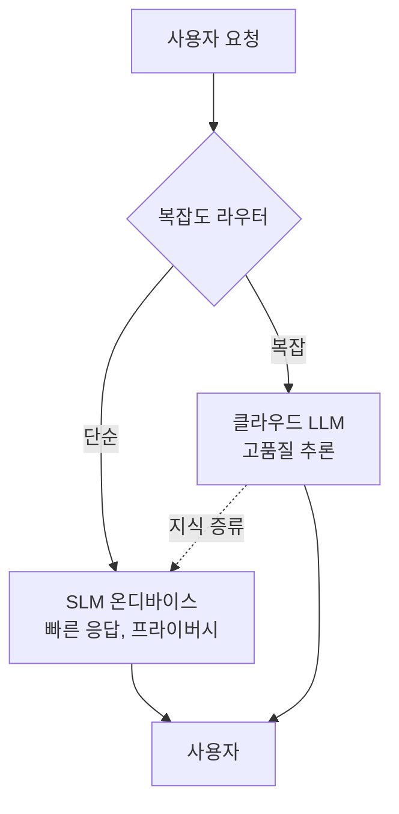
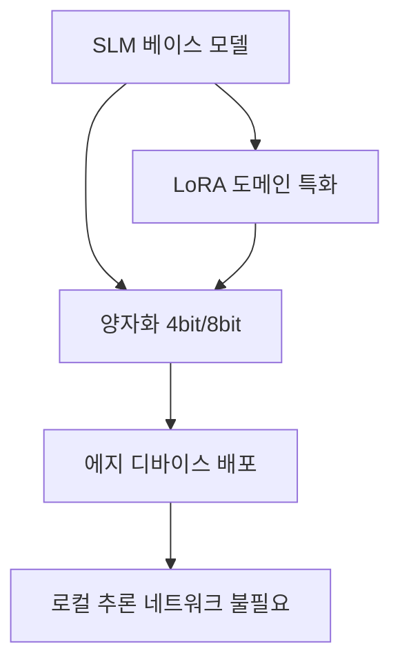

# 소형 언어 모델 (Small Language Models, SLMs)

## 개요

소형 언어 모델(SLM)은 일반적으로 500M~10B 파라미터 범위의 모델로, 최적화된 아키텍처와 학습 기법을 통해 에지 디바이스에서도 효과적으로 동작하도록 설계된다. Llama 3.2(1B/3B), Gemma 3(270M), Phi-4 mini(3.8B) 등이 대표적이며, 2026년 현재 메모리 대역폭(memory bandwidth)이 에지 배포의 핵심 제약으로 부상했다.

## 핵심 개념

### 크기 분류

| 등급 | 파라미터 | 대표 모델 | 메모리 요구 | 적합 환경 |
|------|---------|-----------|------------|-----------|
| 초소형 | 500M-2B | Llama 3.2 1B, Gemma 3 270M, Qwen2-0.5B | 1-4GB RAM | 모바일, IoT |
| 소형 | 2B-5B | Llama 3.2 3B, Phi-4 mini 3.8B, Qwen2-1.5B | 4-8GB RAM | 태블릿, GPU 가속 |
| 성능형 | 5B-10B | Llama 3.2 8B, Qwen2.5-7B, Phi-4 | 8-16GB RAM | 데스크톱, 엣지 서버 |

### 메모리 대역폭 병목

에지 디바이스에서 SLM 추론의 주요 병목은 연산 능력(compute)이 아닌 메모리 대역폭(memory bandwidth)이다. 자기회귀(autoregressive) 추론에서 매 토큰 생성 시 전체 모델 가중치를 메모리에서 읽어야 하므로, 토큰 생성 속도는 "가중치 크기 / 메모리 대역폭"에 직접적으로 비례한다.

양자화(Q4_K_M, Q8_0 등)로 모델 크기를 줄여 대역폭 요구량을 낮추는 것이 실용적 해법이다:

| 양자화 포맷 | 비트 수 | 품질 | 속도 | 적합 환경 |
|------------|--------|------|------|-----------|
| Q8_0 | 8비트 | 거의 무손실 | 보통 | 충분한 RAM 확보 시 |
| Q4_K_M | 4비트 | 소폭 손실 | 빠름 | 범용 추천 |
| Q2_K | 2비트 | 눈에 띄는 손실 | 매우 빠름 | 극한 제약 환경 |

Apple Silicon의 통합 메모리(Unified Memory) 구조는 CPU-GPU 간 데이터 복사 없이 직접 접근이 가능하여 이 병목을 완화하는 데 유리한 위치를 점한다.

### 프론티어 모델 대비 전략

SLM은 범용 능력 경쟁이 아닌, 특정 도메인에서 LoRA/QLoRA 파인튜닝으로 특화하는 전략이 효과적이다. 파인튜닝 비용이 대형 모델 대비 현저히 낮아, 도메인별 전문 모델을 다수 운영하는 패턴이 가능하다. Dell의 예측에 따르면 2027년까지 "조직들이 범용 LLM보다 태스크 특화 소형 모델을 3배 더 많이 사용"할 것이다.

Jeff Clarke(Dell)는 "Micro LLM -- 효율성에 최적화된 소형 모델 -- 은 더 적은 컴퓨팅, 더 적은 전력을 필요로 하며 디바이스 위에서 동작하게 될 것"이라고 전망했다.

### 대형 모델과의 협업 패턴

SLM은 독립적으로 사용되기도 하지만, 대형 모델과 계층적으로 협업하는 패턴이 증가하고 있다:

[[apple-foundation-model]]의 온디바이스/클라우드 이중 구조가 이 패턴의 대표적 사례이며, [[knowledge-distillation]]을 통해 대형 모델의 지식을 SLM으로 지속 전이하는 방식도 활발히 연구되고 있다.

## 작동 원리

SLM의 에지 배포 파이프라인은 다음과 같다.

1. 사전 학습된 SLM 베이스 모델 선택
2. (선택) 도메인 특화 LoRA 파인튜닝
3. 타겟 하드웨어에 맞는 양자화 포맷 적용
4. Ollama, llama.cpp 등 로컬 추론 런타임으로 배포
5. 네트워크 없이 온디바이스 추론 수행

## 성능/효과

| 장점 | 설명 |
|------|------|
| 프라이버시 | 민감 데이터를 외부 API 호출 없이 로컬 처리 |
| 비용 | 요청당 과금 없이 기존 하드웨어에서 운영 |
| 지연시간 | 네트워크 왕복 제거로 실시간 응답 |
| 오프라인 | 인터넷 연결 없이 동작 |
| 커스터마이징 | 대형 모델 대비 낮은 파인튜닝 비용 |
| 에너지 효율 | 대형 모델 대비 현저히 낮은 전력 소비 |
| 데이터 주권 | 데이터가 조직/기기 외부로 나가지 않음 |

### 주요 활용 분야

- **소매**: 키오스크에서 SLM 기반 즉각적 고객 지원 (연결 불필요)
- **제조**: 실시간 품질 관리 및 예측 유지보수 (데이터센터 미연결 환경)
- **의료**: 환자 데이터 프라이버시가 필수적인 임상 보조
- **코딩 어시스턴트**: 로컬 코드 완성 및 리뷰
- **다국어 처리**: 에지 번역 및 NLP 태스크

## 에지 배포 런타임 비교

SLM을 에지 디바이스에 배포할 때 사용하는 주요 런타임:

| 런타임 | 특징 | 지원 플랫폼 |
|--------|------|------------|
| llama.cpp | C/C++ 구현, 최소 의존성, 다양한 양자화 포맷 | macOS, Linux, Windows, Android |
| Ollama | llama.cpp 래퍼, 모델 관리 편의성, REST API | macOS, Linux, Windows |
| MLX | Apple Silicon 최적화, Python 친화적 | macOS (Apple Silicon 전용) |
| MLC LLM | 크로스 플랫폼, WebGPU 지원 | 모든 주요 플랫폼 + 웹 |
| ONNX Runtime | Microsoft 엔진, 하드웨어 가속 | 모든 주요 플랫폼 |

### 하드웨어별 추론 성능 특성

- **Apple M-시리즈**: 통합 메모리로 대역폭 병목 완화. Neural Engine 활용 시 전력 효율 극대화
- **NVIDIA Jetson**: GPU 기반 추론에 최적. CUDA 가속 가능
- **Qualcomm Hexagon NPU**: 안드로이드 디바이스에서 저전력 추론. AI Hub 통합
- **Intel Neural Compute Stick**: USB 폼팩터, IoT 게이트웨이 적합

신경망 전용 가속기(NPU), 뉴로모픽 프로세서, 에지 최적화 알고리즘의 조합이 에지 AI의 실시간 처리를 가능하게 한다. 특히 컴퓨터 비전과 SLM을 결합한 멀티모달 에지 파이프라인이 제조업과 소매업에서 실전 배포되고 있다.

## 관련 문서

- [[lora-qlora-finetuning]] -- SLM 도메인 특화의 핵심 기법
- [[knowledge-distillation]] -- 대형 모델에서 SLM으로 지식 전이
- [[turboquant]] -- 양자화 기반 추론 최적화
- [[mirror-speculative-decoding]] -- 에지 디바이스 추론 가속
- [[apple-foundation-model]] -- 온디바이스 SLM의 대표적 상용 사례
