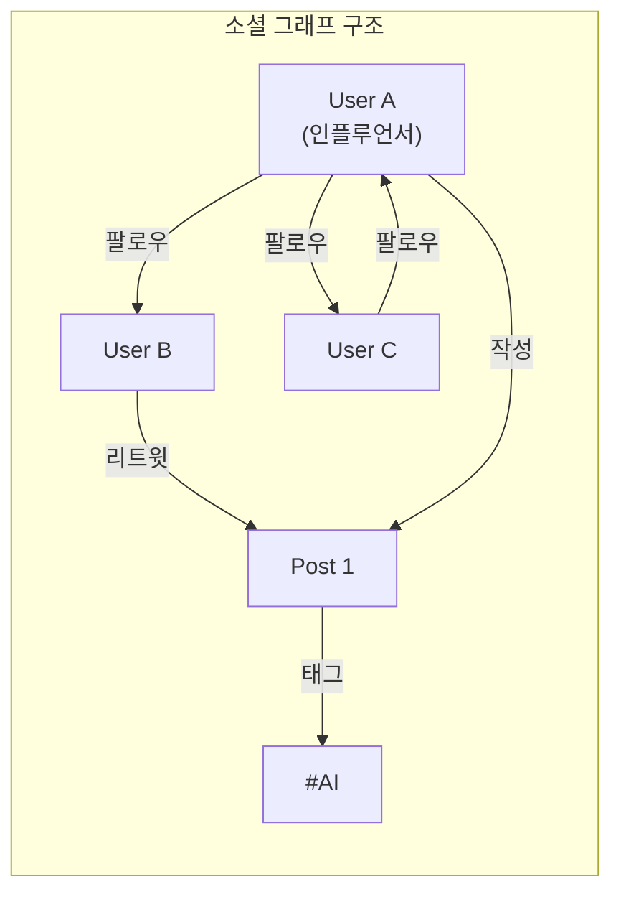
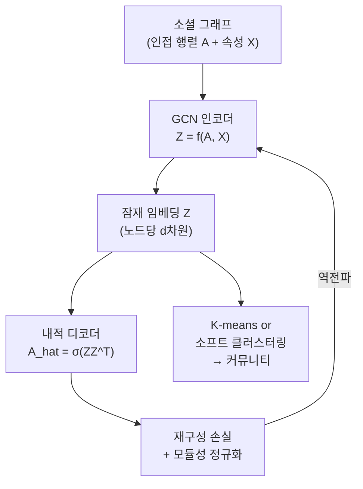
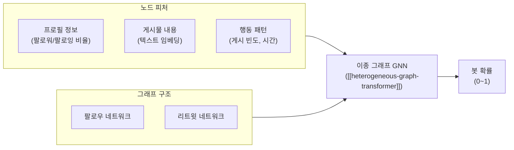

# 소셜 네트워크 GNN 분석

## 개요

소셜 네트워크 분석(SNA, Social Network Analysis)에 그래프 신경망(GNN)을 적용하는 분야는 [[graph-neural-networks]]의 가장 활발한 응용 영역 중 하나다. 전통적인 SNA가 중심성(centrality), 군집 계수(clustering coefficient) 같은 수작업 피처에 의존했다면, GNN 기반 SNA는 **네트워크 구조와 노드 속성을 함께 end-to-end로 학습**한다.

주요 태스크는 커뮤니티 탐지(community detection), 영향력 확산 예측(influence diffusion), [[link-prediction-gnn]]의 소셜 컨텍스트 특화 버전, 가짜 뉴스/봇 탐지 등이다.

## 소셜 그래프의 특성

일반 그래프와 구별되는 소셜 네트워크만의 특성:

- **척도 없는(scale-free) 분포**: 팔로워 수가 멱함수(power-law)를 따름. 허브 노드 존재
- **소세계(small-world) 특성**: 평균 경로 길이가 짧고 군집 계수가 높음
- **동종 선호(homophily)**: 비슷한 속성의 노드끼리 연결 경향
- **동적 변화**: 엣지가 시간에 따라 추가/삭제
- **이종 구조**: 사용자, 게시물, 그룹, 해시태그 등 다양한 타입 혼재



## 커뮤니티 탐지

### 전통적 방법 vs GNN

| 방법 | 접근 | 한계 |
|------|------|------|
| Louvain | 모듈성 최대화 (그리디) | 노드 속성 무시 |
| Spectral Clustering | 라플라시안 고유벡터 | 대규모 그래프 불가 |
| **GNN 기반** | 구조 + 속성 동시 학습 | 레이블 필요 (semi-supervised) |

### Graph Autoencoder 기반 커뮤니티 탐지



**VGAE (Variational Graph Autoencoder)**: 임베딩을 확률적으로 학습해 커뮤니티 경계의 불확실성을 모델링한다.

**Deep Graph Infomax**: 노드 임베딩과 글로벌 그래프 요약 간 상호 정보(mutual information)를 최대화해 비지도 학습으로 커뮤니티 구조를 포착한다.

## 영향력 확산 예측

### 독립 캐스케이드(IC) 모델과 GNN

전통적인 독립 캐스케이드 모델에서 노드 $v$가 이웃 $u$를 활성화할 확률 $p_{u,v}$를 GNN으로 학습한다:

$$p_{u,v} = \sigma(h_u \cdot W_e \cdot h_v)$$

$h_u, h_v$는 GNN이 학습한 노드 임베딩.

### DeepDiffuse / DiffusionProb

시간 정보를 포함한 확산 시퀀스를 학습하는 접근법:

```
시드 노드 → [t=0] → [t=1] → ... → [t=T] 활성화 노드 집합
```

GNN + 순환 신경망(RNN/Transformer)으로 확산 패턴의 시간적 의존성을 모델링한다.

**영향 최대화(Influence Maximization)**: GNN 임베딩 기반으로 제한된 예산($k$개 노드 선택)으로 확산 범위를 최대화하는 시드 선택 문제. 그리디 + GNN 재순위 조합이 실용적이다.

## 봇 및 가짜 뉴스 탐지

### 트위터 봇 탐지



**BotRGCN**: 관계형 GCN으로 트위터 팔로우/팔로잉/리트윗 관계를 별도 엣지 타입으로 처리. 텍스트, 숫자, 범주 피처를 결합해 봇 탐지.

### 가짜 뉴스 확산 패턴

가짜 뉴스와 진짜 뉴스는 소셜 미디어에서 다른 확산 패턴을 보인다:
- 가짜 뉴스: 버스트(burst) 패턴, 소규모 에코 챔버(echo chamber) 내 집중 확산
- 진짜 뉴스: 점진적 확산, 다양한 커뮤니티 전파

**UPFD (User Preference-aware Fake News Detection)**: 사용자-뉴스 이종 그래프에서 GNN으로 확산 패턴과 사용자 편향을 함께 학습.

## 링크 예측의 소셜 맥락

[[link-prediction-gnn]]에서 소셜 네트워크 특화 고려 사항:

- **상호 관계(reciprocity)**: 팔로우가 맞팔 가능성은 방향성 링크 예측
- **삼각 폐쇄(triangle closure)**: "공통 친구가 있으면 친구 될 가능성 높음" 가정
- **시간적 패턴**: 최근 상호작용이 과거보다 중요
- **부정적 샘플링 전략**: 인기 노드와 무작위 엣지 혼합이 편향을 줄임

## 동적 그래프 GNN

소셜 네트워크는 시간이 지남에 따라 변화한다. 이를 처리하는 두 가지 접근법:

**Snapshot 기반**: 시간 구간별 그래프 스냅샷을 GCN + LSTM으로 처리
$$h^t_v = \text{GNN}(A^t, H^{t-1})$$

**연속 시간 기반**: 이벤트(엣지 추가/삭제)를 시간 포인트 프로세스로 모델링. TGAT(Temporal Graph Attention Network)가 대표적.

## 실무 적용 시 고려사항

- **개인정보**: 소셜 그래프는 개인 식별 정보 포함. 연합 학습(federated learning) 또는 차분 프라이버시(differential privacy) 고려
- **대규모 확장**: 수억 노드 소셜 그래프에서 전체 배치 학습 불가. 미니배치 그래프 샘플링(GraphSAGE, Cluster-GCN) 필수
- **레이블 희소성**: 봇/가짜 뉴스 레이블은 적음. 반지도 학습(semi-supervised) 또는 자기지도 사전학습 활용

## 관련 문서

- [[graph-neural-networks]] - GNN 기반 개념 전반
- [[link-prediction-gnn]] - 소셜 네트워크 친구 추천·팔로우 예측
- [[heterogeneous-graph-transformer]] - 다중 타입 소셜 엔티티 처리를 위한 이종 그래프 모델
