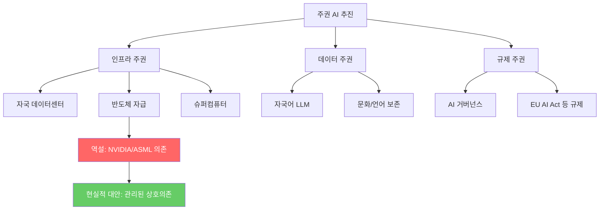

# 주권 AI / 국가 AI 전략

국가가 자체 인프라, 데이터, 인력, 규제를 통해 AI를 독자적으로 생산/제어/배포할 수 있는 역량을 확보하려는 글로벌 움직임.

## 개요

2026년 현재 50개국 이상에서 130개 이상의 주권 AI 프로젝트가 진행 중이며, 정부의 AI 인프라 투자 계획은 $1.3T(1.3조 달러)에 달한다. EU는 200B 유로 규모의 AI Continent Plan을 발표했고, 미국은 Project Stargate($500B), 중국은 반도체 자급률 80%를 목표로 한다. 그러나 BCG는 "AI 주권은 환상이며, 회복탄력성(resilience)이 현실"이라고 진단한다. 대부분의 국가가 NVIDIA 칩과 ASML 장비에 의존하는 근본적 역설이 존재하기 때문이다.

## 핵심 개념

### 주요 국가별 전략

| 국가/지역 | 전략/프로젝트 | 투자 규모 |
|-----------|--------------|-----------|
| 미국 | Project Stargate | $500B |
| EU | AI Continent Plan | 200B 유로 |
| 중국 | 반도체 자급률 80% 목표 | 미공개 (전방위 투자) |
| 한국 | 5개 재벌 컨소시엄 | $735B (7,350억 달러) |
| 사우디 | HUMAIN | $100B+ |
| 캐나다 | AI 주권 컴퓨팅 전략 | $1.5B |
| 인도 | 인도-AI 미션 (BharatGen) | 22개 언어 지원 |
| 싱가포르 | SEA-LION | $52M |
| 브라질 | Santos Dumont 슈퍼컴퓨터 | $320M |
| 네덜란드 | GPT-NL | ~$15M |

### 주권 AI의 세 가지 축

주권 AI는 단일 목표가 아니라 스펙트럼으로 이해해야 한다.

1. **인프라 주권**: 자국 내 데이터센터, 슈퍼컴퓨터, 반도체 제조 역량
2. **데이터 주권**: 자국 언어/문화 데이터로 학습한 자국어 LLM 개발
3. **규제 주권**: 자국 법과 가치관에 맞는 AI 거버넌스 프레임워크

### 근본적 역설

MIT Technology Review는 "모두가 주권을 원하지만 누구도 완전히 달성할 수 없다"고 진단한다. 핵심 병목은 다음과 같다.

- **GPU**: NVIDIA(미국)가 AI 학습/추론 칩 시장을 사실상 독점
- **리소그래피**: ASML(네덜란드)이 EUV 장비를 유일하게 제조
- **파운드리**: 최첨단 반도체 제조 비용 $10B-$20B, 건설에 3-5년 소요
- **미국 수출 규제**: 중국 등 특정 국가에 대한 첨단 AI 칩 수출 제한

## 기술 상세

### 주권 AI 전략 구조

### EU의 집단 주권 전략

EU는 개별 국가가 아닌 블록 단위의 집단 주권 전략을 채택했다. 19개 AI 팩토리 네트워크와 EuroHPC 프로젝트(~$2B)를 통해 컴퓨팅 인프라를 공유한다. 각국은 자국 언어 기반 LLM을 개발하면서도(네덜란드 GPT-NL, 스페인, 스웨덴 등), 인프라는 공동으로 구축하는 이중 전략이다. AI Act를 통해 규제 표준을 선도하고, 미국 빅테크에 대한 의존을 구조적으로 줄이려 한다.

### 미국의 수출 규제와 동맹 전략

미국은 AI 칩 수출 규제로 중국의 접근을 제한하면서, 동맹국과의 "디지털 연대"를 추진한다. 국가 AI 안전 연구소 네트워크를 구축하고, 민간 기업(Microsoft, Google, Meta, Amazon)의 대규모 인프라 투자가 사실상 미국 주권 AI의 핵심 동력이다.

### 중국의 자급자족 전략

중국은 미국 수출 규제에 대응하여 자체 AI 칩 개발과 슈퍼컴퓨팅 역량 강화에 집중한다. Huawei Ascend 칩 기반의 독자 생태계를 구축하고, 정부 규제를 통해 AI 모델에 이념적 검증을 요구한다. DeepSeek 등 자국 모델의 성과가 주목받고 있으나, 최첨단 반도체 제조에서는 여전히 기술 격차가 존재한다.

### 현실적 대안: 관리된 상호의존

완전한 AI 독립이 불가능하다는 인식이 확산되면서, "관리된 상호의존(managed interdependence)"이 현실적 대안으로 부상하고 있다. 신뢰할 수 있는 파트너와의 전략적 협력을 통해 핵심 기술의 다변화와 공급망 회복탄력성을 확보하는 접근이다.

## 관련 문서

- [[ai-regulation-us|미국 AI 규제]]
- [[us-china-ai-competition]] -- 미중 AI 패권 경쟁 구체 현황
- [[ai-copyright-litigation|AI 저작권 및 IP 소송]]
- [[ai-venture-bubble-2026|AI 벤처 버블 (2026 Q1 $300B)]]
- [[ai-ma-mega-deals|AI M&A 메가딜과 산업 통합]]
