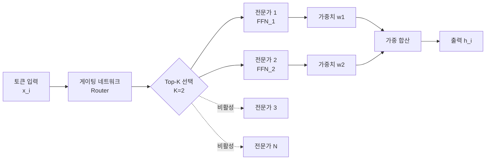
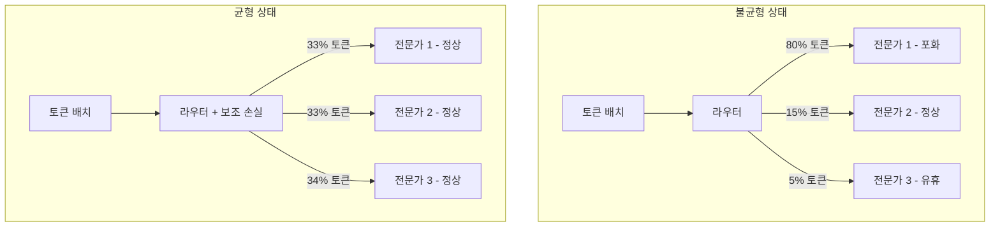
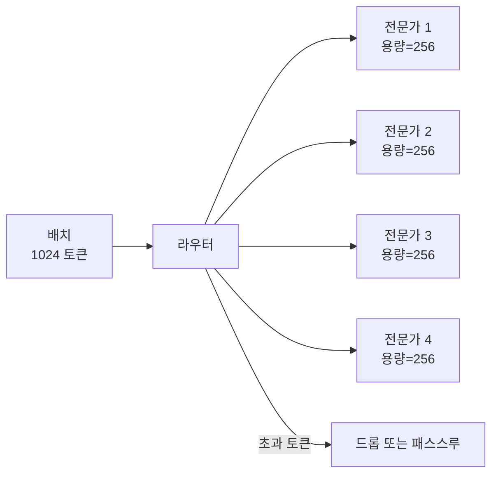

# 희소 MoE 이론

## 개요

희소 Mixture-of-Experts(MoE)는 트랜스포머 아키텍처에서 MLP 레이어를 다수의 전문가(expert) 네트워크로 대체하고, 각 입력 토큰에 대해 소수의 전문가만 활성화하는 방식이다. 이를 통해 **파라미터 총량은 크게 늘리면서도 연산량(FLOP)은 유지**하는 "조건부 연산(conditional computation)"을 실현한다.

Mixtral 8x7B, GPT-4(추정), Switch Transformer 등이 이 방식을 채택했다고 알려져 있다. 핵심 장점은 같은 추론 비용으로 더 많은 파라미터가 제공하는 표현력을 활용할 수 있다는 것이다.

## 기본 구조

수식으로 표현하면:

$$h_i = \sum_{j \in \text{Top-K}(G(x_i))} G(x_i)_j \cdot E_j(x_i)$$

여기서 $G(x_i)$는 게이팅 함수 출력(소프트맥스 확률), $E_j$는 j번째 전문가 FFN이다.

## 게이팅 메커니즘의 유형

### 소프트맥스 게이팅 (Noisy Top-K)

Switch Transformer 이전의 표준 방식. 게이팅 네트워크 출력에 가우시안 노이즈를 추가하여 탐험을 유도한다.

$$G(x) = \text{Softmax}(\text{Top-K}(x \cdot W_g + \text{Noise}))$$

### Switch Routing (Top-1)

Switch Transformer에서 제안. K=1로 제한하여 각 토큰이 하나의 전문가만 사용하게 한다. 연산 효율은 극대화되지만 불안정성이 증가한다.

### Expert Choice Routing

토큰이 전문가를 선택하는 대신, **전문가가 토큰을 선택**하는 역방향 라우팅. 각 전문가가 처리할 토큰을 직접 고르므로 부하 균형이 자동으로 달성된다.

## 부하 분산 문제

희소 MoE의 핵심 기술 과제는 전문가 간 부하를 균등하게 분산하는 것이다. 부하 불균형이 발생하면 일부 전문가는 과부하, 나머지는 유휴 상태가 된다.

### 보조 부하 균형 손실

가장 보편적인 해결책은 훈련 손실에 보조 항을 추가하는 것이다:

$$\mathcal{L}_{aux} = \alpha \cdot N \cdot \sum_{i=1}^{N} f_i \cdot P_i$$

- $f_i$: i번째 전문가에 배정된 토큰 비율 (실제 부하)
- $P_i$: 라우터가 i번째 전문가에 배정할 확률 (기대 부하)
- $N$: 전문가 수
- $\alpha$: 보조 손실 가중치 (일반적으로 0.01)

## 전문가 붕괴 (Expert Collapse)

전문가 붕괴는 훈련 과정에서 소수의 전문가만 계속 선택되고 나머지는 학습 기회를 잃는 현상이다. [[mixture-of-experts]] 연구에서 자주 보고되는 실패 모드다.

| 단계 | 현상 |
|------|------|
| 초기 훈련 | 모든 전문가가 비슷한 확률로 선택됨 |
| 중간 훈련 | 성능 좋은 전문가가 더 자주 선택되기 시작 |
| 후기 훈련 | 극소수 전문가에 모든 토큰이 집중 |
| 붕괴 완료 | 나머지 전문가는 사실상 사용되지 않음 |

붕괴를 방지하기 위한 접근들:

- 용량 요소(Capacity Factor) 제한
- 토큰 드롭(Token Dropping) 허용
- 초기화 전략 개선 (전문가들이 서로 다른 영역에서 시작하도록)
- Expert Choice Routing 사용

## 용량 요소 (Capacity Factor)

용량 요소는 각 전문가가 처리할 수 있는 최대 토큰 수를 결정하는 하이퍼파라미터다:

$$\text{Capacity} = \frac{\text{배치 내 토큰 수}}{\text{전문가 수}} \times \text{Capacity Factor}$$

Capacity Factor가 1.0이면 완벽한 균형을 가정한다. 현실에서는 1.25~2.0으로 설정하여 버퍼를 둔다. 용량을 초과하는 토큰은 드롭되거나 다음 레이어로 직접 통과한다.

## 분산 시스템에서의 MoE

실제 구현에서 MoE는 분산 훈련 전략과 복잡하게 얽힌다. 전문가들은 서로 다른 GPU에 배치(Expert Parallelism)될 수 있어, 토큰을 올바른 전문가에게 라우팅하는 All-to-All 통신이 필요하다.

[[moe-original-paper]]에서 최초 제안된 이 구조는 이후 GShard, Switch Transformer, GLaM, Mixtral 등으로 발전했다.

### 전문가 병렬성 vs. 데이터 병렬성

| 비교 항목 | 전문가 병렬성 | 데이터 병렬성 |
|-----------|--------------|--------------|
| 전문가 배치 | GPU마다 다른 전문가 | 각 GPU에 모든 전문가 복사 |
| 통신 패턴 | All-to-All (복잡) | AllReduce (단순) |
| 메모리 효율 | 높음 | 낮음 (전문가 중복) |
| 통신 비용 | 높음 | 낮음 |
| 적합 규모 | 대규모 MoE | 소규모 MoE |

## 전문가 전문화 패턴

흥미롭게도, 잘 훈련된 MoE 모델에서 전문가들은 자연스럽게 서로 다른 영역에 전문화되는 경향을 보인다:

- 특정 언어(영어, 코드, 수학)에 특화된 전문가
- 특정 토큰 유형(공백, 구두점, 숫자)에 특화된 전문가
- 특정 문법 역할(동사, 명사, 수식어)에 특화된 전문가

이 자연스러운 전문화가 MoE의 성능 향상 이유 중 하나로 추정된다.

## 관련 문서

- [[mixture-of-experts]] - MoE 기본 개념과 역사
- [[moe-original-paper]] - Shazeer et al. (2017) 원본 논문 요약
- [[sparse-autoencoders-mech-interp]] - 희소성 활용의 다른 사례
