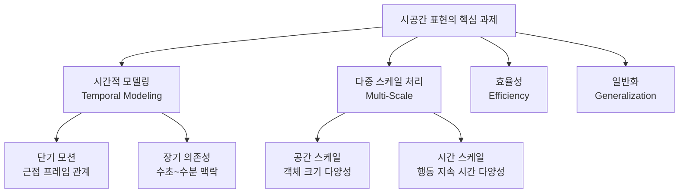
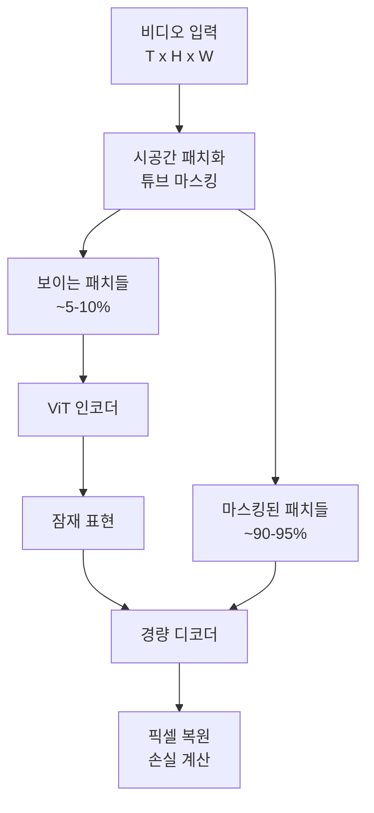
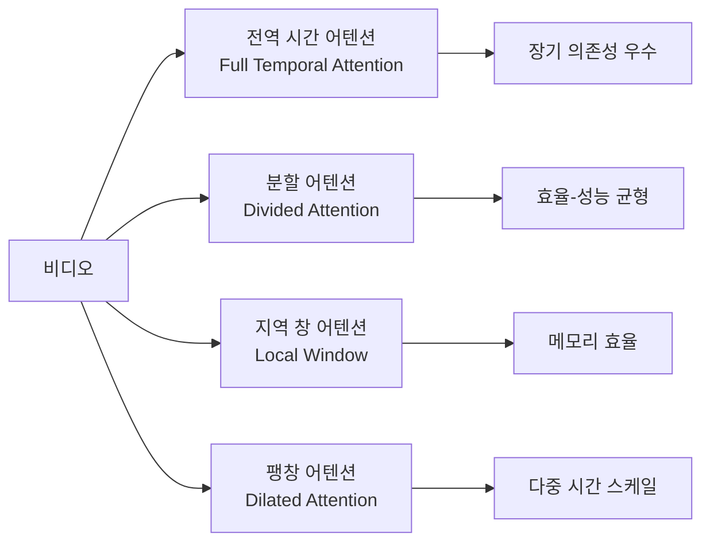

## 개요

시공간 표현 학습(Spatiotemporal Representation Learning)은 비디오에서 공간(spatial) 정보와 시간(temporal) 정보를 통합한 풍부한 특징(feature)을 추출하는 방법론이다. 정적 이미지와 달리 비디오는 **"무엇이 있는가(what)"** 와 **"어떻게 변화하는가(how)"** 를 동시에 인코딩해야 한다.

이 표현의 품질이 [[temporal-action-detection]], [[video-question-answering]], [[video-object-tracking]] 등 거의 모든 비디오 이해 태스크의 성능 상한(upper bound)을 결정한다.

## 핵심 과제

## 방법론 발전사

### 1세대: 광학 흐름 + CNN (2014-2018)

**Two-Stream Network**가 대표적. RGB 프레임에서 외관, 광학 흐름(optical flow)에서 모션을 별도 스트림으로 추출한 뒤 융합.

[[optical-flow-deep-learning]]은 모션 표현의 핵심 도구였으나, 광학 흐름 계산 비용이 높고 종단 간(end-to-end) 학습이 어렵다는 한계가 있다.

### 2세대: 3D CNN (2017-2020)

공간 필터를 시간 축으로 확장하여 시공간 패턴을 직접 학습.

| 모델 | 방식 | 특징 |
|------|------|------|
| C3D | 3x3x3 컨볼루션 | 시공간 통합 첫 시도 |
| I3D | 2D 필터를 시간 축으로 팽창(inflate) | ImageNet 사전학습 활용 |
| R(2+1)D | 공간 2D + 시간 1D 분리 | 파라미터 효율 개선 |
| SlowFast | 빠른/느린 경로 이중 스트림 | 다중 시간 해상도 |

### 3세대: Video Transformer (2021-현재)

Transformer의 셀프 어텐션을 비디오에 적용. 장기 의존성 모델링에 강점.

**[[timesformer-divided-attention]]**: 공간 어텐션과 시간 어텐션을 교번(alternating) 방식으로 분리하여 효율화.

**[[videomae-masked-video]]**: 마스크 오토인코더(MAE) 자기지도 학습을 비디오에 적용. 랜덤하게 마스킹된 비디오 패치를 복원하도록 학습하여 시공간 구조를 이해하는 강력한 표현 획득.

### 4세대: 대규모 사전학습 + 멀티모달 (2022-현재)

- **비디오-텍스트 정렬**: 대규모 비디오-캡션 쌍으로 CLIP 스타일 대조 학습
- **언어 감독(language supervision)**: 텍스트 설명이 시각 표현을 풍부하게 만드는 다리 역할
- **InternVideo2([[internvideo2-video-foundation]])**: 다양한 모달리티와 태스크를 통합 학습하는 비디오 파운데이션 모델

## 주요 설계 선택

### 시간적 모델링 전략

### 프레임 샘플링 전략

| 전략 | 방식 | 적합 태스크 |
|------|------|-------------|
| 균일 샘플링 | 고정 간격 | 일반 행동 인식 |
| 조밀 샘플링 | 짧은 클립 반복 | 세밀 동작 분석 |
| 희소 샘플링 | 긴 비디오 커버리지 | 장기 이해 |
| 적응형 샘플링 | 콘텐츠 기반 | 다양한 속도 |

### 시공간 위치 인코딩

- **분리형(Factorized)**: 공간 PE + 시간 PE 독립 적용
- **통합형(Joint)**: 3D 위치를 단일 임베딩으로
- **상대적(Relative)**: 절대 위치가 아닌 상대적 관계 인코딩

## 자기지도 학습 패러다임

레이블 없이 대규모 비디오에서 표현을 학습하는 것이 현재 주류.

| 방법 | 핵심 아이디어 |
|------|-------------|
| VideoMAE | 마스크 패치 복원 |
| MaskFeat | HOG 특징 예측 |
| BEVT | BERT 스타일 마스크 토큰 |
| DINO / DINOv2 | 자기 증류(self-distillation) |
| VICReg (비디오) | 분산-공분산 정규화 |

마스킹 비율이 높을수록(VideoMAE는 90% 이상) 모델이 프레임 간 시간적 관계를 더 적극적으로 추론해야 하므로 강력한 시공간 표현이 형성된다.

## 평가 벤치마크

| 데이터셋 | 태스크 | 특징 |
|----------|--------|------|
| Kinetics-400/600/700 | 행동 분류 | 가장 보편적 사전학습 데이터 |
| Something-Something v2 | 인과 행동 분류 | 시간적 추론 특화 |
| AVA | 시공간 행동 탐지 | 밀도 레이블 |
| Ego4D | 1인칭 비디오 | 일상 활동 |
| ActivityNet | 행동 인식/탐지 | 긴 비디오 |

## 실무 적용 관점

시공간 표현 품질은 다운스트림 태스크에 직접 연결된다:

- 강력한 VideoMAE 사전학습 특징 → [[temporal-action-detection]] mAP 개선
- 비디오-텍스트 정렬 표현 → [[video-question-answering]] 정확도 향상
- 정밀한 시공간 임베딩 → [[video-object-tracking]] 재동일화(re-identification) 성능 향상

현재 트렌드는 이미지 ViT 사전학습 가중치를 비디오로 전이(transfer)하는 것이다. ImageNet 사전학습 ViT를 비디오 파인튜닝하는 것이 비디오 전용 모델을 처음부터 학습하는 것보다 효율적임이 실증되었다.

## 관련 문서

- [[videomae-masked-video]] - 마스크 오토인코더 기반 시공간 표현 학습
- [[timesformer-divided-attention]] - 분할 어텐션으로 효율적 시공간 Transformer
- [[temporal-action-detection]] - 시공간 표현이 핵심 기반이 되는 태스크
- [[video-question-answering]] - 시공간 이해가 필요한 멀티모달 추론
- [[video-object-tracking]] - 시공간 특징을 활용한 객체 추적
