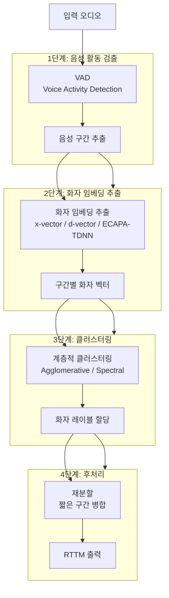

# 화자 분리 (Speaker Diarization)

## 개요

화자 분리(Speaker Diarization)는 오디오 스트림에서 **"누가 언제 말했는가(who spoke when)"**를 자동으로 파악하는 기술이다. 회의 녹음, 인터뷰, 전화 통화, 팟캐스트 등에서 여러 화자의 발화를 자동으로 구분하고 레이블을 붙이는 데 사용된다. [[whisper]] 같은 음성 인식(STT) 모델과 결합하면 "A가 10:02에 '안녕하세요'라고 말했다" 수준의 정보를 자동 생성할 수 있다.

## 핵심 문제 정의

화자 분리의 결과물은 시간 구간별 화자 레이블이다. 이를 **RTTM(Rich Transcription Time Mark)** 형식으로 표현한다.

```
SPEAKER meeting_1  1  0.00  5.23  <NA>  <NA>  SPEAKER_A  <NA>  <NA>
SPEAKER meeting_1  1  5.23  8.41  <NA>  <NA>  SPEAKER_B  <NA>  <NA>
SPEAKER meeting_1  1  8.41 12.00  <NA>  <NA>  SPEAKER_A  <NA>  <NA>
```

이 과정에서 해결해야 할 세부 문제:
- **화자 수 추정**: 사전에 화자 수를 모르는 경우가 대부분
- **겹침 발화(overlap) 처리**: 두 화자가 동시에 말하는 구간
- **화자 변경점 검출**: 어느 시점에 화자가 바뀌었는지
- **화자 동일성 유지**: 같은 화자를 일관된 레이블로 추적

## 전통적 파이프라인



## 주요 접근법

### 1. 임베딩 + 클러스터링 (전통적)

- **MFCC / Filter Bank** 특성 추출 후 GMM/i-vector로 화자 모델링 (2010년대 이전)
- **x-vector + PLDA** (2018~): 딥러닝 임베딩으로 화자 특성 압축 후 PLDA 점수로 클러스터링
- **d-vector / ECAPA-TDNN** (2020~): 더 표현력 높은 임베딩 모델

### 2. 종단간(End-to-End) 접근법

- **EEND(End-to-End Neural Diarization)**: 오디오 입력에서 직접 화자 레이블 예측. 겹침 발화 처리가 가능한 이점
- **EEND-EDA**: 인코더-디코더 어텐션으로 가변 화자 수 처리
- **Pyannote.audio**: EEND 기반 파이프라인 오픈소스 라이브러리 (가장 널리 사용)

### 3. LLM 기반 (최신)

- [[whisper]] 출력과 화자 분리 결과를 결합해 화자별 트랜스크립트 생성
- 화자 분리 자체를 LLM의 학습 목표로 포함하는 연구 진행 중

## 평가 지표: DER

화자 분리는 **DER(Diarization Error Rate)**로 평가한다.

$$\text{DER} = \frac{\text{Miss} + \text{False Alarm} + \text{Confusion}}{\text{총 화자 활동 시간}}$$

- **Miss**: 실제 발화를 묵음으로 잘못 처리한 비율
- **False Alarm**: 묵음을 발화로 잘못 처리한 비율
- **Confusion**: 화자 레이블을 잘못 할당한 비율

최신 모델은 1-person 회의에서 DER 5% 이하를 달성하지만, 다화자 겹침 발화가 많은 환경에서는 여전히 10-20% 수준이다.

## [[whisper]]와의 결합

[[whisper]]는 뛰어난 STT 성능을 갖지만 화자 분리 기능이 없다. 두 기술을 결합하는 일반적인 방법:

1. [[whisper]]로 전체 오디오의 텍스트와 타임스탬프 생성
2. Pyannote.audio로 RTTM 형식의 화자 분리 결과 생성
3. 시간 겹침 기반으로 각 [[whisper]] 세그먼트에 화자 레이블 매핑

이 결합 파이프라인은 회의 요약, 인터뷰 분석, [[audio-rag]] 등의 실무 응용에서 표준 접근법이다.

## [[audio-rag]]에서의 역할

[[audio-rag]] 파이프라인에서 화자 분리는 검색 인덱스의 품질을 높이는 전처리 단계로 사용된다. 화자별로 청크를 분리하면:

- "A 씨가 말한 내용만 검색" 같은 화자 특정 쿼리 가능
- 같은 화자의 발언을 맥락으로 묶어 더 긴 의미 단위 생성
- 회의 참여자별 기여도 분석 가능

## 실무 관점

화자 분리는 "회의록 자동 생성", "고객센터 통화 분석", "팟캐스트 트랜스크립션" 등 기업 환경에서 실용적 수요가 매우 높다. 현재 가장 접근하기 쉬운 도구는 `pyannote/speaker-diarization-3.1` (HuggingFace)이며, [[whisper]]와의 결합을 위해 `whisperx` 라이브러리가 편리하다. 정확도는 음질, 화자 수, 겹침 발화 비율에 크게 영향을 받는다.

## 관련 문서

- [[whisper]] - 화자 분리와 결합해 화자별 트랜스크립트를 생성하는 STT 모델
- [[audio-rag]] - 화자 분리를 전처리로 활용하는 오디오 RAG 파이프라인
- [[audiolm-framework]] - 오디오 이해의 기반 프레임워크
