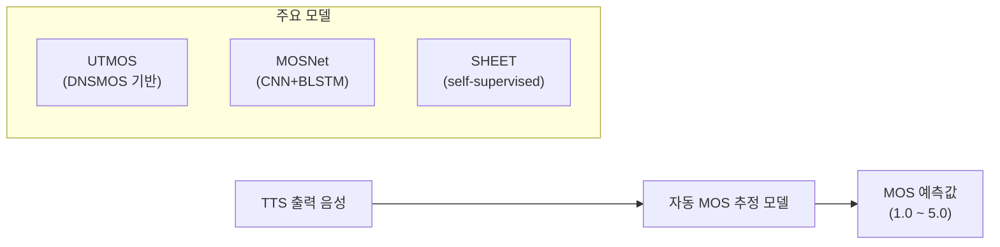
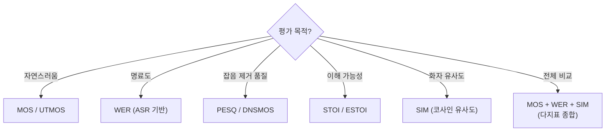

# 음성 합성 평가 지표

## 개요

음성 합성(TTS, Text-to-Speech) 및 음성 변환 시스템의 품질을 측정하는 지표는 크게 **주관적(subjective)** 평가와 **객관적(objective)** 평가로 나뉜다. [[voxcpm2]], [[voicebox-nonautoregressive-tts]] 같은 현대 TTS 모델 논문에서는 두 유형을 모두 사용해 다각도 품질 검증을 수행한다. [[whisper]] 같은 ASR 모델과 결합해 자동 전사 기반 평가를 수행하는 패턴도 표준화되고 있다.

## 주관적 평가 지표

### MOS (Mean Opinion Score)

음성 품질 평가의 황금 기준(gold standard)으로, 청취자들이 1-5점으로 음성을 평가한 평균값이다.

| 점수 | 품질 설명 |
|------|----------|
| 5.0 | 완벽 (Excellent) |
| 4.0 | 좋음 (Good) |
| 3.0 | 보통 (Fair) |
| 2.0 | 나쁨 (Poor) |
| 1.0 | 매우 나쁨 (Bad) |

**한계**
- 수십~수백 명의 청취자가 필요해 비용이 높음
- 문화권/청취 환경에 따라 결과가 달라짐
- 재현성(reproducibility) 확보가 어려움
- 학습 루프에 통합 불가능

이를 보완하기 위해 자동 MOS 추정 모델들이 개발되었다.

### MUSHRA (MUltiple Stimuli with Hidden Reference and Anchor)

여러 시스템을 동시에 비교하는 청취 테스트 방법론. 참조(reference)와 앵커(anchor)를 숨긴 채로 평가자가 여러 샘플을 0-100점으로 채점한다. 음성 코덱, 음성 향상 시스템 비교에 적합하다.

## 자동 객관적 평가 지표

### PESQ (Perceptual Evaluation of Speech Quality)

ITU-T P.862 표준으로 정의된 음성 품질 자동 측정 지표. 원본 참조 음성과 처리된 음성을 비교해 지각적 유사도를 계산한다.

```
PESQ 점수 범위: -0.5 ~ 4.5 (광대역), 1.0 ~ 4.5 (협대역)
```

**특징**
- 전화 품질 평가(ITU 표준)에서 유래
- 참조 음성이 반드시 필요 (reference-based)
- 잡음 제거, 패킷 손실 복구 평가에 적합
- TTS 자연스러움 평가에는 부적합 (참조 음성 없음)

### STOI (Short-Time Objective Intelligibility)

음성 **명료도(intelligibility)**를 측정하는 지표. 0~1 사이 값으로, 청취자가 발화를 얼마나 잘 이해할 수 있는지를 추정한다.

```python
# 사용 예 (pystoi 라이브러리)
from pystoi import stoi

d = stoi(reference_signal, processed_signal, fs=16000, extended=False)
# d: 0.0(전혀 이해 불가) ~ 1.0(완벽 이해)
```

**ESTOI (Extended STOI)**: 낮은 SNR 환경에서 STOI의 예측 정확도를 개선한 변형판.

### WER (Word Error Rate)

ASR([[whisper]] 등)로 합성 음성을 전사한 뒤 원본 텍스트와 비교하는 간접 평가 지표.

$$\text{WER} = \frac{S + D + I}{N} \times 100\%$$

- $S$: 대체(substitution) 단어 수
- $D$: 삭제(deletion) 단어 수
- $I$: 삽입(insertion) 단어 수
- $N$: 참조 텍스트 총 단어 수

낮을수록 좋으며, TTS 자연스러움보다는 **발음 정확도**를 측정한다.

### 자동 MOS 추정 모델



**UTMOS (UTokyo-SaruLab MOS)**: MOS 예측 대회(VoiceMOS Challenge)에서 SOTA를 달성한 앙상블 모델. 강한 지도학습 시스템과 자기지도 피처를 결합한다.

**DNSMOS**: Microsoft가 개발한 딥러닝 기반 음성 품질 자동 평가. 잡음 제거 성능 평가에 특화.

## 화자 유사도 평가

TTS의 제로샷 화자 복제 품질 평가에 사용된다.

### SV (Speaker Verification) 기반 유사도

화자 검증 모델([[whisper]] 기반 또는 ECAPA-TDNN 등)로 생성 음성과 참조 음성의 임베딩을 추출한 뒤 코사인 유사도를 계산.

$$\text{SIM} = \cos(\mathbf{e}_{gen}, \mathbf{e}_{ref}) = \frac{\mathbf{e}_{gen} \cdot \mathbf{e}_{ref}}{|\mathbf{e}_{gen}||\mathbf{e}_{ref}|}$$

### EER (Equal Error Rate)

화자 인증에서 거짓 수락률(FAR)과 거짓 거부율(FRR)이 같아지는 지점의 오류율. 낮을수록 화자 구별 능력이 좋음.

## 지표 선택 가이드



| 시나리오 | 권장 지표 조합 |
|---------|-------------|
| TTS 논문 SOTA 비교 | MOS/UTMOS + WER + SIM |
| 잡음 환경 음성 향상 | PESQ + STOI + MOS |
| 화자 복제 시스템 | SIM + WER + MOS |
| 실시간 서비스 모니터링 | UTMOS + WER (자동화 용이) |

## 실무에서의 주의사항

- **MOS 인플레이션**: 현대 TTS 시스템은 자연 발화에 근접한 MOS를 달성해 상위권 변별이 어려움. MUSHRA나 A/B 테스트가 더 민감
- **도메인 의존성**: PESQ는 전화 품질(8/16kHz) 가정으로 광대역 시스템에 부적합
- **참조 음성 품질**: 참조 기반 지표(PESQ, STOI)는 참조 음성 품질 자체가 변수가 됨
- **WER의 함정**: ASR 모델의 편향이 WER에 반영될 수 있음 (특정 발음 방식에 유리)

## 관련 문서

- [[voxcpm2]] - 비자기회귀 TTS 모델 (평가 지표 실제 적용 사례)
- [[whisper]] - WER 계산 및 음성 전사에 활용되는 ASR 모델
- [[voicebox-nonautoregressive-tts]] - Flow Matching 기반 TTS의 평가 패턴
