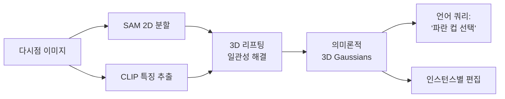
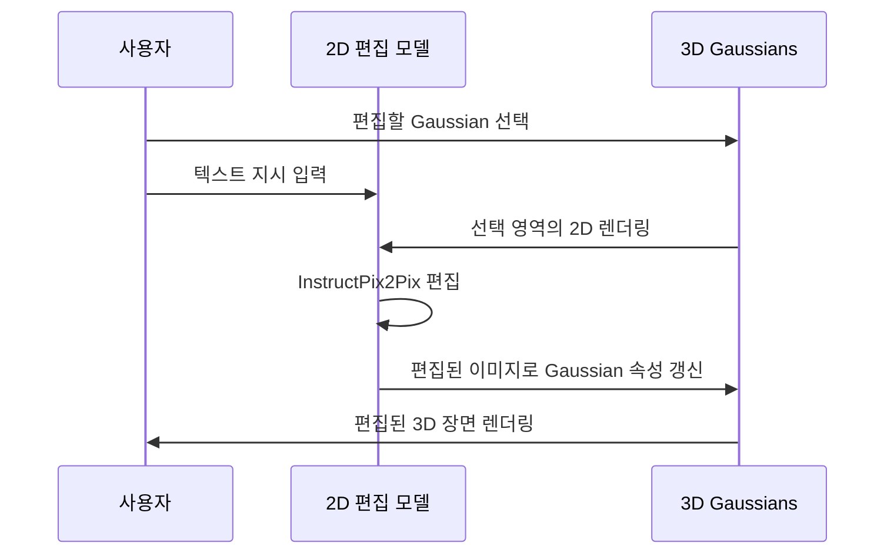

# Splat 기반 장면 표현

Splat 기반 장면 표현은 [[3d-gaussian-splatting]](3DGS)이 제공하는 명시적 Gaussian 표현을 기반으로, 장면 편집(editing), 합성(composition), 압축(compression), 세분화(segmentation) 등 다양한 하류 작업으로 확장하는 기법들의 총칭이다. 단순한 렌더링 도구를 넘어 편집 가능하고 의미론적으로 풍부한 장면 표현 시스템으로 발전하고 있다.

## 3DGS가 편집에 유리한 이유

[[nerf-neural-radiance-fields|NeRF]]는 암묵적 신경망 가중치에 장면 정보를 분산 저장하므로, 특정 물체를 선택하거나 편집하기 어렵다. 반면 [[3d-gaussian-splatting]]은 각 Gaussian이 명시적인 위치·크기·색상 파라미터를 가지므로:

- 특정 Gaussian 집합을 선택·이동·삭제 가능
- 개별 Gaussian의 속성(색상, 불투명도) 직접 수정
- 두 장면의 Gaussian을 단순히 병합(concatenation)으로 합성

```mermaid
flowchart TD
    subgraph 3DGS_기반
        SG[장면 Gaussians\nN×(μ, Σ, α, SH)]
    end
    SG --> SEG[의미론적 분할\n물체별 레이블]
    SG --> EDIT[장면 편집\n이동/삭제/교체]
    SG --> COMP[장면 합성\n다중 장면 병합]
    SG --> COMP2[압축\n저비트 표현]
    SG --> D4GS[4D 확장\n동적 장면]
```

## 주요 확장 방향

### 1. 의미론적 3DGS (Semantic Gaussian Splatting)

각 Gaussian에 의미론적 특징(semantic feature)을 추가로 할당하여 언어 쿼리나 분할 작업을 지원한다.

- **Feature 3DGS**: CLIP/DINO 특징을 Gaussian에 증류(distill). 언어로 Gaussian 검색 가능
- **LangSplat** (Qin et al. 2023): SAM 분할 마스크 + CLIP 특징을 3D에 리프팅
- **Gaussian Grouping**: 물체 수준 분할. 각 Gaussian에 인스턴스 레이블 할당



### 2. 편집 가능한 3DGS (Editable 3DGS)

텍스트 지시나 예시 이미지로 특정 물체의 외관을 변경한다.

- **GaussianEditor** (Chen et al. 2023): InstructPix2Pix + 3DGS. 텍스트로 외관 편집
- **Gaussian Inpainting**: 물체 제거 후 배경 자동 복원
- **StyleGaussian**: 스타일 이미지를 참조하여 텍스처 전이

편집 파이프라인:



### 3. 장면 합성 (Scene Composition)

별도로 학습한 Gaussian 장면들을 결합하여 새로운 장면을 구성한다.

- **물체 삽입**: 전경 Gaussian + 배경 Gaussian 결합
- **스케일 맞춤**: 상대 스케일 추정 후 Gaussian 재스케일
- **조명 일관성**: 구면 조화(SH) 계수 재추정으로 조명 통일

### 4. 3DGS 압축 (Compression)

대규모 Gaussian(수백만 개)은 저장·전송 비용이 크다. 압축 기법:

| 방법 | 원리 | 압축률 |
|------|------|--------|
| 위치 양자화 | 무질서한 위치를 격자 인덱스로 | 5-10× |
| 속성 벡터 양자화 | 색상/SH 계수 코드북 학습 | 3-8× |
| 중요도 기반 가지치기 | 기여 낮은 Gaussian 제거 | 2-5× |
| VQ-VAE | Gaussian 속성 잠재 코드로 압축 | 10-50× |

- **LightGaussian** (Fan et al. 2023): Gaussian 중요도 계산 → 가지치기 + 속성 증류
- **Compact 3D Gaussians**: 신경망으로 압축된 Gaussian 속성 디코딩

### 5. 물리 시뮬레이션과 결합

Gaussian의 명시적 위치를 강체·소프트바디 시묥레이션과 연결.

- **PhysGaussian** (Xie et al. 2023): MPM(Material Point Method)으로 Gaussian 변형 시뮬레이션
- **GaussianSim**: 로봇 조작을 위한 Gaussian 기반 물리 환경
- Gaussian 위치 → 파티클로 매핑 → 물리 엔진 업데이트 → 렌더링

## [[nerf-neural-radiance-fields|NeRF]]와의 장단점 비교

| 항목 | Splat (3DGS) | NeRF |
|------|-------------|------|
| 편집 용이성 | 명시적 → 직접 조작 | 가중치 분산 → 어려움 |
| 렌더링 속도 | 실시간 (30+ FPS) | 느림 (수 초) |
| 표면 품질 | Gaussian 원반 아티팩트 | 부드러운 표면 |
| 메모리 | Gaussian 수에 비례 | 고정 (모델 크기) |
| 학습 속도 | 빠름 (수십 분) | 느림 (수 시간) |
| 합성 | 직접 병합 가능 | 재학습 필요 |

## 실무 활용 예시

- **게임/영화 VFX**: 실사 촬영 장면 → 3DGS → 선택적 요소 교체
- **실내 디자인 시각화**: 방 스캔 → Gaussian 가구 교체
- **로봇 조작 시뮬레이터**: Gaussian 장면에서 물리 시뮬레이션
- **AR 콘텐츠**: 실제 공간의 3DGS에 가상 Gaussian 오브젝트 합성

## 현재 한계와 연구 방향

- **미관측 부분 처리**: 가려진 영역의 Gaussian은 품질 저하
- **반사·투명 표면**: 기본 3DGS로 표현 어려움 → 특수 Gaussian 변형 연구 중
- **대규모 장면**: 도시 단위 Gaussian은 수억 개 → 스트리밍·LOD 기법 필요
- **물체 재사용**: 같은 물체 유형의 Gaussian을 라이브러리화하는 연구

## 관련 문서

- [[3d-gaussian-splatting]] - Splat 표현의 기반 기법
- [[nerf-neural-radiance-fields|NeRF]] - 암묵적 표현과의 비교 및 하이브리드 접근
- [[4d-gaussian-splatting]] - 시간 축 확장으로 동적 장면 처리
- [[structure-from-motion]] - Gaussian 초기화에 사용하는 SfM 포즈 추정
- [[implicit-surface-representation]] - 대조적 표현 방식: SDF/Occupancy 기반 표면
