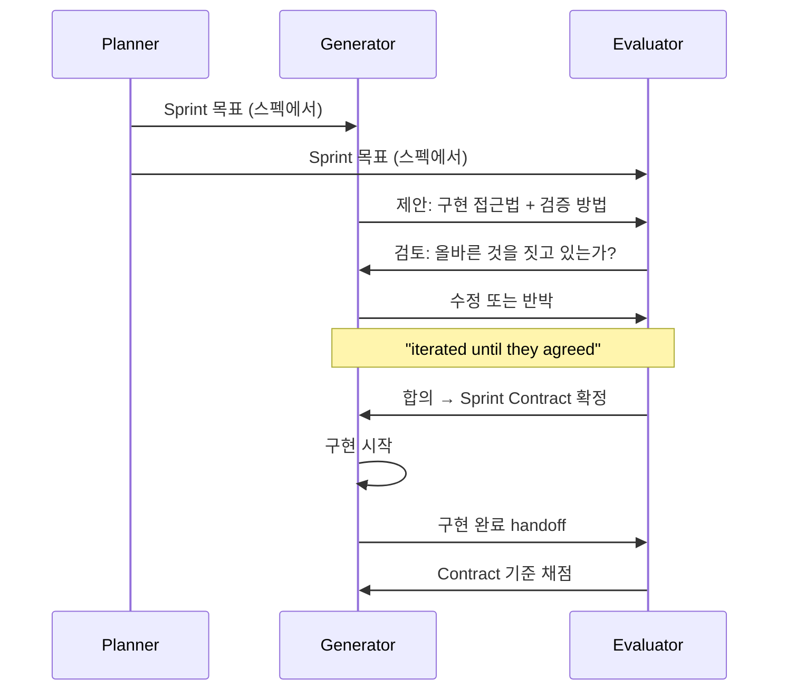

# Sprint Contracts (스프린트 계약)

## 정의

**Sprint Contract**는 구현을 시작하기 전에 **Generator와 Evaluator가 "이 sprint에서 무엇을 만들고, 어떻게 성공을 검증할지" 를 명시적으로 협상해 문서화하는 pre-coding 합의**다. Anthropic의 Prithvi Rajasekaran이 [[anthropic harness design|Harness Design for Long-Running Application Development]] 에서 도입한 용어.

> "Before coding each sprint, generator and evaluator negotiated a 'sprint contract' defining what 'done' looked like and how success would be verified."

## 왜 필요한가

[[generator-evaluator architecture|Generator-evaluator 패턴]]을 순진하게 돌리면 두 가지 문제가 생긴다:

1. **Over-specification**: Planner가 upfront에 세부 구현까지 명시하면 작은 실수가 downstream에 cascade된다
2. **Under-specification**: 높은 수준의 user story만으로는 "done"의 의미가 모호해 evaluator가 공정하게 채점할 수 없다

Sprint contract는 이 사이의 **just-in-time 해상도**를 제공한다 — planner가 미리 정하지 못한 구체성을 sprint가 시작되는 순간에 generator와 evaluator가 함께 정한다.

## 협상 절차

단계별:

1. **Planner의 고수준 목표**가 sprint에 할당됨 (예: "sprite editor 구현")
2. **Generator가 구현 접근법 제안** — 어떤 컴포넌트를 만들지, 어떤 API를 노출할지, 무엇을 verification 기준으로 할지
3. **Evaluator가 검토** — 제안된 검증 방법이 user story를 충분히 커버하는가? 빠진 edge case는 없는가?
4. **양자가 합의할 때까지 반복** — "iterated until they agreed"
5. **Contract 확정 후 generator가 구현 시작**

## 계약에 들어가는 것

- **Success criteria**: 이 sprint가 끝났다고 말할 수 있는 구체적 조건들
- **Verification method**: 어떻게 검증할 것인가 (Playwright 시나리오? API 호출? DB 상태 확인?)
- **주요 API/컴포넌트**: 어떤 인터페이스가 외부에 노출되는가
- **Out of scope**: 이번 sprint가 다루지 *않을* 것 (다음 sprint로 미루거나 아예 제외)

## 무엇이 들어가지 **않는가**

- **Granular implementation details**: 변수 이름, 파일 구조, 내부 알고리즘은 generator에 맡김
- **스펙 전체**: Planner의 제품 스펙은 contract의 *맥락*일 뿐, 재기술되지 않음
- **모든 edge case**: Contract는 "critical path"와 주요 verification만 고정. Evaluator는 이후에도 undiscovered edge case를 찾을 수 있음

## Upfront vs Just-in-Time 해상도

Sprint contract의 핵심 통찰은 **해상도의 시점**이다:

| 접근 | 시점 | 문제 |
|---|---|---|
| Upfront (전통 spec) | Planner 단계 | Cascade 에러, 유연성 상실 |
| Just-in-time (sprint contract) | Sprint 시작 | 적정 수준 고정, 이후 자유 |
| No spec (ad-hoc) | 없음 | 검증 기준 부재 |

Contract는 **"지금 알아야 할 것만 지금 고정"** 이라는 점진적 공개 원칙을 multi-agent 조율에 적용한 것이다.

## Inter-Agent 통신 수단

Sprint contract는 보통 **파일**로 구현된다. Generator가 contract 초안을 파일로 쓰고, evaluator가 같은 파일에 코멘트를 달거나 새 파일로 응답한다. 이 파일은:

- 버전 관리됨 (git)
- 구현 중 generator가 재참조 가능
- QA 단계에서 evaluator의 채점 기준 문서로 사용
- 다음 sprint의 context로 전달 가능

## 실무 시사점

- 새 sprint를 시작할 때 "우리가 무엇을 만드는가"가 모호하면 먼저 contract를 협상
- Contract 작성 자체를 한 번의 LLM call로 끝내지 말 것 — 반드시 **양측 iterative 검토**
- Contract는 너무 길지 않게. 1페이지를 넘어가면 over-specification 위험
- Sprint가 자주 실패하면 contract 단계의 문제인지, 구현 단계의 문제인지 분리해 분석

## 모델 capability와의 관계

[[load-bearing harness|load-bearing test]] 관점에서, sprint contract는 **특정 capability boundary에서만 가치 있다**:

- **낮은 capability**: Generator가 스펙 해석을 실수로 crashes → contract 필수
- **중간 capability** (Opus 4.5 수준): Generator가 지시만으로는 under-scope → contract 여전히 필요
- **높은 capability** (Opus 4.6 이후): Generator가 전체 스펙을 native하게 decompose → sprint 구조 자체가 불필요해질 수 있음

실제로 Anthropic 저자는 Opus 4.6에서 **sprint 구조를 완전히 제거**했다. Planner와 end-of-run evaluator는 유지했지만 sprint-level contract는 더 이상 load-bearing이 아니었다.

## 관련 문서

- [[generator-evaluator architecture]] — sprint contract는 이 아키텍처의 핵심 조율 메커니즘
- [[anthropic harness design]] — 용어가 도입된 원 출처
- [[load-bearing harness]] — contract 자체의 필요성도 모델 capability에 따라 변한다
- [[harness engineering]] — pre-coding 합의는 "feedforward" 하네스 요소
- [[harness quadrants]] — contract는 deterministic/feedforward (Guides) 방향에 가깝지만 non-deterministic 생성이 뒤따른다
