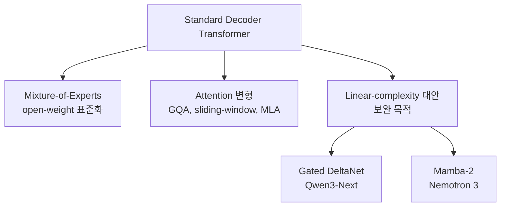

# The State Of LLMs 2025 (Sebastian Raschka 2025-12)

Sebastian Raschka가 정리한 2025년 LLM 분야의 진보, 문제, 예측. Substack "Ahead of AI" 게시.

## 핵심 트렌드: Reasoning + RLVR

2025년 dominant 패러다임 = **Reasoning models with RLVR (Reinforcement Learning with Verifiable Rewards) + GRPO algorithm**.

> "The 'V' in RLVR represents verifiable rewards—deterministic correctness labels enabling models to learn from large-scale data without expensive human annotations."

## DeepSeek R1: 패러다임 전환점

DeepSeek R1 (2025년 1월 출시):
- 추론 능력을 RL로 발전 가능하다는 증명
- 훈련 비용 약 **$294,000 (compute credits)** — 산업 가정보다 훨씬 적음

## GRPO: 올해의 알고리즘

GRPO에 대한 다수의 정제:
- Zero gradient signal filtering + active sampling
- Token-level loss modifications
- 특정 도메인에서 KL loss 제거
- Truncated importance sampling
- Modified advantage normalization

이 수정들은 훈련 안정성과 성능을 크게 개선 — 작은 규모 실험에서도.

## 아키텍처 진화

표준 decoder transformer가 여전히 dominant, 단 효율성 개선 추가:

이는 **대체가 아니라 보완** — LLM 배포 비용 부담 해소 목적.

## 연도별 LLM 개발 포커스

| 연도 | 핵심 |
|---|---|
| 2022 | RLHF + PPO |
| 2023 | LoRA + parameter-efficient fine-tuning |
| 2024 | Mid-training + 데이터 최적화 |
| 2025 | **RLVR + GRPO** |

## 추론 시 스케일링 (Inference-Time Scaling)

DeepSeekMath-V2: gold-medal 수준의 수학 올림피아드 성능 — self-consistency + self-refinement 결합으로.

## 도구 사용 통합

도구 사용이 hallucination 감소에 핵심.
- OpenAI gpt-oss는 검색엔진/계산기/코드 인터프리터 등 외부 도구 활용을 명시적 훈련

## 주목할 만한 변화

1. 다수 모델이 gold-medal 수준 수학 추론 (OpenAI, Gemini, DeepSeekMath-V2)
2. **Qwen이 Llama를 대체**해 선호 open-weight foundation 모델로
3. **MCP**가 도구 접근의 ecosystem 표준으로 빠르게 정립
4. 다수의 경쟁력 있는 open-weight 후보: Kimi, GLM, MiniMax, Yi
5. OpenAI가 첫 open-weight 모델 gpt-oss 출시

## "Benchmaxxing" 문제

> "Public benchmarks no longer reliably reflect real-world capabilities."

- Test-set 최적화
- 의도적/비의도적 데이터 contamination
- 벤치마크 유효성 약화

여전히 임계값 indicator로는 유용 — low score = weak model이지만 high score가 우월성을 보장하지 않음.

## 2026-2027 예측

### 2026 포커스
- **RLVR 확장**: 수학/코딩 → 화학, 생물학
- 소비자용 diffusion 모델 보급 (Gemini Diffusion 선두 예측)
- Open-weight ecosystem의 local tool use 채택
- **Long-context 처리 개선이 classical RAG를 대체**
- 추론 최적화에서 진보 (순수 훈련 진보보다)

### 2027
- **Continual learning 부상** — catastrophic forgetting 해결

## Private Data Advantage

기업이 도메인 특화 데이터를 LLM 제공자에게 판매하기를 꺼리는 경향 → DeepSeek V3.2 같은 foundation 모델을 base layer로 한 in-house 특화 모델 기회.

## 인간 전문성에 대한 관점

- LLM = 생산성 "superpowers"
- 도메인 전문성은 **더 가치 있어짐** (대체되지 않음) — 더 나은 AI 도구 활용 가능
- 과의존 위험: 기술 발달 저해, intrinsic motivation 침식 ("burnout 가속")
- 체스 비유: AI가 경쟁 플레이를 향상시켰지 제거하지 않음

## 메모

- 게시일: 2025-12-30
- Substack: Ahead of AI
- Raschka의 신간: *Build A Reasoning Model (From Scratch)* — post-training, inference scaling, RL for reasoning
- 각 챕터에 75-120 시간 소요 (실험, 그림, 정제 포함)

## 관련 문서

- [[deepseek-v4]] — DeepSeek 모델 시리즈
- [[mixture-of-experts]] — MoE 아키텍처
- [[mamba-3]] — Mamba 시리즈 (linear-complexity)
- [[grpo-algorithm]] — GRPO 알고리즘
- [[rlhf-rlvr-history]] — RLHF/RLVR 진화 (있다면 후속 보강)
- [[ai-reasoning-models]] — 추론 모델 일반
- [[long-context-processing]] — Long context 처리
- [[benchmark-saturation-goodharts-law]] — Benchmaxxing 관련
