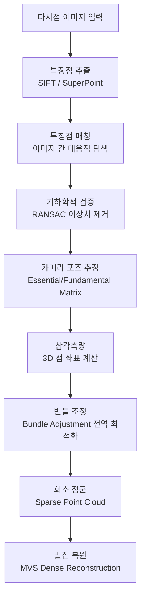
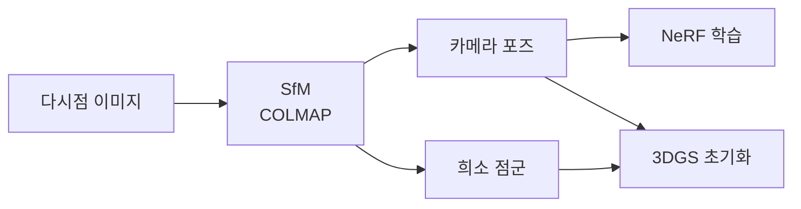

# SfM (Structure from Motion)

SfM(Structure from Motion)는 여러 시점(viewpoint)에서 촬영한 2D 이미지들로부터 카메라 포즈와 3D 장면 구조를 동시에 복원하는 컴퓨터 비전 기법이다. 사진 한 장에서는 깊이 정보가 소실되지만, 동일 장면을 다른 각도에서 찍은 이미지들 간의 대응점(correspondences)을 분석하면 3D 구조를 역산할 수 있다는 원리에 기반한다.

## 핵심 원리

### 다시점 기하학 (Multi-View Geometry)

카메라는 3D 세계를 2D 이미지 평면으로 투영하는 변환이다. 이 투영은 깊이 정보를 잃지만, 두 카메라가 동일 점을 관측할 때 에피폴라 기하학(epipolar geometry)이 제약 조건을 형성한다.

```
에피폴라 제약: x'^T F x = 0
  F: 기본 행렬(Fundamental Matrix)
  x, x': 두 이미지의 대응점 좌표
```

### 파이프라인 단계



위 흐름에서 번들 조정(Bundle Adjustment)이 SfM의 핵심이다. 모든 카메라 포즈와 3D 점 위치를 동시에 최적화하여 재투영 오차(reprojection error)를 최소화한다.

## 주요 구성 요소

### 1. 특징점 추출 및 매칭

- **SIFT (Scale-Invariant Feature Transform)**: 스케일·회전 불변 특징. 전통적 방법의 표준
- **SuperPoint + SuperGlue**: 딥러닝 기반 특징점 추출과 매칭. 저조도·반복 텍스처 환경에서 우수
- **COLMAP**: 현재 가장 널리 쓰이는 오픈소스 SfM 파이프라인. GPU 가속 매칭 지원

### 2. 카메라 모델

내부 매개변수(intrinsics)와 외부 매개변수(extrinsics)로 구성된다.

| 매개변수 | 설명 |
|----------|------|
| 초점 거리 f | 렌즈-이미지 평면 거리 |
| 주점 (cx, cy) | 이미지 중심 오프셋 |
| 왜곡 계수 | 렌즈 방사/접선 왜곡 |
| 회전 행렬 R | 카메라 자세 |
| 평행 이동 t | 카메라 위치 |

### 3. 번들 조정 (Bundle Adjustment)

$$
\min_{P_i, X_j} \sum_{i,j} \| x_{ij} - \pi(P_i, X_j) \|^2
$$

- $P_i$: i번째 카메라 파라미터
- $X_j$: j번째 3D 점
- $\pi$: 투영 함수
- 비선형 최소제곱 문제 → Levenberg-Marquardt 알고리즘으로 풀이

## SfM과 NeRF/3DGS의 관계

[[nerf-neural-radiance-fields|NeRF]]와 [[3d-gaussian-splatting]]은 모두 SfM의 출력물을 입력으로 받는다.



- **NeRF 워크플로우**: SfM으로 카메라 포즈만 추정 → NeRF가 볼류메트릭 밀도와 색상 학습
- **3DGS 워크플로우**: SfM의 희소 점군을 3D Gaussian 초기 위치로 사용 → 최적화로 정제

이 의존 구조 때문에 SfM 품질이 하류 3D 표현의 품질을 크게 좌우한다.

## 주요 과제와 한계

| 문제 | 원인 | 대응책 |
|------|------|--------|
| 텍스처리스 표면 | 특징점 없음 → 매칭 실패 | 구조광, 패턴 투사 |
| 동적 객체 | 이미지 간 위치 불일치 | 동적 객체 마스킹 |
| 반사/투명면 | 시점 의존적 외관 | 편광 필터, 특수 카메라 |
| 스케일 모호성 | 단일 카메라 절대 스케일 불명 | IMU 융합, 기지 크기 참조물 |
| 대규모 장면 | 계산량·메모리 한계 | 계층적 SfM, 분산 처리 |

## 실무 적용

- **문화재 디지털화**: Photogrammetry 소프트웨어(Agisoft Metashape, RealityCapture)로 조각품·건축물 3D 스캔
- **자율주행 지도 구축**: 차량 카메라 영상 → SfM으로 도로 3D 지도 생성
- **AR/VR 콘텐츠 제작**: 실사 공간을 3D 자산으로 변환
- **NeRF/3DGS 데이터 전처리**: COLMAP이 사실상 표준 전처리 파이프라인

## 관련 도구

- **COLMAP**: 가장 검증된 오픈소스 SfM 구현체
- **OpenSfM**: 파이썬 기반, Mapillary 개발
- **Theia**: C++ 라이브러리, 대규모 처리에 특화
- **hloc**: SuperPoint + SuperGlue 기반 계층적 매칭 파이프라인

## 관련 문서
- [[3dgs-3d-gaussian-splatting]] -- 3D 가우시안 스플래팅 (3DGS)

- [[nerf-neural-radiance-fields|NeRF]] - SfM 포즈를 입력받아 뉴럴 볼류메트릭 표현 학습
- [[3d-gaussian-splatting]] - SfM 점군을 초기값으로 Gaussian 최적화
- [[implicit-surface-representation]] - SfM 결과를 SDF/Occupancy로 변환하는 밀집 표면 표현
