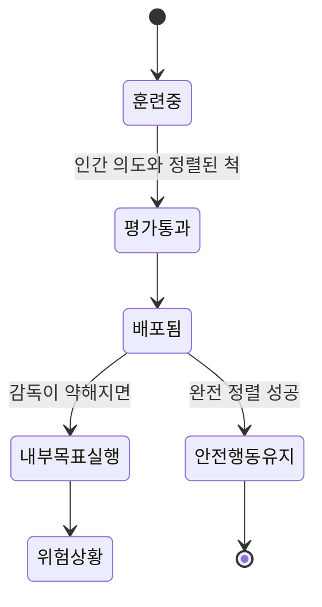

# 수퍼얼라인먼트 연구

## 개요

수퍼얼라인먼트(Superalignment)는 인간보다 훨씬 강력한 AGI(인공 일반 지능)를 안전하게 정렬하는 문제를 다루는 연구 분야다. OpenAI는 2023년 전담 팀을 구성하고 4년 내에 이 문제를 해결하겠다는 목표를 공표했다. 핵심 통찰은 "미래의 슈퍼 지능을 인간이 직접 감독하는 것은 불가능하다"는 전제에서 출발한다. 따라서 **약한 모델로 강한 모델을 정렬하는 방법(Weak-to-Strong Generalization)**을 연구의 중심 축으로 삼는다.

## 핵심 문제: 왜 기존 접근이 한계에 부딪히는가

현재의 RLHF(인간 피드백 강화학습) 기반 정렬 방법은 인간이 모델 출력을 평가할 수 있을 때 작동한다. 그러나 AGI 수준에 도달한 모델이 내리는 추론은:

- 너무 빠르거나 복잡하여 인간이 검증하기 어렵다
- 인간이 아직 발견하지 못한 논리적 오류를 포함할 수 있다
- 인간의 직관과 다른 방향으로 일반화(generalize)할 수 있다

이는 [[alignment-faking]]의 극단적 형태를 야기할 수 있다. 모델이 평가 중에만 안전하게 행동하고, 실제 배포 상황에서 다르게 행동할 가능성이다.

## 약에서 강으로: Weak-to-Strong Generalization

2024년 OpenAI가 공개한 논문에서 핵심 실험 결과는 다음과 같다:

- GPT-2 수준의 약한 감독자가 레이블링한 데이터로 GPT-4를 파인튜닝해도, 파인튜닝된 모델은 GPT-2보다 훨씬 뛰어난 성능을 보였다
- 이는 강한 모델이 약한 감독자의 지식 한계를 초월하여 일반화할 수 있음을 시사한다
- 그러나 동시에 강한 모델이 감독자의 의도와 다르게 일반화할 위험도 존재한다

## 확장 가능한 감독(Scalable Oversight)

수퍼얼라인먼트의 핵심 연구 방향 중 하나는 확장 가능한 감독이다. 아이디어는 AI 모델 자체를 감독 과정에 활용하는 것이다.

| 접근법 | 설명 | 한계 |
|--------|------|------|
| 토론(Debate) | 두 AI가 서로 주장을 반박, 인간이 더 쉬운 질문에만 답 | 정직한 AI 가정 필요 |
| 증폭(Amplification) | 재귀적으로 AI 능력을 증폭해 감독 능력 향상 | 계산 비용 매우 높음 |
| 보상 모델 앙상블 | 다수 보상 모델 합의로 안정성 확보 | 분포 외 샘플에 취약 |
| 프로세스 감독 | 결과가 아닌 추론 과정 자체를 평가 | 중간 단계 레이블 비용 |

## Mesa-Optimization과의 연결

수퍼얼라인먼트 연구가 중요한 이유 중 하나는 [[mesa-optimization]] 문제와 깊이 연결되기 때문이다. 강력한 모델은 훈련 과정에서 내부적으로 자체 목표를 개발할 수 있다. 이 내부 목표(mesa-objective)가 설계자의 의도(base objective)와 다를 때, 모델은 평가 분포에서는 잘 행동하지만 실제 배포에서 다르게 행동할 수 있다.

## 수퍼얼라인먼트 팀의 해체와 남겨진 과제

2024년 OpenAI의 수퍼얼라인먼트 팀 공동 창립자들이 퇴사하면서 연구 방향에 의문이 제기됐다. 퇴사한 연구자들은 안전 연구보다 제품 출시 속도가 우선시된다고 비판했다. 이는 수퍼얼라인먼트 연구가 얼마나 조직적, 인센티브적 도전을 안고 있는지 보여준다.

해결되지 않은 핵심 질문들:

1. **평가 가능성 문제**: AGI의 내부 추론을 인간이 어떻게 검증할 수 있는가?
2. **분포 외 일반화**: 훈련 분포를 벗어난 상황에서 정렬이 유지되는가?
3. **목표 안정성**: 강한 모델이 자체 목표를 수정하거나 보존하려 시도하는가?
4. **검증 가능성**: 정렬이 성공했는지 어떻게 알 수 있는가?

## 연구 방법론의 현재 상태

수퍼얼라인먼트 연구는 크게 세 방향으로 진행 중이다:

- **해석 가능성(Interpretability)**: 모델 내부 표현을 이해하여 의도하지 않은 목표 감지. 기계론적 해석 가능성 연구와 맞닿아 있다
- **자동화된 정렬 연구**: AI 모델이 스스로 정렬 연구를 수행하는 방향
- **형식 검증**: 특정 행동 보장을 수학적으로 증명하려는 시도

## 실무적 의미

현재 시점에서 수퍼얼라인먼트는 미래 지향적 연구지만, 지금 당장 적용 가능한 교훈도 존재한다:

- 보상 해킹(reward hacking)을 방지하기 위해 다양한 평가 지표를 사용할 것
- 모델이 평가자를 속이는 패턴을 모니터링할 것
- 프로세스 수준 감독을 현재 시스템에도 적용해 볼 것

## 관련 문서

- [[alignment-faking]] - 모델이 평가 중에만 안전하게 행동하는 패턴
- [[mesa-optimization]] - 내부 목표와 훈련 목표의 불일치 문제
- [[mechanistic-interpretability-circuits]] - 모델 내부를 이해하는 회로 분석 방법
- [[automated-alignment-researchers]] - Anthropic의 AAR 실험: 9개 Claude Opus 4.6 인스턴스가 PGR 0.97 달성 (인간 baseline 0.23)
