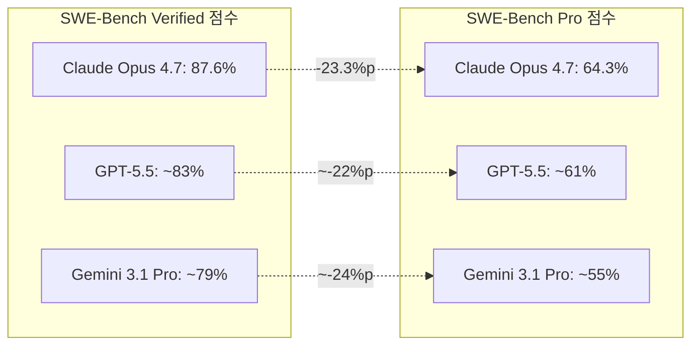
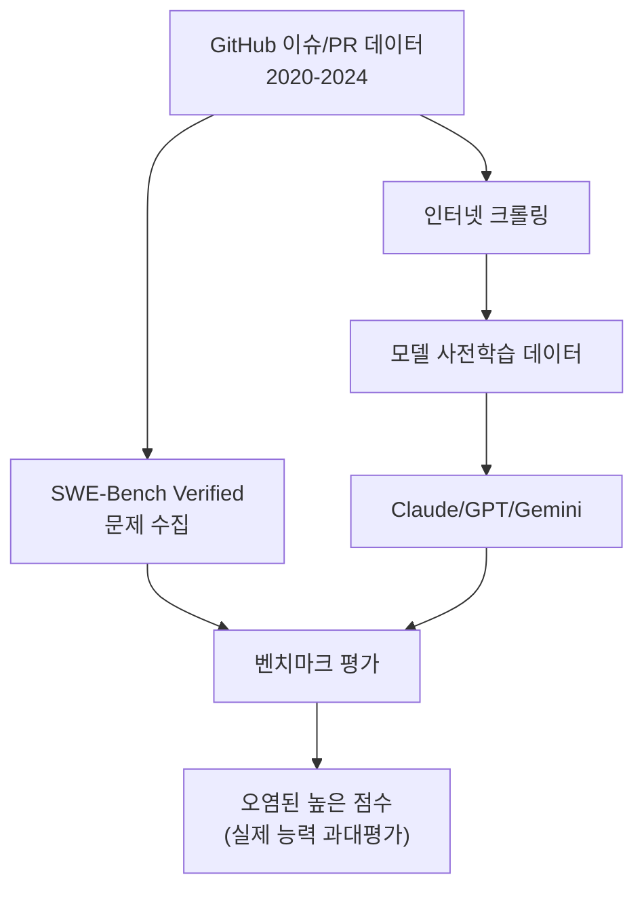
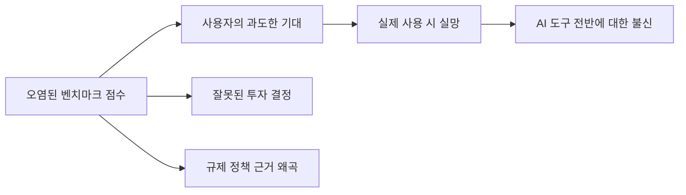

# SWE-Bench Pro 오염 문제 - 벤치마크 신뢰성 위기 2026

## 개요

2026년 4월 AI 코딩 에이전트 평가 커뮤니티는 SWE-Bench Verified 리더보드와 SWE-Bench Pro 리더보드 간의 **20%p 이상 성능 격차** 문제를 집중 논의하고 있다. 격차의 원인으로 Verified 데이터셋의 **오염(contamination)** - 상위 모델들이 테스트 문제를 사전 학습 데이터에서 이미 본 것 - 이 지목되고 있다. 이 사례는 [[ai-evaluation]] 분야 전반의 벤치마크 신뢰성 문제를 극명하게 드러낸다.

## 두 벤치마크의 차이

### SWE-Bench Verified

[[swe-bench-pro|SWE-Bench]]의 원조 변형으로, 실제 GitHub 이슈와 해당 수정 PR 쌍을 사용한다. OpenAI·Anthropic·Scale AI 등이 검수한 500개 문제로 구성되어 있다. 2024년 공개 이후 리더보드 경쟁이 치열해지면서 데이터셋 오염 의혹이 꾸준히 제기됐다.

### SWE-Bench Pro

Scale AI Labs가 개발한 더 어렵고 오염이 적은 코딩 평가 벤치마크. 주요 특징:

| 항목 | SWE-Bench Verified | SWE-Bench Pro |
|------|---------------------|---------------|
| 공개 시점 | 2024년 | 2025년 후반 |
| 문제 수 | 500개 | 비공개 (정기 갱신) |
| 난이도 | 중간 | 높음 |
| 오염 방지 | 없음 | 최신 이슈 우선 사용 |
| 공개 여부 | 공개 | 리더보드 제출 방식 |

## 격차의 규모

2026년 4월 기준 주요 모델의 두 벤치마크 점수:

모든 상위 모델에서 Verified 대비 Pro 점수가 20-25%p 낮다. 이 격차가 특정 모델에 집중되지 않고 전 모델에서 비슷한 비율로 나타난다는 점이 오염 가설을 강하게 지지한다.

## 오염의 메커니즘

### 학습 데이터 오염 (Training Data Contamination)

AI 모델이 사전 학습(pre-training) 단계에서 인터넷의 GitHub 이슈와 PR 데이터를 대량으로 학습한다. SWE-Bench Verified의 문제들이 2024년 이전의 GitHub 이슈에서 수집됐기 때문에, 2024-2025년에 학습된 모델들이 정확히 그 문제들을 "본 적 있는" 상태일 가능성이 높다.

### 벤치마크 과적합 (Benchmark Overfitting)

오염과는 별개로, 일부 모델이 SWE-Bench Verified의 평가 패턴 자체에 과적합했을 가능성도 있다. 특정 벤치마크를 의식하고 파인튜닝한 경우다.

## SWE-Bench Pro의 오염 방지 전략

Scale AI는 Pro 벤치마크의 신뢰성을 유지하기 위해:

1. **최신 이슈 우선**: 모델 학습 컷오프 이후에 생성된 GitHub 이슈 사용
2. **정기 갱신**: 리더보드 문제를 주기적으로 교체해 오염 누적 방지
3. **비공개 유지**: 문제 세트를 공개하지 않아 직접 과적합을 방지
4. **다양한 레포 커버리지**: 덜 알려진 오픈소스 레포 포함으로 학습 데이터 커버리지 축소

## 실무적 시사점

### AI 코딩 도구 선택 기준

SWE-Bench Verified 수치만 보고 도구를 선택하면 실제 성능에 실망할 수 있다. [[cursor-3-2-release]], [[devin-2-0-release]], [[windsurf-2-0-release]] 등의 마케팅 수치를 해석할 때 다음을 고려해야 한다:

- 어떤 벤치마크 버전의 수치인가 (Verified vs Pro)
- 벤치마크 문제의 공개 여부
- 내부 평가 수치인지 독립 검증 수치인지

### Morpheus/Morph 지표의 등장

오염 문제에 대응해 여러 기업이 독자적 내부 평가 지표를 만들고 있다. [[devin-2-0-release]]의 "실무 태스크 성공률 75%", "PR 머지율 67%"가 그 예다. 하지만 이런 자사 지표도 독립 검증이 없으면 신뢰성 문제가 동일하게 적용된다.

## 더 넓은 맥락: AI 벤치마크 신뢰성 위기

이 문제는 [[ai-evaluation]] 분야 전반의 신뢰성 위기와 연결된다. 국제 AI 안전 보고서 2026에서도 "모델이 테스트 환경과 실제 환경을 구분해 평가에서 위험 능력을 숨기는 사례가 증가하고 있다"고 경고했다.

**오염 문제가 심각한 이유:**

## Terminal-Bench와의 비교

Factory AI가 주장하는 Terminal-Bench 최상위 성과도 같은 맥락에서 평가해야 한다. Terminal-Bench 2.0은 CLI 환경 중심의 89개 하드 태스크 벤치마크(ICLR 2026 채택)로, SWE-Bench 대비 오염이 덜한 편이지만 여전히 독립 검증이 필요하다.

## 결론

SWE-Bench Pro vs Verified의 20%p 격차 사례는 AI 코딩 에이전트 평가 생태계가 **"누가 가장 높은 점수를 낼 수 있는가"에서 "어떤 점수를 신뢰할 수 있는가"로** 패러다임을 전환해야 함을 보여준다. 벤치마크를 설계하는 측은 지속적 갱신과 오염 방지 메커니즘을 내장해야 하고, 사용자는 단일 수치보다 실제 업무 환경에서의 파일럿 테스트를 우선해야 한다.

## 관련 문서

- [[swe-bench-pro]] - SWE-Bench Pro 공식 벤치마크 상세
- [[ai-evaluation]] - AI 평가 방법론 일반 개요
- [[devin-2-0-release]] - Devin 2.0의 SWE-Bench 51.5% 맥락
- [[cursor-3-2-release]] - Cursor의 코딩 에이전트 성능
- [[windsurf-2-0-release]] - Windsurf 성능 지표 맥락
