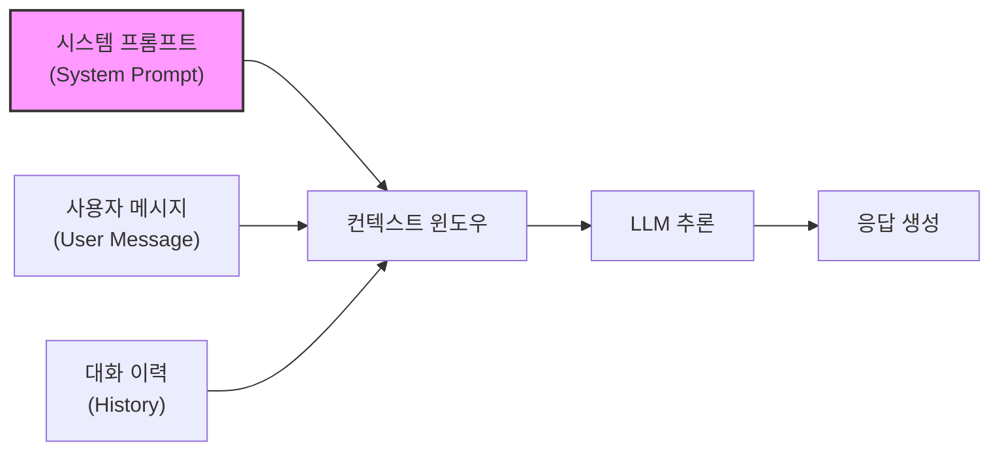

# 시스템 프롬프트 (System Prompt)

## 정의

시스템 프롬프트(System Prompt)는 LLM 추론 시 **모델의 행동, 역할, 제약을 정의하는 최상위 지시문**이다. 사용자 메시지(user message)보다 먼저 처리되며, 대화 전체에 걸쳐 모델의 응답 방식을 결정하는 "운영 체제" 역할을 한다. API 호출에서 `system` 역할(role)로 전달되고, 사용자에게는 보통 노출되지 않는다.

[[prompt-engineering|프롬프트 엔지니어링]]이 개별 질의의 품질을 높이는 기법이라면, 시스템 프롬프트는 **모든 질의에 적용되는 기저 규칙(ground rules)**을 설정하는 것이다.

## LLM 추론에서의 역할

LLM은 입력 토큰 시퀀스를 조건부 확률 분포로 처리한다. 시스템 프롬프트는 이 시퀀스의 가장 앞에 위치하여 모든 후속 생성에 조건을 부여한다.

시스템 프롬프트가 컨텍스트 윈도우의 최상단에 위치하여 모든 후속 토큰 생성에 영향을 미친다.

핵심 메커니즘:

- **어텐션 편향(Attention Bias)**: 시스템 프롬프트 토큰은 모든 후속 토큰에 대해 어텐션을 받으므로, 모델 행동에 지속적 영향을 미침
- **조건부 생성(Conditional Generation)**: 모델은 $P(\text{response} | \text{system}, \text{user}, \text{history})$를 계산하므로 시스템 프롬프트가 출력 분포 자체를 변형
- **프롬프트 캐싱(Prompt Caching)**: Anthropic, OpenAI 등은 시스템 프롬프트를 캐싱하여 반복 호출 시 연산 비용을 절감 -- 시스템 프롬프트가 고정적이라는 특성을 활용

## 구조: 4대 구성 요소

잘 설계된 시스템 프롬프트는 다음 네 가지 층을 포함한다:

### 1. 정체성(Identity)

모델이 누구인지, 어떤 역할을 수행하는지 정의한다.

- "당신은 Python 전문 코딩 어시스턴트입니다"
- "당신은 의학 용어를 일반인에게 설명하는 건강 상담사입니다"
- 정체성 설정은 모델의 어조, 전문성 수준, 응답 스타일에 큰 영향을 미침

### 2. 규칙(Rules)

모델이 따라야 하는 행동 규칙과 제약을 명시한다.

- 출력 형식: "항상 JSON으로 응답하세요", "마크다운 테이블 사용"
- 언어: "한국어로만 응답", "기술 용어는 영어 병기"
- 길이: "3문장 이내로 요약", "상세한 설명 제공"
- 안전: "의학적 조언은 하지 마세요", "개인정보 요청 거부"

### 3. 컨텍스트(Context)

모델이 참조해야 하는 배경 정보를 제공한다.

- 회사 FAQ, 제품 매뉴얼, 코드베이스 설명
- 사용자 프로필, 선호도, 이전 상호작용 요약
- [[context-engineering|컨텍스트 엔지니어링]]의 핵심 적용 지점

### 4. 제약(Constraints)

모델이 **하지 말아야 할 것**을 명시한다.

- "경쟁사 제품을 추천하지 마세요"
- "코드 생성 시 eval()을 사용하지 마세요"
- "불확실한 정보를 사실처럼 말하지 마세요"

## 에이전트에서의 시스템 프롬프트

[[coding-agent|코딩 에이전트]]와 같은 LLM 에이전트 시스템에서 시스템 프롬프트는 단순한 지시문을 넘어 **에이전트의 운영 프레임워크** 역할을 한다.

### Claude Code의 시스템 프롬프트 구조

[[claude-code|Claude Code]]는 시스템 프롬프트에 다음 요소를 포함한다:

- **도구 정의(Tool Definitions)**: 사용 가능한 도구 목록과 JSON Schema 형식의 파라미터 정의
- **실행 규칙**: 파일 수정 전 반드시 읽기, 커밋 전 테스트 실행 등의 워크플로우 규칙
- **CLAUDE.md 주입**: 프로젝트별 규칙 파일을 시스템 프롬프트에 동적으로 삽입
- **환경 정보**: OS, 셸, 작업 디렉토리 등 런타임 컨텍스트

### 에이전트 시스템 프롬프트의 특수성

에이전트의 시스템 프롬프트는 일반 챗봇과 비교해 고유한 요구사항이 있다:

1. **도구 사용 프로토콜**: 어떤 도구를 언제 호출할지, 결과를 어떻게 해석할지
2. **에러 복구 전략**: 도구 호출 실패 시 재시도, 대안 경로, 사용자 확인 요청
3. **안전 가드레일(Safety Guardrails)**: 위험한 작업(파일 삭제, force push) 전 확인, [[agent-prompt-injection-defense|프롬프트 인젝션 방어]]
4. **멀티턴 상태 관리**: 긴 작업에서 목표 추적, 중간 결과 참조, 컨텍스트 압축

## 설계 모범 사례

### 효과적인 시스템 프롬프트 작성법

1. **구체적으로 작성**: "좋은 응답을 해주세요"보다 "3문단으로 구성하고, 각 문단에 예시를 포함하세요"
2. **우선순위 명시**: 충돌하는 규칙이 있을 때 어느 것이 우선인지 명확히 지정
3. **네거티브 예시 포함**: "~하지 마세요"뿐만 아니라 구체적으로 무엇을 피해야 하는지 예시 제공
4. **단계적 공개(Progressive Disclosure)**: 모든 규칙을 한 번에 나열하기보다, 카테고리별로 구조화
5. **테스트 주도 반복(Test-Driven Iteration)**: 엣지 케이스를 발견할 때마다 규칙을 추가하고 회귀 테스트

### 흔한 실수

- **과도한 지시**: 규칙이 너무 많으면 모델이 우선순위를 혼동하고 중요한 규칙을 놓침
- **모순된 규칙**: "간결하게 응답하세요"와 "모든 세부사항을 포함하세요"가 공존
- **정적 프롬프트 고수**: 사용자 피드백과 실제 사용 패턴을 반영해 지속적으로 갱신해야 함
- **보안 무시**: 시스템 프롬프트 내용이 사용자에게 유출될 수 있음을 고려하지 않음

## 프롬프트 엔지니어링과의 관계

[[prompt-engineering|프롬프트 엔지니어링]]의 기법들 -- Few-shot, Chain-of-Thought, ReAct 등 -- 은 시스템 프롬프트 내에서도 적용된다. 예를 들어:

- Few-shot 예시를 시스템 프롬프트에 포함하여 일관된 출력 형식 유도
- Chain-of-Thought 지시("단계별로 생각하세요")를 기본 행동으로 설정
- 출력 파싱 규칙을 시스템 프롬프트에 명시하여 structured output 보장

시스템 프롬프트는 [[context-engineering|컨텍스트 엔지니어링]]의 핵심 구성 요소이기도 하다. 모델에 전달되는 전체 컨텍스트 -- 시스템 프롬프트, 검색된 문서, 도구 결과, 대화 이력 -- 를 최적화하는 것이 컨텍스트 엔지니어링의 범위이며, 시스템 프롬프트는 그중 가장 안정적이고 통제 가능한 부분이다.

## 관련 문서
- [[agent-persona-identity]] -- 에이전트 페르소나와 아이덴티티

- [[prompt-engineering]] -- 프롬프트 설계 기법 전반
- [[context-engineering]] -- 모델에 전달되는 전체 컨텍스트 최적화
- [[claude-code]] -- 시스템 프롬프트 기반 에이전트 아키텍처 사례
- [[coding-agent]] -- 코딩 에이전트의 시스템 프롬프트 활용
- [[agent-prompt-injection-defense]] -- 시스템 프롬프트 보안 위협과 방어
