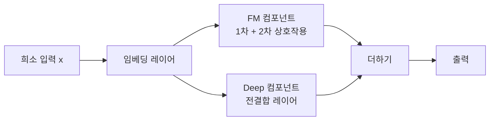
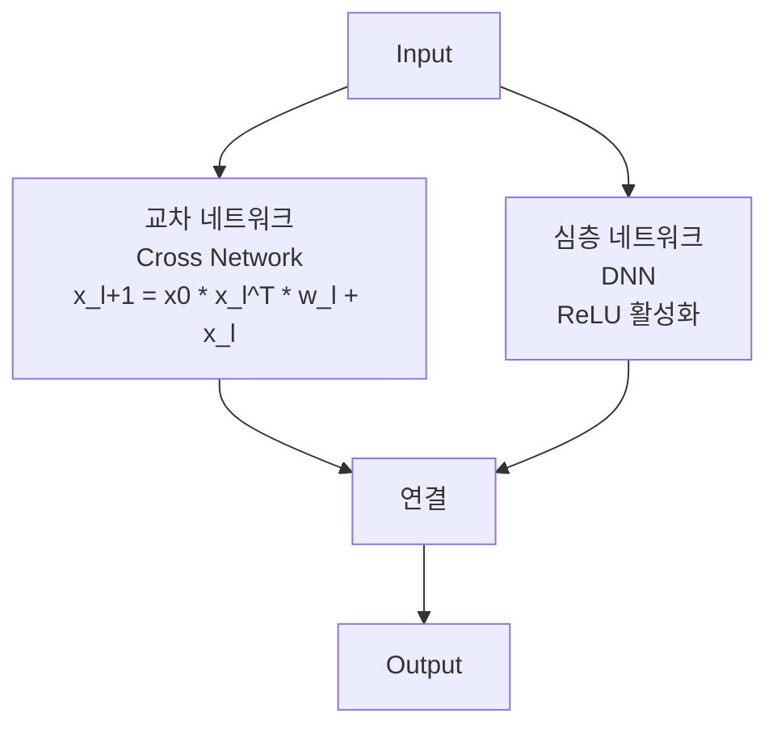

# 테이블 특성 상호작용 (Tabular Feature Interaction)

특성 상호작용(feature interaction)은 두 개 이상의 특성이 결합될 때 개별 특성의 단순 합 이상의 예측력을 갖는 현상이다. 추천 시스템, CTR 예측, 테이블 데이터 전반에서 핵심 모델링 과제다. FM(Factorization Machine) 계열과 명시적 교차 네트워크(Cross Network) 계열이 주요 접근법이다.

## 왜 상호작용이 중요한가

단순 선형 모델은 특성 $x_i$와 $x_j$의 결합 효과를 포착하지 못한다. 예시:
- `성별=여성` + `카테고리=화장품` → CTR이 각각의 주효과(main effect) 합보다 훨씬 높음
- `나이` + `소득 수준` 조합이 신용 리스크를 비선형적으로 결정

수동 교차 특성(cross feature) 생성은 도메인 전문성이 필요하고 $O(d^2)$개 특성이 생성되어 확장이 어렵다.

## Factorization Machine (FM)

Rendle(2010)이 제안한 FM은 2차 교호작용을 잠재 벡터 내적으로 파라미터화한다:

$$\hat{y} = w_0 + \sum_i w_i x_i + \sum_{i=1}^{d} \sum_{j=i+1}^{d} \langle v_i, v_j \rangle x_i x_j$$

$\langle v_i, v_j \rangle$는 차원 $k$의 잠재 벡터 내적 ($k \ll d$). 전체 $d^2$ 상호작용 행렬을 $O(dk)$로 압축한다. 계산은 항등식을 이용해 $O(kd)$로 단순화된다:

$$\sum_{i<j} \langle v_i, v_j \rangle x_i x_j = \frac{1}{2}\left[\left\|\sum_i v_i x_i\right\|^2 - \sum_i \|v_i\|^2 x_i^2\right]$$

[[recommendation-systems-dl]] 에서 FM 계열이 얼마나 중요한지 확인할 수 있다.

## DeepFM

DeepFM(Guo et al., 2017)은 FM과 DNN을 공유 임베딩 위에 병렬로 결합한다:
- FM 컴포넌트: 저차(low-order) 명시적 상호작용 포착
- DNN 컴포넌트: 고차(high-order) 암시적 상호작용 포착
- 단일 End-to-End 학습

Wide & Deep(Google, 2016)의 개선판으로, Wide 부분을 FM으로 대체해 수동 교차 특성 없이도 저차 상호작용을 포착한다.

## DCN (Deep & Cross Network)

Wang et al.(2017, 2021 v2)의 DCN은 **명시적 고차 교차 네트워크**를 제안한다. 핵심 Cross 레이어:

$$x_{l+1} = x_0 x_l^T w_l + b_l + x_l$$

$l$번째 레이어는 최대 $l+1$차의 다항식 교호작용을 포함한다. DCN-V2에서는 행렬 가중치로 더 풍부한 교차를 허용한다.

## AUTOINT

어텐션 기반으로 특성 상호작용을 학습한다. [[ft-transformer-tabular]] 의 멀티헤드 셀프어텐션을 CTR/테이블 데이터에 적용한 형태로, 어텐션 가중치로 상호작용을 해석할 수 있다.

## 비교 요약

| 모델 | 상호작용 방식 | 차수 | 해석 가능성 | 파라미터 효율 |
|------|-------------|------|------------|------------|
| FM | 잠재 벡터 내적 | 2차 | 중간 | 높음 |
| DeepFM | FM + DNN 병렬 | 고차 | 낮음 | 중간 |
| DCN-V2 | 명시적 교차 | 설정 가능 | 중간 | 중간 |
| AUTOINT | 셀프 어텐션 | 고차 | 높음 (어텐션) | 중간 |
| [[tabnet-architecture\|TabNet]] | 순차 마스킹 | 암시적 | 높음 | 높음 |

## 테이블 데이터 vs 추천 시스템

FM 계열은 [[recommendation-systems-dl]] 의 CTR 예측에서 탄생했지만, [[tabular-ml]] 일반 분류/회귀에도 적용된다. 차이점:
- 추천 시스템: 고도로 희소한 원-핫/멀티-핫 입력, 아이디 기반 임베딩
- 일반 테이블: 밀집 수치형 혼합, 특성 수 적지만 값이 연속적

## GBDT 기반 상호작용 포착

XGBoost, LightGBM 같은 트리 기반 모델은 분기(split)의 연쇄를 통해 자연스럽게 고차 상호작용을 포착한다. 깊이 $d$인 트리는 최대 $d$차 상호작용을 표현한다. [[shap-feature-importance]] 의 SHAP 상호작용 값으로 이를 정량화할 수 있다.

## 실무 권고

- **데이터 < 10만 행**: GBDT가 교호작용을 자동 포착, FM/DCN 추가 이점 제한적
- **희소 고차원 (CTR/추천)**: DeepFM, DCN-V2가 검증된 선택
- **해석 필요**: AUTOINT 어텐션 또는 SHAP 상호작용 값
- **특성 수 많음**: FM으로 2차 교호작용 먼저 확인 후 고차 모델 고려

## 관련 문서
- [[deepfm-factorization]] -- DeepFM - FM과 DNN의 병렬 결합

- [[tabular-ml]] - 테이블 데이터 ML 전반
- [[recommendation-systems-dl]] - FM 계열이 핵심적으로 활용되는 추천 시스템
- [[ft-transformer-tabular]] - 어텐션 기반 특성 상호작용
- [[shap-feature-importance]] - 상호작용 효과 정량화 도구
- [[tabnet-architecture]] - 마스킹 기반 암시적 상호작용 학습
