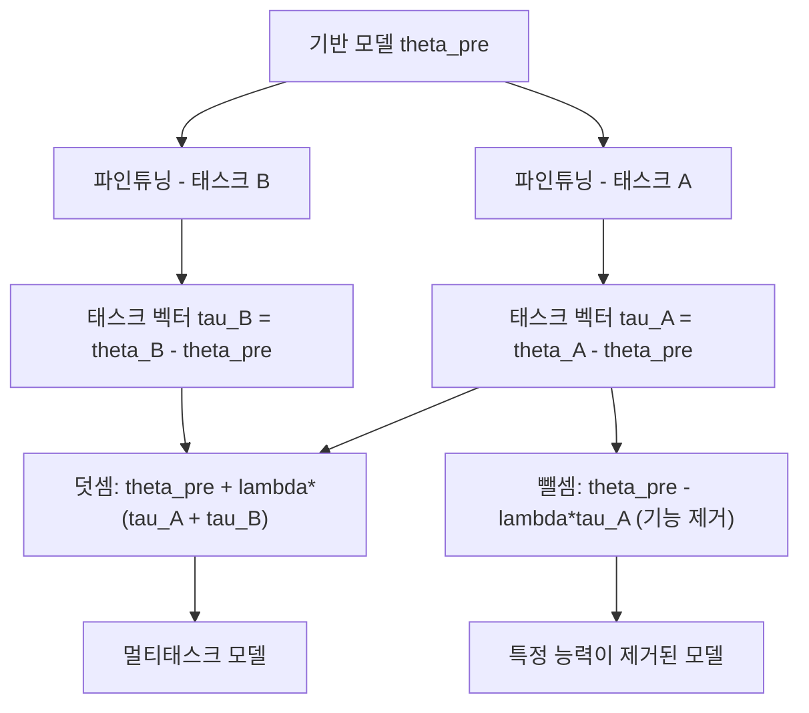

# 태스크 산술 (Task Arithmetic)

## 개요

태스크 산술(Task Arithmetic)은 파인튜닝된 모델 가중치와 기반(base) 모델 가중치의 차이인 **태스크 벡터(task vector)**를 산술 연산의 피연산자로 다루는 기법이다. 덧셈, 뺄셈, 스케일링 같은 기본 연산을 통해 재학습 없이 모델의 능력을 추가하거나 제거하거나 조합할 수 있다.

2023년 Ilharco et al.이 "Editing Models with Task Arithmetic" 논문에서 제안한 이 방법은 모델 병합([[model-merging-slerp-ties-dare]])의 핵심 이론적 기반이 되었으며, 파라미터 공간(weight space)에서의 개념 조작을 가능하게 했다.

## 태스크 벡터의 정의

파인튜닝 전 기반 모델 파라미터를 $\theta_\text{pre}$, 특정 태스크 $t$에 대해 파인튜닝한 모델 파라미터를 $\theta_t$라 하면, 태스크 벡터는 다음과 같이 정의된다:

$$\tau_t = \theta_t - \theta_\text{pre}$$

이 벡터는 "기반 모델에서 해당 태스크를 수행하는 방향으로의 이동"을 나타낸다. 파라미터 공간에서의 델타(delta) 값이므로 **델타 벡터**라고도 불린다.

## 핵심 연산

### 1. 덧셈 (Task Addition) - 기능 추가

두 태스크 벡터를 더해 기반 모델에 적용하면 두 태스크를 동시에 수행할 수 있는 모델이 된다:

$$\theta_\text{new} = \theta_\text{pre} + \lambda \cdot (\tau_A + \tau_B)$$

스케일링 계수 $\lambda$는 병합 강도를 조절한다. 실험적으로 $\lambda \in [0.3, 0.7]$ 범위가 안정적인 경우가 많다.

### 2. 뺄셈 (Task Negation) - 기능 제거

태스크 벡터를 빼면 해당 능력이 억제된다:

$$\theta_\text{new} = \theta_\text{pre} - \lambda \cdot \tau_\text{harmful}$$

예를 들어 "독성 언어 생성" 능력에 해당하는 태스크 벡터를 빼면 해당 능력을 줄일 수 있다. 이는 [[machine-unlearning]]의 경량화 접근법으로도 주목받고 있다.

### 3. 유사도 기반 선택 (Task Analogy)

단어 임베딩의 유추(analogy) 연산처럼, 태스크 벡터 공간에서도 유추가 가능하다:

$$\tau_\text{target} \approx \tau_A - \tau_B + \tau_C$$

## 실용적 응용

| 시나리오 | 연산 | 결과 |
|---------|------|------|
| 수학 + 코딩 능력 결합 | $\tau_\text{math} + \tau_\text{code}$ | 두 능력 겸비 |
| 유해 콘텐츠 생성 억제 | $-\tau_\text{harmful}$ | 안전성 향상 |
| 언어별 전문화 | $\tau_\text{base} + \tau_\text{ko}$ | 한국어 특화 |
| 도메인 전문가화 | $\tau_\text{medical}$ 덧셈 | 의료 도메인 강화 |

## 장점과 한계

**장점**
- 재학습 불필요 - 기존 파인튜닝된 체크포인트 재활용
- 선형 조합이므로 계산 비용이 매우 낮음
- 직관적인 해석 가능성 (어떤 능력을 더하고 뺐는지 명확)
- [[transfer-learning]] 효과를 파라미터 수준에서 명시적으로 제어

**한계**
- 태스크 벡터 간 간섭(interference)이 발생할 수 있음 - TIES, DARE 등 [[model-merging-slerp-ties-dare]] 기법이 이를 완화
- 구조가 다른 모델 간에는 직접 적용 불가
- 최적의 $\lambda$ 탐색이 필요하며 태스크 조합에 따라 달라짐
- 태스크 수가 많아질수록 벡터 합산이 불안정해질 수 있음

## 이론적 배경

태스크 산술이 동작하는 이유에 대한 주된 가설은 **신경망의 선형 모드 연결성(Linear Mode Connectivity)**이다. 동일한 기반 모델에서 파인튜닝된 모델들은 loss landscape에서 선형으로 연결된 영역(basin)에 존재하는 경향이 있으며, 이 영역 내에서 선형 보간이 안정적으로 동작한다는 것이다.

[[transfer-learning]]의 관점에서 보면, 기반 모델이 학습한 표현 공간 위에서 각 태스크 파인튜닝이 방향을 정하고, 태스크 산술은 이 방향들을 조합하는 방법이다.

## 관련 문서

- [[model-merging-slerp-ties-dare]] - SLERP, TIES, DARE 등 태스크 산술을 확장한 모델 병합 기법
- [[transfer-learning]] - 태스크 산술의 이론적 기반이 되는 전이학습
- [[concept-erasure]] - 태스크 벡터 뺄셈과 유사한 개념 제거 기법
- [[machine-unlearning]] - 태스크 벡터 뺄셈을 언러닝에 활용하는 연구
