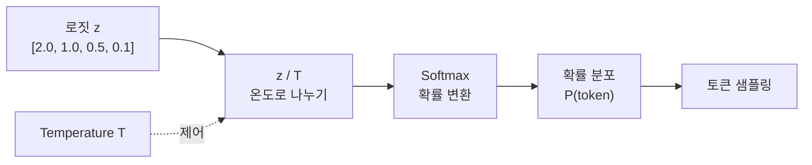
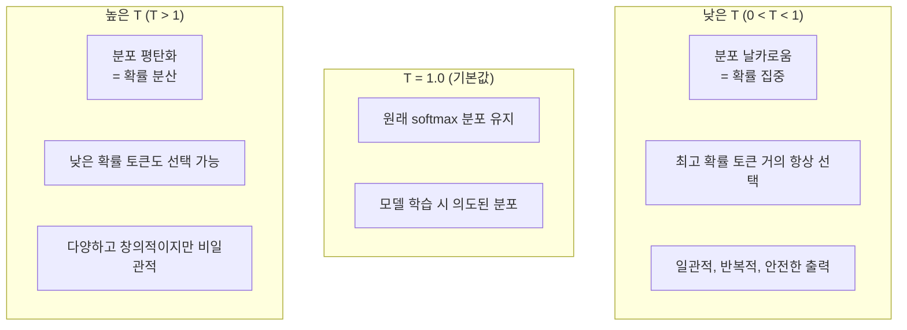

# Temperature Sampling (온도 샘플링)

## 정의

**Temperature(온도)**는 LLM이 다음 토큰을 선택할 때 확률 분포의 형태를 제어하는 스칼라 파라미터다. softmax 함수의 로짓을 나누는 값으로, 생성 텍스트의 **결정론성 vs 다양성**을 조절한다. 위키 내 **19회 이상 언급**되며, [[decoding-strategies|디코딩 전략]]의 가장 기본적인 제어 변수다.

이름은 통계 역학의 볼츠만 분포에서 유래했다. 물리학에서 온도가 높으면 분자 운동이 활발해지듯, LLM에서도 T가 높으면 다양한 토큰이 선택될 확률이 높아진다.

## 수학적 원리

표준 softmax 함수에 temperature T를 적용하면:

```
P(x_i) = exp(z_i / T) / SUM_j(exp(z_j / T))
```

여기서 z_i는 i번째 토큰의 로짓(raw logit)이고, T가 temperature다.



### T에 따른 확률 분포 변화

로짓이 [2.0, 1.0, 0.5] 인 경우:

| Temperature | P(토큰1) | P(토큰2) | P(토큰3) | 분포 특성 |
|-------------|----------|----------|----------|----------|
| **T=0.1** | 0.9998 | 0.0002 | ~0.0 | 거의 결정론적 |
| **T=0.5** | 0.876 | 0.106 | 0.018 | 집중적 |
| **T=1.0** | 0.665 | 0.245 | 0.090 | 기본값 |
| **T=2.0** | 0.506 | 0.307 | 0.187 | 평탄화 |
| **T->INF** | 0.333 | 0.333 | 0.333 | 완전 균등 |



## T=0의 의미

T=0은 수학적으로 정의되지 않지만(0으로 나누기), 대부분의 API는 T=0을 **greedy decoding**(항상 최고 확률 토큰 선택)으로 구현한다. argmax 선택과 동일하며, 동일 입력에 항상 동일 출력을 보장한다.

## Top-p, Top-k와의 관계

Temperature는 확률 분포의 **형태**를 바꾸고, top-p/top-k는 분포에서 **후보 집합**을 자른다. 이들은 독립적으로 또는 조합하여 사용된다.

| 파라미터 | 작용 시점 | 역할 |
|---------|----------|------|
| **Temperature** | softmax 이전 | 분포의 날카로움/평탄함 조절 |
| **Top-k** | softmax 이후 | 상위 k개 토큰만 후보로 유지 |
| **Top-p (Nucleus)** | softmax 이후 | 누적 확률 p 이내 토큰만 유지 |
| **Min-p** | softmax 이후 | 최고 확률의 p% 미만 토큰 제거 |

[[decoding-strategies|디코딩 전략]] 페이지에서 각 방법의 상세 비교를 다룬다.

### Temperature Coupling 문제

전통적인 top-p, top-k 같은 확률 기반 트렁케이션 방법은 temperature 값에 따라 후보 집합이 달라지는 **temperature coupling** 문제를 가진다. T를 올리면 분포가 평탄해져 top-p 커트오프를 통과하는 토큰 수가 증가하는 식이다.

**Top-n-sigma** (Tang et al., ACL 2025)는 이 문제를 해결한 최신 방법으로, 로짓 공간에서 통계적 유의성을 기준으로 트렁케이션하여 temperature에 독립적인 후보 선택을 구현한다.

## 실무 가이드라인

### 태스크별 권장 Temperature

| 태스크 | 권장 T | 이유 |
|--------|--------|------|
| 코드 생성 | 0.0 - 0.2 | 문법 정확성, 재현성 중요 |
| 요약 / 번역 | 0.0 - 0.3 | 원문 충실성 우선 |
| 질의응답 (사실 기반) | 0.0 - 0.3 | 정확한 사실 전달 |
| 범용 대화 | 0.5 - 0.7 | 자연스러움 + 정확성 균형 |
| 창작 / 브레인스토밍 | 0.8 - 1.2 | 다양성과 창의성 필요 |
| 롤플레이 / 실험적 생성 | 1.0 - 1.5 | 예상치 못한 조합 탐색 |

### 주의사항

- **Temperature만으로 [[hallucination|환각]]을 제어할 수 없다**: 2025년 npj Digital Medicine 연구에 따르면 T 조정만으로는 환각률이 거의 변하지 않았다
- **너무 높은 T (>1.5)**: 문법적으로 깨진 텍스트, 무의미한 반복이 발생할 수 있다
- **T=0에서도 비결정론적일 수 있다**: GPU 부동소수점 연산의 비결정성, 배치 처리 등으로 미세한 차이 발생 가능

## API 구현 차이

| 제공자 | 기본 T | 범위 | 특이사항 |
|--------|--------|------|---------|
| OpenAI | 1.0 | 0-2 | T=0이면 greedy |
| Anthropic Claude | 1.0 | 0-1 | 1.0 초과 불가 |
| Google Gemini | 모델별 상이 | 0-2 | 안전 필터와 상호작용 |
| llama.cpp | 0.8 | 0+ | top-k=40 기본 조합 |

## 관련 페이지

- [[decoding-strategies|Decoding Strategies]] -- temperature를 포함한 디코딩 전략 전체 비교
- [[hallucination|Hallucination]] -- temperature와 환각의 관계
- [[prompt-engineering|Prompt Engineering]] -- temperature 선택이 프롬프트 전략에 미치는 영향
- [[structured-output|Structured Output]] -- 구조화 출력에서의 낮은 temperature 필요성

## 참고 자료

- Ackley, Hinton, Sejnowski, "A Learning Algorithm for Boltzmann Machines" (1985) -- temperature 개념의 기원
- Holtzman et al., "The Curious Case of Neural Text Degeneration" (ICLR 2020) -- nucleus sampling과 temperature의 상호작용
- Tang et al., "Top-n-sigma: Not All Logits Are You Need" (ACL 2025) -- temperature coupling 문제 해결
