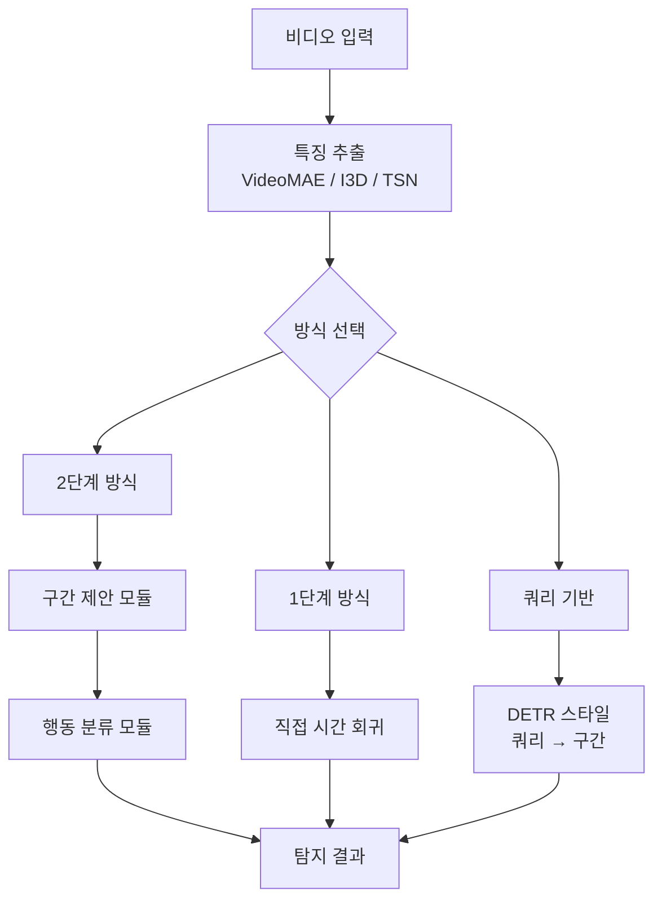
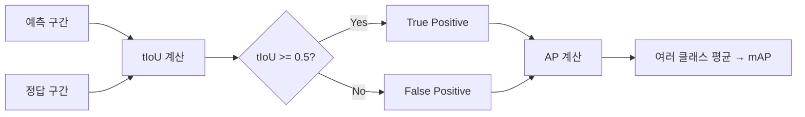

## 개요

시간적 행동 탐지(Temporal Action Detection, TAD)는 비디오에서 특정 행동이 **시작되는 시점과 끝나는 시점**을 자동으로 찾고, 그 행동이 무엇인지 분류하는 컴퓨터 비전 태스크다. 이미지의 객체 탐지(object detection)가 공간적 위치(bounding box)를 찾는 것이라면, TAD는 **시간 축(temporal axis)** 위에서 행동 구간(action segment)을 탐지한다.

활용 분야: 스포츠 하이라이트 자동 편집, 보안 CCTV 이상 행동 감지, 교육 영상 단원 분할, 의료 수술 영상 분석.

## 태스크 정의

주어진 비디오 $V$에 대해, 각 행동 인스턴스를 튜플로 출력:

$$\{(t_{start}^i, t_{end}^i, c^i, s^i)\}_{i=1}^{N}$$

- $t_{start}^i$, $t_{end}^i$: 시작·종료 시간(초 또는 프레임)
- $c^i$: 행동 클래스 레이블
- $s^i$: 신뢰 점수

이는 **Temporal Action Proposal Generation**(구간 제안)과 **Action Classification**(분류)의 두 단계로 분리되거나, 단일 모델이 통합 처리하는 방식으로 구현된다.

## 주요 접근 방식

### 2단계 방식 (Two-Stage)

**제안(Proposal) → 분류(Classification)** 파이프라인.

1. **BSN (Boundary-Sensitive Network)**: 구간의 시작/끝 경계 확률을 예측한 뒤 후보 구간 생성
2. **BMN (Boundary-Matching Network)**: 2D 구간 맵을 생성해 모든 가능한 (시작, 끝) 조합을 동시에 평가
3. **DBG (Dense Boundary Generator)**: 고밀도 경계 예측

### 1단계 방식 (One-Stage)

앵커(anchor) 기반 또는 앵커 프리(anchor-free) 방식으로 구간을 직접 회귀.

- **AFSD**: 앵커 프리, 각 시간 위치에서 직접 시작·종료 오프셋 예측
- **TriDet**: 트라이앵글(삼각형) 표현으로 행동 경계의 불확실성을 모델링

### DETR 기반 (쿼리 기반)

Transformer 디코더의 학습 가능한 쿼리 벡터가 각 행동 인스턴스에 대응.

- **RTD-Net, ActionFormer**: 비디오 특징 시퀀스를 Transformer로 인코딩 후, 쿼리가 시간 구간을 직접 예측

[[timesformer-divided-attention]]의 시공간 분리 어텐션은 TAD의 비디오 특징 추출 백본으로 자주 활용된다.

## 평가 지표

### mAP (mean Average Precision) at IoU thresholds

**시간 IoU(Temporal Intersection over Union)**:

$$\text{tIoU} = \frac{|[t_s^{pred}, t_e^{pred}] \cap [t_s^{gt}, t_e^{gt}]|}{|[t_s^{pred}, t_e^{pred}] \cup [t_s^{gt}, t_e^{gt}]|}$$

tIoU 임계값(0.3, 0.5, 0.7 등)을 변화시키며 각 임계값에서 AP를 계산한 후 평균.

### 표준 벤치마크

| 데이터셋 | 특징 | 평가 지표 |
|----------|------|-----------|
| ActivityNet-1.3 | 200개 행동, 10K+ 영상 | mAP@0.5, Avg mAP |
| THUMOS14 | 101개 행동, 스포츠 중심 | mAP@0.3-0.7 |
| FineAction | 세밀한 행동 106개 | mAP |
| MultiTHUMOS | 다중 레이블 동시 탐지 | mAP |

## 핵심 과제

### 1. 다중 스케일 행동 지속 시간

행동 구간의 길이가 수 초에서 수 분까지 다양하다. 짧은 행동(골킥)과 긴 행동(농구 경기 쿼터)을 동일 모델이 처리하려면 멀티스케일 특징 피라미드가 필요하다.

### 2. 경계 모호성

행동의 시작과 끝이 명확하지 않은 경우가 많다. "달리기"가 "걷기"로 전환되는 순간의 정확한 프레임을 레이블링하는 것 자체가 모호하며, 이 레이블 노이즈가 모델 학습에 영향을 준다.

### 3. 행동 중첩 (Overlapping Actions)

같은 시간에 여러 행동이 동시에 발생하는 다중 레이블 시나리오. "말하면서 걷기" 등은 단일 레이블 프레임워크로 처리하기 어렵다.

## 비디오 특징 추출 백본

TAD 성능은 백본 특징 품질에 크게 의존한다:

- **I3D (Inflated 3D CNN)**: C3D에서 발전, Kinetics 사전학습
- **TSN (Temporal Segment Networks)**: 비디오를 세그먼트로 나눠 합성 특징 추출
- **VideoMAE**: 마스크 오토인코더 방식으로 자기지도 학습된 강력한 특징 ([[videomae-masked-video]])
- **CLIP 기반**: 이미지-언어 정렬 특징을 TAD에 적용하는 시도

[[spatiotemporal-representation]] 학습이 발전할수록 TAD 백본의 표현력도 함께 향상된다.

## 실무 적용 관점

- **스포츠 분석**: 농구 슛, 축구 파울, 수영 턴 등 특정 행동의 자동 타임스탬프 생성
- **수술 영상 분석**: 각 수술 단계의 시작·끝을 탐지해 교육 자료 자동 인덱싱
- **미디어 모니터링**: 방송 영상에서 광고·뉴스·스포츠 구간 자동 분류

## 관련 문서

- [[videomae-masked-video]] - TAD 백본으로 활용되는 자기지도 학습 비디오 인코더
- [[timesformer-divided-attention]] - 시공간 분리 어텐션 기반 비디오 이해 모델
- [[spatiotemporal-representation]] - 비디오의 시공간 특성을 인코딩하는 방법론
- [[video-question-answering]] - 행동 이해를 필요로 하는 유관 태스크
