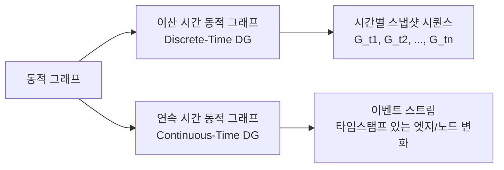
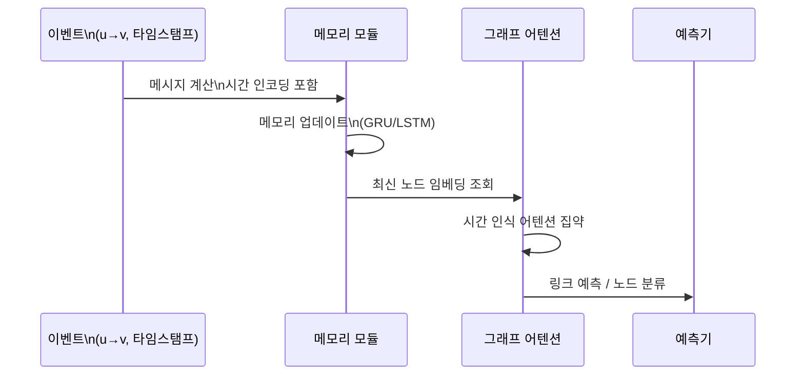

# 시간 그래프 학습

시간 그래프 학습(temporal graph learning)은 시간에 따라 노드와 엣지가 추가·삭제되거나 속성이 변하는 **동적 그래프(dynamic graph)**에서 패턴을 학습하는 방법이다. 정적 그래프를 가정하는 [[graph-neural-networks]]와 달리, 그래프의 진화 자체를 모델링한다.

## 왜 시간 정보가 중요한가

- 소셜 네트워크에서 친구 관계는 시간에 따라 형성·해체된다
- 금융 거래 그래프에서 이상 거래 패턴은 시간 순서에 의존한다
- 지식 그래프의 사실은 시간적 맥락을 가진다 (예: "A는 2020년부터 B의 CEO")
- 분자 시뮬레이션에서 원자 간 거리가 시간에 따라 변한다

## 동적 그래프의 두 가지 표현

**이산 시간(Discrete-Time)**: 고정 간격으로 그래프 스냅샷을 찍고, 이를 시퀀스로 처리한다.

**연속 시간(Continuous-Time)**: 각 엣지/노드 변화에 정확한 타임스탬프가 붙어 있다. 이벤트 기반(event-based) 처리가 필요하다.

## 주요 모델

### EvolveGCN

Pareja et al. (2019)이 제안한 이산 시간 모델이다. GCN의 가중치 행렬을 [[rnn-lstm-gru]]로 시간에 따라 진화시킨다:

$$W^{(t)} = \text{GRU}(W^{(t-1)}, H^{(t-1)})$$

두 가지 변형이 있다:
- **EvolveGCN-H**: 노드 임베딩 $H$를 GRU 입력으로 사용 (노드 특성 변화 포착)
- **EvolveGCN-O**: 가중치 행렬만 진화 (노드 집합이 바뀌어도 적용 가능)

### TGN (Temporal Graph Networks)

Rossi et al. (2020, Twitter Research)이 제안한 연속 시간 모델이다. 각 노드의 **메모리(memory)**를 유지하고 새로운 이벤트로 업데이트한다:

핵심 구성요소:
1. **메모리**: 각 노드의 압축된 히스토리 상태 벡터
2. **메시지 함수**: 이벤트 발생 시 관련 노드에 보낼 메시지 계산
3. **메모리 업데이트**: RNN으로 메모리를 새 메시지로 갱신
4. **임베딩 모듈**: 메모리 + 최근 이웃 정보로 현재 임베딩 계산

### JODIE

Kumar et al. (2019)이 제안한 사용자-아이템 상호작용 예측 모델이다. 사용자와 아이템 모두 RNN으로 임베딩을 진화시키며, **궤적(trajectory)** 예측으로 미래 임베딩을 추정한다.

### TGAT (Temporal Graph Attention Network)

Xu et al. (2020)이 제안한 모델로, 시간 인코딩(Time Encoding)을 어텐션에 통합한다:

$$\Phi(t) = \cos(2\pi \mathbf{w} t + \mathbf{b})$$

각 상호작용의 시간 차이를 주기적 특성(basistime2vec)으로 변환해 어텐션 가중치에 반영한다.

## 시간 인코딩

절대 타임스탬프를 직접 쓰면 일반화 어렵다. **Time2Vec**은 시간을 사인 주기 특성으로 변환한다:

$$t2v(t)[i] = \begin{cases} wt + b & i = 0 \\ \sin(w_i t + b_i) & i > 0 \end{cases}$$

## 평가 설정: 미래 링크 예측

시간 그래프 평가에서 핵심은 **시간 누출(temporal leakage) 방지**다. 학습/검증/테스트는 반드시 시간 순서로 분리해야 한다:

| 분할 | 구간 |
|------|------|
| 학습 | 0% - 70% 시간 범위 |
| 검증 | 70% - 85% |
| 테스트 | 85% - 100% |

랜덤 분할은 미래 정보가 학습에 유입되는 치명적 오류를 만든다.

## 실무 응용

- **실시간 추천**: 최근 사용자 행동 패턴 반영
- **사기 탐지**: 금융 거래의 시간 패턴 이상 탐지
- **트위터/소셜**: 정보 확산 경로와 타이밍 예측
- **교통망**: 시간대별 통행 패턴 예측
- **임상 데이터**: 환자 상태 변화 모니터링

## [[rnn-lstm-gru]]와의 비교

순수 RNN은 그래프 구조를 무시하고 시퀀스만 처리한다. 시간 GNN은 그래프 위상 구조와 시간 의존성을 **동시에** 모델링한다:

| 모델 | 구조 포착 | 시간 포착 | 이산/연속 |
|------|-----------|-----------|-----------|
| LSTM | X | O | 이산 |
| Static GNN | O | X | - |
| EvolveGCN | O | O | 이산 |
| TGN | O | O | 연속 |

## 관련 문서

- [[graph-neural-networks]] - 정적 GNN 기본 원리
- [[rnn-lstm-gru]] - 순환 신경망과 시간 시퀀스 처리
- [[link-prediction-gnn]] - 동적 그래프에서의 미래 링크 예측
- [[graph-attention-network]] - TGAT에서 활용한 어텐션 메커니즘
