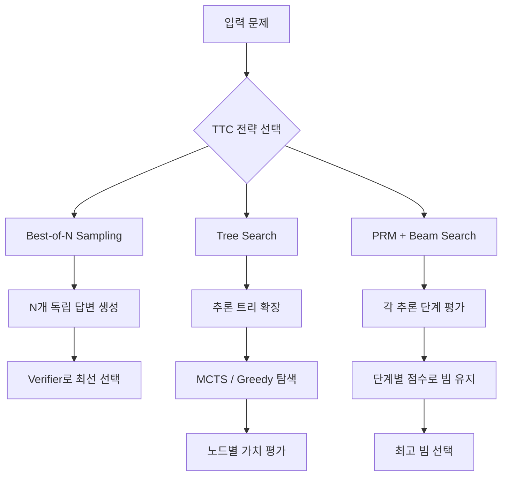

# 테스트 타임 컴퓨트 (Test-Time Compute)

## 패러다임 전환

전통적인 AI 성능 향상 공식은 "더 많은 학습 컴퓨트 = 더 좋은 모델"이었다. 테스트 타임 컴퓨트(test-time compute, TTC)는 이 패러다임을 바꾼다. **추론(inference) 단계에서 더 많은 계산을 쓸수록 성능이 개선된다**는 접근법이다.

OpenAI의 o1, DeepSeek-R1이 이 방법론으로 수학·코드·추론 벤치마크에서 급격한 성능 향상을 실증했다.

## 핵심 전략 비교

### Best-of-N Sampling

- N개의 독립적인 답변을 생성하고 검증자(verifier)가 최선의 답변을 선택
- 구현이 단순하고 병렬화 용이
- N이 커질수록 성능 향상은 $O(\log N)$ 수준으로 둔화
- 검증자의 품질이 전체 성능의 병목

### Tree Search + Verifier

- 추론 과정을 트리 구조로 확장, 중간 단계마다 가치(value)를 평가
- Monte Carlo Tree Search(MCTS) 또는 Beam Search 적용
- 단순 Best-of-N보다 같은 컴퓨트에서 더 효율적
- 구현 복잡도 높음

### Process Reward Model (PRM) + Beam Search

- 최종 답변이 아닌 **중간 추론 단계마다** 보상을 부여하는 PRM 사용
- 각 단계의 품질을 평가하면서 빔(beam)을 유지
- o1류 모델의 핵심 구성 요소
- PRM 학습을 위한 단계별 레이블 데이터 구축이 어려움

## 학습 컴퓨트와의 트레이드오프

| 비교 항목 | 학습 컴퓨트 스케일링 | TTC 스케일링 |
|-----------|---------------------|-------------|
| 비용 구조 | 1회 고정 투자 | 쿼리마다 반복 |
| 성능 향상 | 모든 태스크에 균등 적용 | 복잡 태스크에 집중 효과 |
| 지연시간 | 추론 고정 | 추론 증가 (수초~수분) |
| 사용자 경험 | 즉각 응답 | 사고 시간 증가 |
| 적합 영역 | 범용 | 수학/코드/과학 등 검증 가능 문제 |

## 적응형 컴퓨트 (Adaptive Compute)

문제 복잡도에 따라 TTC를 동적으로 조절하는 방향이 2025-2026년 주요 연구 흐름이다.

- 쉬운 문제: 단일 패스(single pass)로 빠르게 답변
- 어려운 문제: 트리 탐색 또는 다중 샘플링으로 더 많은 컴퓨트 투입
- 컴퓨트 예산(budget)을 사용자가 조절 가능한 인터페이스 등장

## 실증 사례

- **OpenAI o1**: Chain-of-Thought를 내부 추론 토큰으로 처리, AIME 수학 대회에서 GPT-4 대비 극적 개선
- **DeepSeek-R1**: 강화학습 기반 TTC 최적화, 오픈소스로 o1급 성능 공개
- **Forest-of-Thought**: 여러 추론 트리를 앙상블해 30B 토큰 실험에서 최적 전략 검증

## 한계와 주의점

1. **검증 가능성 의존**: TTC는 답변의 옳고 그름을 판단할 수 있는 verifier가 있을 때 효과적. 창작·주관적 태스크에서는 효과 제한적.
2. **비용 증가**: 컴퓨트를 추론 시마다 쓰므로 API 비용이 기하급수적으로 증가 가능.
3. **탈옥 위험**: 더 많은 추론 토큰이 의도치 않은 경로로 이어질 수 있음.

## 관련 문서

- [[forest-of-thought]] - 멀티트리 앙상블 추론
- [[latent-space-reasoning]] - 토큰 생성 없이 잠재 공간에서 반복 추론
- [[inference-compute-economics]] - TTC 채택의 경제적 맥락
- [[emergent-abilities]] - TTC로 발현되는 능력과 스케일링의 관계
