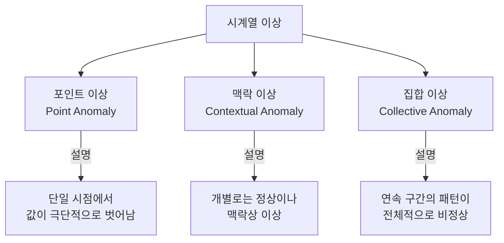
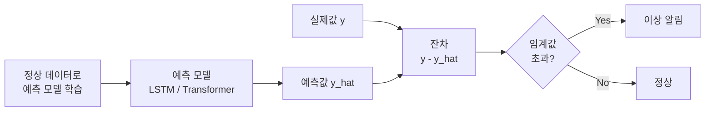

# 시계열 이상 탐지

## 개요

시계열 이상 탐지(time-series anomaly detection)는 시계열 데이터에서 정상 패턴에서 크게 벗어난 **이상 구간 또는 포인트**를 자동으로 식별하는 태스크다. 제조 결함 감지, 네트워크 침입 탐지, 장비 고장 예측, 금융 사기 탐지 등 실무에서 광범위하게 활용된다.

[[time-series-forecasting-dl|딥러닝 기반 시계열 예측]]과 밀접하게 연관되며, [[autoencoders-vae|오토인코더 및 VAE]] 아키텍처가 핵심 방법론으로 자주 쓰인다.

## 이상의 유형

- **포인트 이상**: 단일 타임스텝에서 값이 정상 범위를 크게 벗어남 (예: 센서 급등락)
- **맥락 이상**: 특정 시간대 기준으로는 이상이지만 다른 시간대면 정상 (예: 새벽의 높은 트래픽)
- **집합 이상**: 개별 포인트는 정상이나, 연속된 구간의 형태 자체가 비정상 (예: 진동 패턴 변화)

## 주요 접근법

### 1. 예측 기반 이상 탐지

정상 데이터로 학습된 예측 모델이 다음 값을 예측하고, **예측값과 실제값의 편차(deviation)**가 임계값을 초과하면 이상으로 판단한다.

임계값은 잔차의 평균과 표준편차로 동적으로 설정하거나(3σ 규칙), 분위수 기반으로 설정한다.

### 2. 재구성 오류 기반 이상 탐지

[[autoencoders-vae|오토인코더(AE/VAE)]]를 정상 데이터로 학습시키면, 정상 패턴은 낮은 재구성 오류(reconstruction error)를 보이고, 이상 패턴은 높은 오류를 보인다.

- **AE 기반**: $\text{anomaly score} = \|x - \hat{x}\|^2$
- **VAE 기반**: ELBO(Evidence Lower BOund) 기반 이상 점수로 불확실성 추가 고려

대표 모델: **Anomaly Transformer**, **OmniAnomaly**, **USAD**

### 3. 밀도 추정 기반

정규화 흐름(Normalizing Flow)이나 생성 모델로 정상 데이터의 분포를 학습하고, 새로운 포인트가 저밀도 영역에 속하면 이상으로 판단한다.

### 4. 전통적 통계 방법

- **Z-score**: 이동 평균과 표준편차 기준 이상치 탐지
- **IQR(사분위 범위)**: 박스플롯 기반 이상 탐지
- **CUSUM**: 누적합 기반 변화점(change point) 탐지
- **Grubbs' Test**: 정규 분포 가정 하에 단일 이상치 검정

## 딥러닝 대표 모델

| 모델 | 방법론 | 특징 |
|------|--------|------|
| LSTM-AE | 재구성 오류 | LSTM 인코더-디코더, 시퀀스 재구성 |
| MAD-GAN | GAN 기반 | 다변량 시계열 동시 처리 |
| OmniAnomaly | VAE + 정규화 흐름 | 불확실성 정량화, 다변량 |
| Anomaly Transformer | Anomaly Attention | 정상-이상 어텐션 분리 |
| TranAD | Transformer + AE | 준지도 학습, 빠른 학습 |

## 평가 지표

시계열 이상 탐지 평가는 일반 분류와 다르게 **포인트 단위 vs 이벤트 단위** 평가가 구분된다.

- **Precision / Recall / F1**: 표준 분류 지표
- **Point-adjusted F1**: 이상 구간 내 임의 포인트를 탐지하면 구간 전체를 탐지한 것으로 인정
- **Affiliation Precision/Recall**: 예측 구간과 실제 이상 구간의 시간적 근접도를 고려

## 실무 고려사항

1. **레이블 희소성**: 정상 데이터는 풍부하나 이상 레이블은 희귀 → 비지도·준지도 학습 선호
2. **임계값 선택**: 도메인 전문 지식 또는 ROC 커브 기반으로 결정
3. **개념 드리프트(concept drift)**: 시간에 따라 정상 패턴이 변하는 경우 적응형 임계값 필요
4. **False Positive 비용**: 산업 현장에서는 FP로 인한 운영 중단 비용이 큼

## 관련 문서

- [[time-series-forecasting-dl]] - 예측 기반 이상 탐지의 기반
- [[autoencoders-vae]] - 재구성 오류 기반 이상 탐지의 핵심 아키텍처
- [[time-series-classification]] - 이상 구간 분류 문제와의 연관성
- [[patchtst]] - Transformer 기반 시계열 표현 학습
