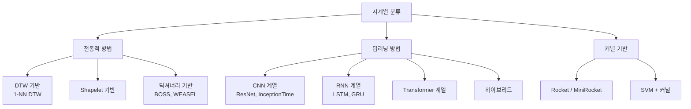
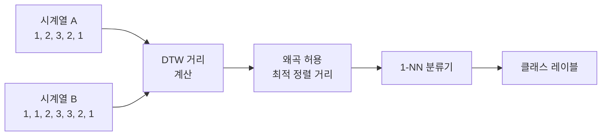
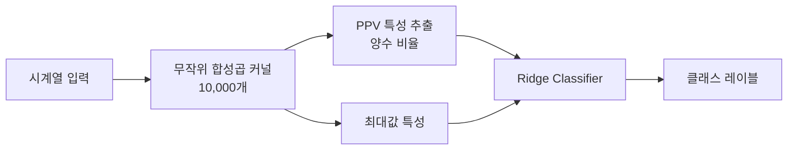
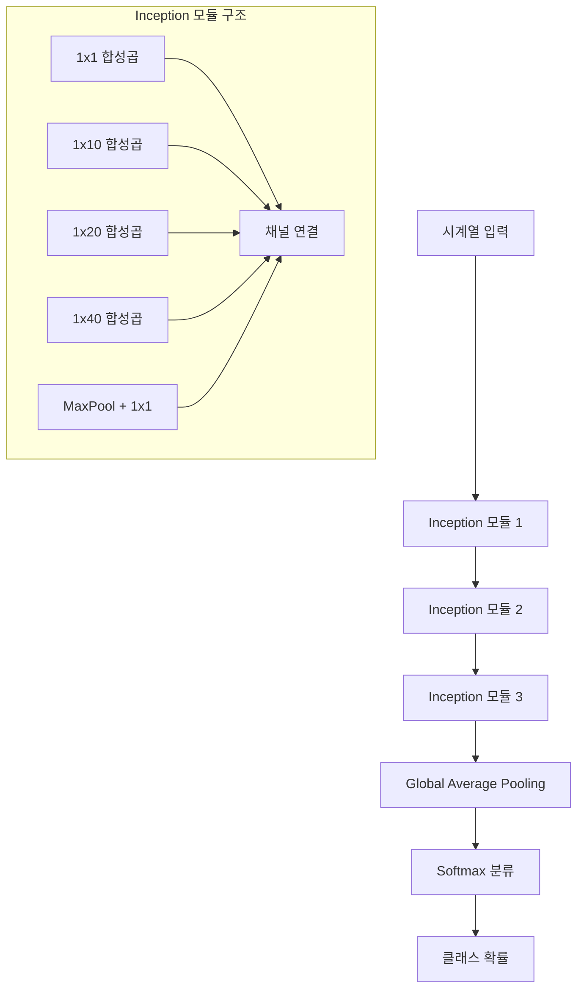

# 시계열 분류

## 개요

시계열 분류(time-series classification, TSC)는 시계열 데이터를 사전 정의된 클래스 레이블에 할당하는 태스크다. 예측(forecasting)이 미래 값을 추정하는 것이라면, 분류는 시계열 전체 또는 일부 구간의 **의미·범주를 판별**하는 것이다.

활동 인식(HAR), 의료 신호 분석(ECG/EEG), 산업 진단, 음성 패턴 인식, 금융 패턴 탐지 등 광범위한 응용 분야를 가진다.

[[time-series-forecasting-dl|딥러닝 기반 시계열 예측]]과 공유되는 표현 학습 기법이 많으며, [[cnn|합성곱 신경망(CNN)]]이 특히 시계열 분류에서 강력한 성능을 보인다.

## 방법론 분류

## DTW (Dynamic Time Warping)

DTW는 시계열 분류의 고전적 기반이다. 두 시계열 사이의 **유연한 정렬(warping)**을 허용하여 길이나 위상(phase)이 약간 다른 유사 패턴을 올바르게 매칭한다.

**1-NN DTW**는 많은 벤치마크에서 아직도 강력한 기준선(baseline)으로 작동한다. 단, $O(n^2)$ 복잡도로 대용량 데이터에서 느리다는 단점이 있다.

## ROCKET / MiniRocket

**ROCKET(RandOm Convolutional KErnel Transform)**은 수만 개의 무작위 합성곱 커널을 시계열에 적용하고, 그 출력 통계(최대값, PPV)를 특성으로 사용해 선형 분류기를 학습하는 방법이다.

ROCKET의 장점:
- 학습 속도가 매우 빠름 (무작위 커널, 학습 불필요)
- 다양한 데이터셋에서 딥러닝 모델에 준하는 성능
- **MiniRocket**: ROCKET의 경량화 변형으로 더 빠르고 결정론적

## InceptionTime

InceptionTime은 Google의 Inception 모듈을 시계열에 적용한 딥러닝 분류기다. 다양한 크기의 합성곱 필터를 병렬로 사용하여 다중 스케일 패턴을 동시에 포착한다.

InceptionTime은 UCR/UEA 벤치마크에서 SOTA급 성능을 보이며, 앙상블(5개 모델)로 사용하면 더 안정적이다.

## UCR/UEA 벤치마크

시계열 분류 연구의 표준 벤치마크는 UCR(University of California Riverside)과 UEA(University of East Anglia)가 관리하는 데이터셋 아카이브다.

- UCR: 단변량(univariate) 시계열 분류, 130개 이상 데이터셋
- UEA: 다변량(multivariate) 시계열 분류, 30개 이상 데이터셋

## 예측과 분류의 경계

| 태스크 | 입력 | 출력 |
|--------|------|------|
| 예측 (Forecasting) | 과거 시계열 | 미래 시계열 값 |
| 분류 (Classification) | 전체/부분 시계열 | 이산 클래스 레이블 |
| 이상 탐지 (Anomaly Detection) | 시계열 스트림 | 이상 여부/점수 |
| 세그먼테이션 (Segmentation) | 시계열 스트림 | 구간별 클래스 레이블 |

## 관련 문서

- [[time-series-forecasting-dl]] - 시계열 딥러닝 전반
- [[cnn]] - InceptionTime, ResNet-TSC 기반 아키텍처
- [[time-series-anomaly-detection]] - 분류와 밀접한 이상 탐지 태스크
- [[patchtst]] - 분류에도 활용 가능한 패치 기반 표현 학습
