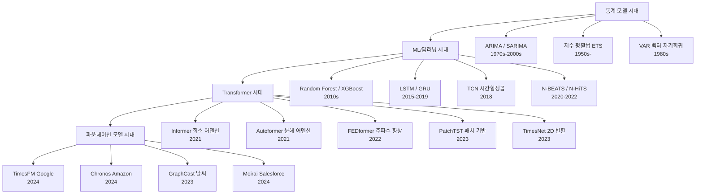
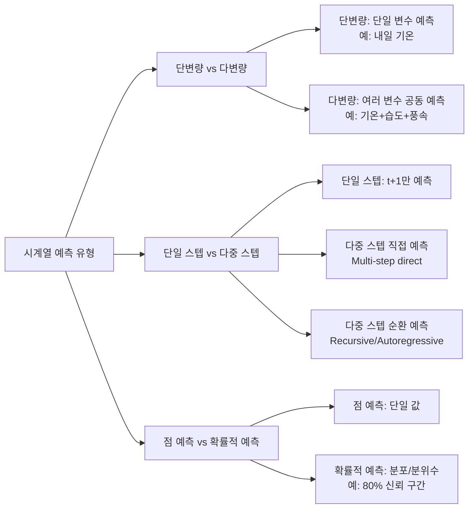

# 시계열 예측 (Time Series Forecasting)

시계열 예측(Time Series Forecasting)은 과거 시간 순서로 정렬된 데이터 포인트들을 기반으로 미래 값을 추정하는 ML/통계 분야다. 기상, 에너지 수요, 금융, 물류, 제조 등 사실상 모든 산업의 핵심 예측 과제다.

## 핵심 개념 정의

**시계열(Time Series)**: 일정한 시간 간격으로 수집된 순서 있는 관측값 집합. $\{y_1, y_2, \ldots, y_T\}$

**예측 과제**: 과거 $T$개 관측값으로 미래 $H$개 값 $\{y_{T+1}, \ldots, y_{T+H}\}$를 예측. $H$를 예측 지평선(horizon)이라 한다.

**시계열의 구성 요소**:
- **추세(Trend)**: 장기적 증가/감소 방향
- **계절성(Seasonality)**: 주기적 패턴 (일별/주별/월별)
- **잔차(Residual)**: 추세·계절성 제거 후 남은 불규칙 성분

## 모델 진화 계보



위 계보는 통계 기반 ARIMA에서 딥러닝 LSTM, 이후 Transformer 계열, 최근 파운데이션 모델로의 진화를 보여준다.

## 1단계: 통계 모델 (ARIMA 시대)

### ARIMA (Autoregressive Integrated Moving Average)

$\text{ARIMA}(p, d, q)$ 모델은 세 구성 요소를 조합한다:

- **AR(p)**: 자기회귀 - 과거 $p$개 값의 선형 조합 $y_t = c + \phi_1 y_{t-1} + \cdots + \phi_p y_{t-p} + \varepsilon_t$
- **I(d)**: 차분 횟수 $d$ - 비정상 시계열을 정상(stationary)으로 변환
- **MA(q)**: 이동평균 - 과거 $q$개 오차 항의 선형 조합

계절성이 있으면 SARIMA: $\text{SARIMA}(p,d,q)(P,D,Q)_s$

```python
from statsmodels.tsa.arima.model import ARIMA

model = ARIMA(train_series, order=(2, 1, 2))
result = model.fit()
forecast = result.forecast(steps=12)
```

**강점**: 해석 가능, 데이터 적어도 작동, 통계적 신뢰 구간 제공  
**약점**: 비선형 관계 포착 불가, 다변량 확장 어려움, 수동 차수 선택 필요

### 지수 평활법 (Exponential Smoothing / ETS)

단순 지수 평활: $\hat{y}_{t+1} = \alpha y_t + (1-\alpha) \hat{y}_t$

Holt-Winters (추세 + 계절성 포함):

$$\ell_t = \alpha(y_t - s_{t-m}) + (1-\alpha)(\ell_{t-1} + b_{t-1})$$
$$b_t = \beta(\ell_t - \ell_{t-1}) + (1-\beta) b_{t-1}$$
$$s_t = \gamma(y_t - \ell_{t-1} - b_{t-1}) + (1-\gamma) s_{t-m}$$

## 2단계: 딥러닝 모델

### LSTM/GRU 시계열 예측

[[rnn-lstm-gru|LSTM (Long Short-Term Memory)]]은 게이팅 메커니즘으로 장기 의존성을 포착한다. 2015-2019년 시계열 딥러닝의 표준이었다.

```python
import torch
import torch.nn as nn

class LSTMForecaster(nn.Module):
    def __init__(self, input_size: int, hidden_size: int, num_layers: int, horizon: int):
        super().__init__()
        self.lstm = nn.LSTM(input_size, hidden_size, num_layers, batch_first=True)
        self.fc = nn.Linear(hidden_size, horizon)

    def forward(self, x: torch.Tensor) -> torch.Tensor:
        # x: (batch, seq_len, features)
        out, _ = self.lstm(x)
        return self.fc(out[:, -1, :])  # 마지막 타임스텝 사용
```

**한계**: 병렬화 불가 (순차 처리), 매우 긴 시퀀스에서 그래디언트 소멸

### N-BEATS / N-HiTS

N-BEATS (2020)는 순수 순방향 신경망으로 전통적 시계열 분해를 신경망으로 모사한다.

- **기본 블록**: backward forecast (입력 재구성) + forward forecast (미래 예측)
- **잔차 연결**: 각 블록이 전 블록의 잔차에서 학습
- **해석 가능 버전**: 추세 다항식 + 푸리에 급수 계절성 분리

N-HiTS (2022)는 다중 해상도 스택으로 다양한 빈도 성분을 분리해 학습한다.

## 3단계: Transformer 기반 모델

[[transformer-architecture|Transformer]]의 어텐션 메커니즘이 장기 의존성 포착에 유리하지만, $O(L^2)$ 복잡도 문제로 긴 시계열에 직접 적용하기 어렵다. 이 문제를 해결하기 위한 여러 변형이 등장했다.

### 주요 Transformer 시계열 모델 비교

| 모델 | 논문 | 핵심 아이디어 | 어텐션 복잡도 |
|------|------|--------------|--------------|
| Informer (2021) | AAAI Best | ProbSparse Attention: 상위 $O(\ln L)$개 쿼리만 계산 | $O(L \ln L)$ |
| Autoformer (2021) | NeurIPS | Auto-Correlation: 주기성 기반 서브시리즈 매칭 | $O(L \ln L)$ |
| FEDformer (2022) | ICML | 주파수 영역 어텐션 (푸리에/웨이블릿 변환) | $O(L)$ |
| Pyraformer (2022) | ICLR | 피라미드 계층 구조 어텐션 | $O(L)$ |
| PatchTST (2023) | ICLR | 시계열을 패치(patch)로 분할 + ViT 스타일 | $O((L/P)^2)$ |
| TimesNet (2023) | ICLR | 1D 시계열 → 2D 이미지 변환 후 CNN | - |

### PatchTST 상세

PatchTST (2023)는 시계열을 길이 $P$의 패치로 분할하여 토큰으로 처리한다. [[deit-data-efficient-image-transformer|ViT]]의 이미지 패치 아이디어를 시계열에 적용한 것이다.

```python
# PatchTST 핵심 아이디어 (개념 코드)
class PatchTST(nn.Module):
    def __init__(self, seq_len: int, patch_len: int, d_model: int):
        super().__init__()
        self.patch_len = patch_len
        self.num_patches = seq_len // patch_len
        self.patch_embedding = nn.Linear(patch_len, d_model)
        self.transformer = nn.TransformerEncoder(...)

    def forward(self, x: torch.Tensor) -> torch.Tensor:
        # x: (batch, seq_len, channels)
        # 패치 분할
        patches = x.unfold(-2, self.patch_len, self.patch_len)
        # 패치 임베딩
        embedded = self.patch_embedding(patches)
        # 채널 독립(Channel-Independence): 각 변수를 독립적으로 처리
        return self.transformer(embedded)
```

**핵심 기여**:
1. 패치 토큰화로 입력 토큰 수를 $L \to L/P$로 줄여 효율 향상
2. **채널 독립(Channel-Independence)**: 각 변수를 독립 처리 -> 다변량 누수 방지
3. 마스크 사전학습으로 전이 학습 가능성 입증

## 4단계: 파운데이션 모델

### TimesFM (Google, 2024)

200M 파라미터 디코더 전용 모델. 다양한 도메인의 1000억 개 실제 시계열로 사전학습한 제로샷 예측 모델이다.

```python
import timesfm

tfm = timesfm.TimesFm(
    context_len=512,
    horizon_len=128,
    backend="gpu",
)
tfm.load_from_checkpoint(repo_id="google/timesfm-1.0-200m")

# 제로샷 예측
point_forecast, experimental_quantile_forecast = tfm.forecast(
    inputs=[[1.0, 2.0, 3.0, ...]],  # 과거 시계열
    freq=[0],  # 0: 고빈도, 1: 중빈도, 2: 저빈도
)
```

### Chronos (Amazon, 2024)

T5 아키텍처를 기반으로 시계열을 토큰화해 언어 모델과 동일한 방식으로 학습하는 접근법. [[chronos-amazon]] 참조.

실수 값을 이산 토큰으로 변환 (z-score 정규화 후 균등 분위수 양자화):
- 훈련: 다양한 실제 + 합성 데이터
- 추론: 토큰 분포에서 샘플링 -> 확률적 예측

### GraphCast (DeepMind, 2023)

그래프 신경망(GNN) 기반 전지구 날씨 예측 모델. [[ai-climate-modeling]] 참조.

- 입력: 위도/경도 격자점의 37개 대기 변수 (온도, 풍속, 습도 등)
- 아키텍처: 격자 → 메시 인코더 + 메시 프로세서(GNN) + 메시 → 격자 디코더
- 성능: ECMWF 중기 예보 모델과 유사한 10일 예측 정확도를 CPU 초 단위로 달성
- 의의: 물리 기반 수치 모델 대비 10만 배 빠른 추론

## 예측 유형 분류



## 주요 평가 메트릭

| 메트릭 | 수식 | 특징 |
|--------|------|------|
| MAE | $\frac{1}{H}\sum|\hat{y}_i - y_i|$ | 이상치에 강건, 해석 쉬움 |
| MSE | $\frac{1}{H}\sum(\hat{y}_i - y_i)^2$ | 큰 오차에 민감 |
| RMSE | $\sqrt{MSE}$ | MSE의 단위 통일 버전 |
| MAPE | $\frac{100}{H}\sum\left|\frac{\hat{y}_i - y_i}{y_i}\right|$ | 퍼센트 오차, $y_i=0$ 불가 |
| SMAPE | $\frac{200}{H}\sum\frac{|\hat{y}_i-y_i|}{|\hat{y}_i|+|y_i|}$ | MAPE의 대칭 버전 |
| CRPS | - | 확률적 예측 평가, 샤프니스+캘리브레이션 |
| WQL | - | 분위수 손실 가중합 |

## 실무 적용 패턴

### 특성 공학

```python
import pandas as pd
import numpy as np

def create_time_features(df: pd.DataFrame, date_col: str) -> pd.DataFrame:
    """시계열 예측을 위한 시간 특성 생성."""
    df = df.copy()
    dt = pd.to_datetime(df[date_col])

    # 주기적 인코딩 (sin/cos으로 원형 연속성 보장)
    df["hour_sin"] = np.sin(2 * np.pi * dt.dt.hour / 24)
    df["hour_cos"] = np.cos(2 * np.pi * dt.dt.hour / 24)
    df["dow_sin"] = np.sin(2 * np.pi * dt.dt.dayofweek / 7)
    df["dow_cos"] = np.cos(2 * np.pi * dt.dt.dayofweek / 7)
    df["month_sin"] = np.sin(2 * np.pi * dt.dt.month / 12)
    df["month_cos"] = np.cos(2 * np.pi * dt.dt.month / 12)

    # 래그 특성
    for lag in [1, 7, 14, 28]:
        df[f"lag_{lag}"] = df["target"].shift(lag)

    # 롤링 통계
    for window in [7, 14, 28]:
        df[f"rolling_mean_{window}"] = df["target"].rolling(window).mean()
        df[f"rolling_std_{window}"] = df["target"].rolling(window).std()

    return df
```

### 교차 검증 (시계열용)

일반 K-fold는 미래 데이터 누수 문제가 있으므로, 시계열에서는 **Walk-Forward Validation**을 사용한다.

```python
from sklearn.model_selection import TimeSeriesSplit

tscv = TimeSeriesSplit(n_splits=5, gap=0, test_size=horizon)

for fold, (train_idx, val_idx) in enumerate(tscv.split(X)):
    X_train, X_val = X[train_idx], X[val_idx]
    y_train, y_val = y[train_idx], y[val_idx]
    model.fit(X_train, y_train)
    preds = model.predict(X_val)
```

## 산업별 응용

| 산업 | 예측 대상 | 주로 사용되는 모델 | 연관 위키 |
|------|-----------|-------------------|-----------|
| 에너지 | 전력 수요, 신재생 발전량 | LSTM, PatchTST, 전통 통계 | [[ai-energy-grid]] |
| 공급망/물류 | 재고 수요, 배송 시간 | N-BEATS, XGBoost 앙상블 | [[ai-supply-chain-optimization]] |
| 제조/설비 | 고장 예측, 이상 감지 | LSTM Autoencoder, Transformer | [[ai-predictive-maintenance]] |
| 기후/날씨 | 기온, 강수량, 태풍 경로 | GraphCast, NeuralGCM | [[ai-climate-modeling]] |
| 금융 | 주가, 환율, 변동성 | Informer, 통계+ML 앙상블 | - |
| 소매 | 매출, 고객 수 | Prophet, LightGBM | - |

## 도전 과제와 주의점

### 1. 분포 이동 (Distribution Shift)
훈련 데이터와 테스트 기간의 분포가 다를 때 성능이 급격히 저하된다. COVID-19 기간 소비 패턴, 전쟁 시 에너지 가격 등이 대표적 예다.

**대응**: 인스턴스 정규화 (RevIN), 온라인 학습, 앙상블로 견고성 확보

### 2. 채널 독립 vs 채널 의존 논쟁
PatchTST의 채널 독립 접근이 종종 복잡한 다변량 모델보다 우수한 결과를 보인다. 실제로 변수 간 관계가 항상 도움이 되지는 않으며 노이즈가 될 수 있다.

### 3. 반사실 예측의 한계
시계열 예측은 "다른 조건이 동일할 때" 미래를 예측하지만, 실제로는 정책 결정, 이상 이벤트 등이 시계열 자체를 변화시킨다.

### 4. 긴 예측 지평선의 오차 누적
순환 예측(recursive)은 오차가 누적된다. 직접 다중 스텝 예측(DIRECT)이 길수록 유리하지만 계산량이 증가한다.

## 관련 문서

- [[rnn-lstm-gru]] - LSTM/GRU 아키텍처 상세
- [[transformer-architecture]] - Transformer 아키텍처 기반
- [[ai-energy-grid]] - 에너지 수요 예측 응용
- [[ai-supply-chain-optimization]] - 수요 예측 기반 공급망 최적화
- [[ai-predictive-maintenance]] - 설비 고장 예측
- [[ai-climate-modeling]] - 기후/날씨 예측 AI
- [[chronos-amazon]] - Amazon Chronos 파운데이션 모델
- [[neural-ode]] - 연속 시간 모델링 이론
