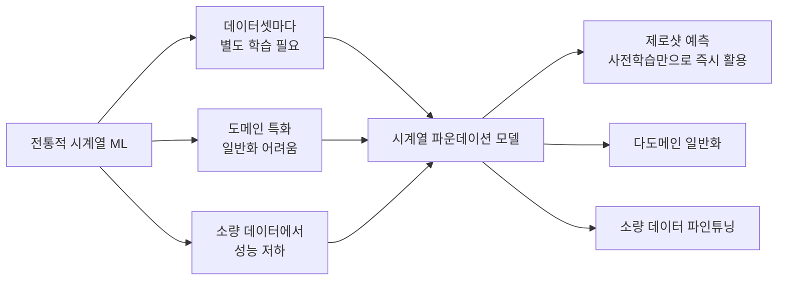
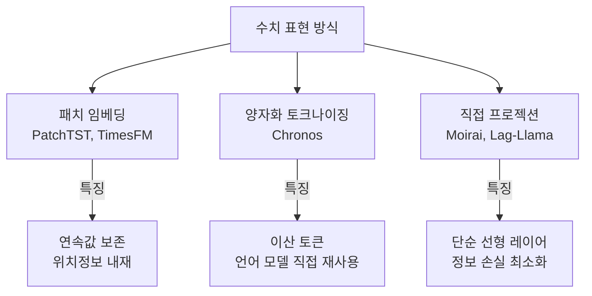

# 시계열 파운데이션 모델 개요

## 개요

시계열 파운데이션 모델(Time-Series Foundation Models, TSFM)은 대규모 다양한 시계열 데이터로 사전학습되어 **새로운 데이터셋에 제로샷(zero-shot) 또는 소수샷(few-shot)으로 예측을 수행**할 수 있는 모델이다. LLM(대규모 언어 모델)이 텍스트 분야에서 성공한 패러다임을 시계열 도메인에 이식한 시도다.

[[patchtst|PatchTST]]가 패치 기반 표현 학습으로 이 방향의 가능성을 열었다면, [[timegpt-foundation|TimeGPT]], [[chronos-amazon|Chronos]], [[moirai-unified-forecasting|Moirai]] 등은 실제 파운데이션 모델 수준으로 발전시킨 사례다.

## 등장 배경

[[time-series-forecasting-dl|딥러닝 기반 시계열 예측]]의 전통적 한계는 다음과 같다:

NLP에서 GPT, BERT 등이 제로샷·퓨샷 전이학습으로 패러다임을 바꾼 것처럼, 시계열 분야에서도 유사한 혁신이 2022년부터 급속히 발전했다.

## 주요 TSFM 비교

| 모델 | 개발사 | 아키텍처 | 공개 여부 | 특징 |
|------|--------|---------|-----------|------|
| TimeGPT | Nixtla | Transformer | 비공개 (API) | 최초 상용 TSFM, 파인튜닝 지원 |
| Chronos | Amazon | T5 + 토크나이저 | 오픈소스 | 언어 모델 재활용, 다양한 크기 |
| Moirai | Salesforce | 마스크 인코더 | 오픈소스 | 다변량+가변빈도 통합 |
| Lag-Llama | 독립연구 | LLaMA 기반 | 오픈소스 | 단변량, 확률적 예측 |
| TimesFM | Google | 패치 기반 Decoder | 오픈소스 | 대규모 사전학습 |
| MOMENT | CMU | T5 인코더 | 오픈소스 | 다중 태스크 (예측/분류/이상탐지) |

## 핵심 설계 결정 비교

### 수치값 표현 방식

시계열의 연속 실수값을 모델에 어떻게 입력하느냐는 TSFM 설계의 핵심 선택이다.

### 확률적 예측 지원

TSFM의 중요한 강점 중 하나는 **불확실성 정량화(uncertainty quantification)**다.

- **분위수 예측(quantile prediction)**: 특정 분위수(10%, 50%, 90% 등) 출력
- **샘플링 기반**: 자기회귀 샘플링으로 예측 분포 추정 (Chronos, Lag-Llama)
- **예측 구간(conformal prediction)**: 통계적 보장을 갖는 예측 구간 계산

## 사전학습 데이터

TSFM의 성능은 사전학습 데이터의 다양성과 규모에 크게 의존한다.

| 데이터 출처 유형 | 예시 |
|----------------|------|
| 공개 시계열 아카이브 | Monash, UCR, M4/M5 대회 데이터 |
| 도메인별 공개 데이터 | 에너지 소비, 날씨 데이터, 교통 데이터 |
| 합성 데이터 | 가우시안 프로세스, 확률 모델 생성 (Chronos) |
| 대규모 독점 데이터 | TimeGPT (Nixtla 내부) |

## TSFM의 한계와 미해결 문제

1. **이질성 처리**: 서로 다른 빈도, 스케일, 도메인을 단일 모델로 처리하는 방법 ([교차검증 필요])
2. **계산 비용**: 대규모 TSFM의 추론 비용이 전통적 방법보다 높음
3. **해석가능성**: 예측 근거 설명이 어려움
4. **긴 컨텍스트**: 수만~수십만 스텝의 매우 긴 시계열 처리
5. **비정상 시계열**: 분포가 시간에 따라 변하는 비정상(non-stationary) 시계열 처리

## 평가 벤치마크

- **Monash Forecasting Repository**: 30개 이상 도메인, 다양한 빈도
- **GIFT-Eval**: 다도메인 제로샷 평가를 위한 표준화 벤치마크
- **LSF(Long-term Series Forecasting)**: ETT, Traffic, Weather 등 장기 예측 벤치마크

## 향후 방향

TSFM 연구는 단순 예측을 넘어 **시계열의 다중 태스크 파운데이션 모델**로 확장되는 추세다. MOMENT처럼 예측, 분류, 이상 탐지, 결측값 보간을 단일 모델로 처리하는 방향이 주목받고 있다.

## 관련 문서

- [[patchtst]] - TSFM 발전에 기여한 패치 기반 표현 학습
- [[timegpt-foundation]] - 최초 상용 TSFM (Nixtla)
- [[chronos-amazon]] - T5 기반 오픈소스 TSFM (Amazon)
- [[moirai-unified-forecasting]] - 다변량 통합 TSFM (Salesforce)
- [[time-series-forecasting-dl]] - 딥러닝 기반 시계열 예측 전반
- [[time-series-anomaly-detection]] - TSFM을 이상 탐지에 활용
